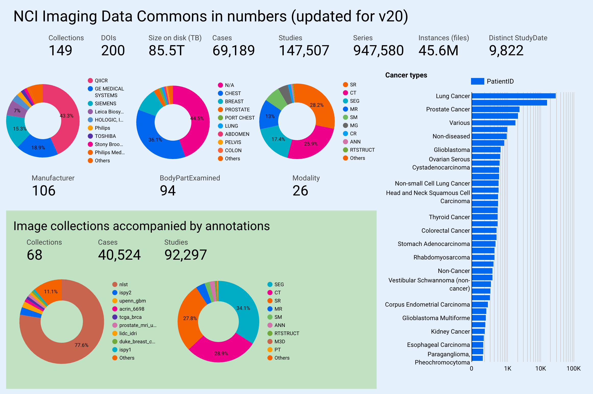

# Welcome!


**If you need support with IDC or have any questions, please open a new topic in** [**IDC User Forum**](https://discourse.canceridc.dev/) **(preferred) or send email to support@canceridc.dev.**&#x20;

**Would you rather discuss your questions in an meeting with an expert from the IDC team? Book a 1-on-1 support session here:** [**https://tinyurl.com/idc-help-request**](https://tinyurl.com/idc-help-request)


[**NCI Imaging Data Commons** **(IDC)**](https://imaging.datacommons.cancer.gov) is a cloud-based environment containing publicly available cancer imaging data co-located with analysis and exploration tools. IDC is a node within the broader NCI [Cancer Research Data Commons (CRDC)](https://datacommons.cancer.gov/) infrastructure that provides secure access to a large, comprehensive, and expanding collection of cancer research data.&#x20;

<figure><figcaption>
IDC data release v20 summary; see live dashboard <a href="https://lookerstudio.google.com/reporting/04cf5976-4ea0-4fee-a749-8bfd162f2e87/page/p_s7mk6eybqc">here</a>.
</figcaption></figure>

## Highlights

* **>85 TB of data**: IDC contains radiology, brightfield (H\&E) and fluorescence slide microscopy images, along with image-derived data (annotations, segmentations, quantitative measurements) and accompanying clinical data
* **free**: all of the data in IDC is publicly available: no registration, no access requests
* **commercial-friendly**: >95% of the data in IDC is covered by the permissive CC-BY license, which allows commercial reuse (small subset of data is covered by the CC-NC license); each file in IDC is tagged with the license to make it easier for you to understand and follow the rules
* **cloud-based**: all of the data in IDC is available from both Google and AWS public buckets: fast and free to download, no out-of-cloud egress fees
* **harmonized**: all of the images and image-derived data in IDC is harmonized into standard DICOM representation

## Functionality

IDC is as much about data as it is about what you can do with the data! We maintain and actively develop a variety of tools that are designed to help you efficiently navigate, access and analyze IDC data:

* **exploration**: start with the [IDC Portal](https://portal.imaging.datacommons.cancer.gov/explore/) to get an idea of the data available
* **visualization**: examine images and image-derived annotations and analysis results from the convenience of your browser using integrated OHIF, VolView and Slim open source viewers
* **programmatic access**: use [`idc-index` python package](https://github.com/ImagingDataCommons/idc-index) to perform search, download and other operations programmatically
* **cohort building**: use rich and extensive metadata to build subsets of data programmatically using `idc-index` or BigQuery SQL
* **download**: use your favorite S3 API client or `idc-index` to efficiently fetch any of the IDC files from our public buckets
* **analysis**: conveniently access IDC files and metadata from the tools that are cloud-native, such as Google Colab or Looker; fetch IDC data directly into 3D Slicer using [SlicerIDCBrowser extension](https://github.com/ImagingDataCommons/SlicerIDCBrowser/)


The overview of IDC is available in this open access publication. If you use IDC, please acknowledge us by citing it!

> Fedorov, A., Longabaugh, W. J. R., Pot, D., Clunie, D. A., Pieper, S. D., Gibbs, D. L., Bridge, C., Herrmann, M. D., Homeyer, A., Lewis, R., Aerts, H. J. W., Krishnaswamy, D., Thiriveedhi, V. K., Ciausu, C., Schacherer, D. P., Bontempi, D., Pihl, T., Wagner, U., Farahani, K., Kim, E. & Kikinis, R. _National Cancer Institute Imaging Data Commons: Toward Transparency, Reproducibility, and Scalability in Imaging Artificial Intelligence_. RadioGraphics (2023). [https://doi.org/10.1148/rg.230180](https://doi.org/10.1148/rg.230180)

