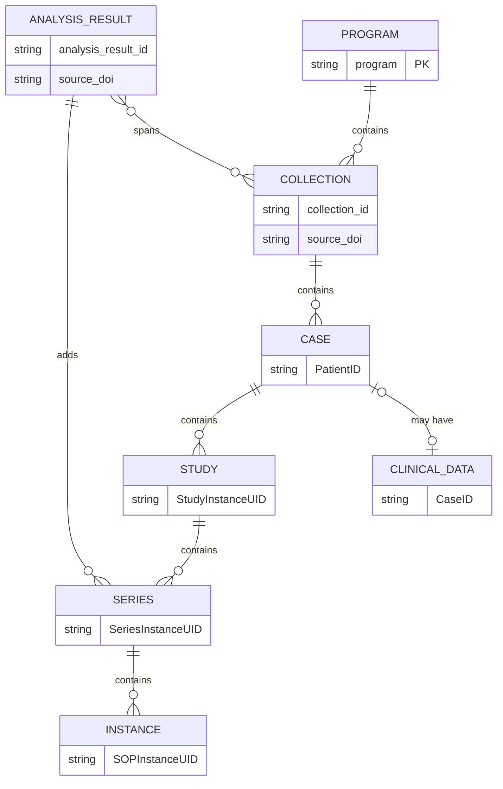

# Data model

IDC relies on the DICOM data model for organizing images and image-derived data. At the same time, IDC includes certain attributes and data types that are outside of the DICOM data model. The _Entity-Relationship (E-R) diagram_ and examples below summarize a simplified view of the IDC data model (you will find the explanation of how to interpret the notation used in this E-R diagram in [this page](https://mermaid.js.org/syntax/entityRelationshipDiagram.html) from Mermaid documentation).

IDC content is organized in **Collections**: groups of DICOM files that were collected through certain research activity. We sometimes refer to these as **Original Collections** to distinguish them from Analysis Results collections described below.

Collections are organized into **Programs**, which group related collections, or those collections that were contributed under the same funding initiative or a consortium. Example: TCGA program contains TCGA-GBM, TCGA-BRCA and other collections. You will see Collections nested under Programs in the upper left section of the [IDC Portal](https://portal.imaging.datacommons.cancer.gov/explore/). You will also see the list of collections that meet the filter criteria in the top table on the right-hand side of the portal interface.&#x20;

Individual DICOM files included in the collection contain attributes that organize content according to the [data-model.md](../dicom/data-model.md "mention").&#x20;

Each collection will contain data for one or more cases, or **patients**. Data for the individual patient is organized in DICOM **studies**, which group images corresponding to a single imaging exam/encounter, and collected in a given session. Studies are composed of DICOM **series**, which in turn consist of DICOM **instances**. Each DICOM instance corresponds to a single file on disk. As an example, in radiology imaging, individual instances would correspond to image slices in multi-slice acquisitions, and in digital pathology you will see a separate file/instance for each resolution layer of the image pyramid. When using the IDC Portal, you will never encounter individual instances - you will only see them if you download data to your computer.

The **Analysis results collection** is a very important concept in IDC. An analysis result is the DICOM encoded result of some analysis performed on data from one or more original collections. Such analysis results are often contributed by investigators unrelated to those that submitted the analyzed images, and may span images across multiple collections.
