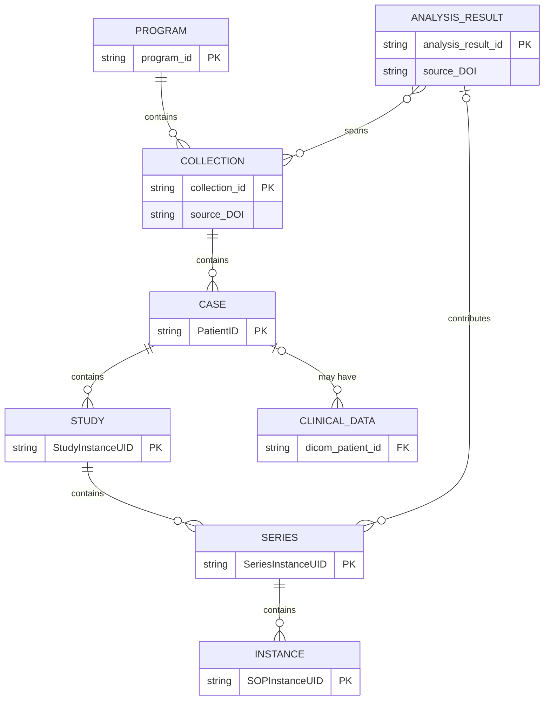

# Data model

IDC relies on the DICOM data model for organizing images and image-derived data. At the same time, IDC includes certain attributes and data types that are outside of the DICOM data model. The _Entity-Relationship (E-R) diagram_ and examples below summarize a simplified view of the IDC data model (you will find the explanation of how to interpret the notation used in this E-R diagram in [this page](https://mermaid.js.org/syntax/entityRelationshipDiagram.html) from Mermaid documentation).



IDC content is organized in **Collections**: groups of DICOM files that were collected through certain research activity. We sometimes refer to these as **Original Collections** to distinguish them from Analysis Results collections described below.

Collections are organized into **Programs**, which group related collections, or those collections that were contributed under the same funding initiative or a consortium. Example: TCGA program contains TCGA-GBM, TCGA-BRCA and other collections. You will see Collections nested under Programs in the upper left section of the [IDC Portal](https://portal.imaging.datacommons.cancer.gov/explore/). You will also see the list of collections that meet the filter criteria in the top table on the right-hand side of the portal interface.

Individual DICOM files included in the collection contain attributes that organize content according to the [data-model.md](../dicom/data-model.md "mention").

Each collection will contain data for one or more cases, or **patients**. Data for the individual patient is organized in DICOM **studies**, which group images and derived objects collected in the context of a single imaging exam or encounter. Studies are composed of DICOM **series**, which in turn consist of DICOM **instances**. Each DICOM instance corresponds to a single file on disk. As an example, in radiology imaging, individual instances will most often correspond to image slices in multi-slice acquisitions (although a single instance of an enhanced multi-frame object, or of a Segmentation, can hold an entire volume), and in digital pathology you will see a separate file/instance for each resolution layer of the image pyramid, plus any label and overview images. Instance is not a level you browse in the IDC Portal - you will encounter individual instances once you download data to your computer.


`PatientID` is unique _within_ a collection, but is not guaranteed to be unique across IDC. If you join or group data across collections, always use `PatientID` together with `collection_id`.


## Analysis results

The **Analysis Results collection** is a very important concept in IDC, and the peer of the Original Collection introduced above. An analysis result - we use the shorter form from here on - is the DICOM encoded result of some analysis performed on data from one or more original collections. Such analysis results are often contributed by investigators unrelated to those that submitted the analyzed images, and may span images across multiple collections.

An analysis result is a collection in its own right. It has its own identifier, title, DOI, license, description and citation, recorded in `analysis_results_index` just as original collections are recorded in `collections_index`. That grouping is what establishes the provenance of the derived content and gives credit to the people who produced it - they are cited for their contribution, and their terms of reuse travel with it.

What is different is _where the content sits_. An analysis result brings no images, patients or studies of its own; it enriches data that is already in IDC. So each derived series belongs to two collections at the same time, and IDC records both:

* `collection_id` - the original collection that supplied the analyzed images. A derived series carries this exactly like the images it describes, which is what places it in the right patient and study.
* `analysis_result_id` - the analysis result that contributed it. Non-empty for derived content only.

The two are **orthogonal grouping axes, not a hierarchy**: an analysis result is not nested under one original collection - `tcga_sbu_til_maps` spans 23 of them - which is why the [IDC Portal](https://portal.imaging.datacommons.cancer.gov/explore/) offers analysis results as a search scope of their own, alongside programs and collections. Filter on whichever axis you actually mean.


Because derived series carry the `collection_id` of the images they analyze, filtering by `collection_id` alone returns analysis result series along with the original images. To select only originally submitted data, add `analysis_result_id IS NULL` - note that the value is NULL, not an empty string. Conversely, to select a contributed dataset, filter on its `analysis_result_id`: filtering on the collections it covers would sweep in all of their original imaging too.


Two properties of derived content follow from all this:

* **Analysis results do not introduce new patients**, and almost always attach to a study that already exists, alongside the images they describe - which is why you see them overlaid when you open the study in the viewer. As of v24, every patient with derived series also has original imaging, and only 260 of the ~92,000 studies containing derived series consist of derived series alone.
* **Provenance and licensing follow the analysis result, not the original collection**: series within a single study can carry different `source_DOI` and `license_short_name` values. License information is available programmatically at series granularity - see [licensing.md](licensing.md "mention").

## The model on a concrete example


The specific counts and version numbers below are as of IDC data release v24, and will change as new data is added.


### Radiology: PROSTATEx

Consider patient `ProstateX-0217` from the [PROSTATEx](https://portal.imaging.datacommons.cancer.gov/explore/filters/?collection_id=prostatex) collection ([open in the IDC viewer](https://viewer.imaging.datacommons.cancer.gov/v3/viewer/?StudyInstanceUIDs=1.3.6.1.4.1.14519.5.2.1.7310.5101.239746591836843122771107560214)):

```
PROGRAM  community
└── COLLECTION  prostatex  (PROSTATEx)
    └── CASE  ProstateX-0217
        └── STUDY  1.3.6.1.4.1.14519.5.2.1.7310.5101.239746591836843122771107560214
            │
            ├── 43 original MR series    DOI 10.7937/k9tcia.2017.murs5cl   CC BY 3.0   since v2
            │   ├── t2_tse_tra                     23 INSTANCEs (one file per slice)
            │   ├── t2_tse_sag                     19 INSTANCEs
            │   ├── diffusie-3Scan-4bval_fs        60 INSTANCEs
            │   ├── 35 × "tfl_3d dynamisch fast"   12 INSTANCEs each (DCE time points)
            │   └── …
            │
            └── 4 series contributed by ANALYSIS_RESULTs, added to this same study:
                ├── SEG  prostatex_seg_zones     10.7937/tcia.nbb4-4655       CC BY 3.0   since v2
                ├── SEG  prostatex_seg_hires     10.7937/tcia.2019.deg7zg1u   CC BY 3.0   since v2
                ├── SEG  bamf_aimi_annotations   10.5281/zenodo.8345959       CC BY 4.0   since v19
                └── SR   prostatex_targets       10.5281/zenodo.15643312      CC BY 4.0   since v23

CLINICAL_DATA for ProstateX-0217, across 4 of the 6 clinical tables for this collection:
    prostatex_images  8 rows │ prostatex_findings  1 │ prostatex_ktrans  1 │ bamf…qa_results  1
```

What this single patient illustrates:

* **A derived series belongs to two collections at once.** All four carry `collection_id = 'prostatex'`, just like the MR images, _and_ the `analysis_result_id` of the analysis result that contributed them - which is where their DOI and license come from.
* **They attach to the existing study.** No new patient, no new study - the SEG and SR objects land in the same `StudyInstanceUID` as the images they describe.
* **One study can carry several licenses and DOIs.** Here, three DOIs under CC BY 3.0 and two under CC BY 4.0. Licensing and provenance attach at the series level.
* **A study accretes content over releases.** The images arrived in IDC v2, the BAMF segmentation in v19, the lesion annotations in v23.
* **`SeriesDescription` is not an identifier.** 35 series here share the description `tfl_3d dynamisch fast`; only `SeriesInstanceUID` distinguishes them.
* **A case maps to many clinical records**, spread across several tables and joined on `dicom_patient_id` - and one of those tables was contributed by an analysis result rather than by the original submitters.

### Digital pathology: TCGA-LUAD

The same model applies to slide microscopy, where the INSTANCE level looks quite different. Patient `TCGA-80-5608` from the [TCGA-LUAD](https://portal.imaging.datacommons.cancer.gov/explore/filters/?collection_id=tcga_luad) collection ([open in the SLIM viewer](https://viewer.imaging.datacommons.cancer.gov/slim/studies/2.25.67565461533469433863078107064394326180)):

```
PROGRAM  tcga
└── COLLECTION  tcga_luad  (TCGA-LUAD)
    └── CASE  TCGA-80-5608
        └── STUDY  2.25.67565461533469433863078107064394326180
            │
            ├── SM series "FFPE HE TP DX1"   DOI 10.5281/zenodo.12689915   CC BY 3.0   since v8
            │   └── 4 INSTANCEs, one per pyramid level:
            │       21987 × 17849  (0.50 µm/px, base layer, 128 MB)
            │        5496 ×  4462  (2.00 µm/px)
            │        2748 ×  2231  (4.00 µm/px)
            │         946 ×   768  (11.6 µm/px, thumbnail)
            │
            ├── ANALYSIS_RESULT  pan_cancer_nuclei_seg_dicom   CC BY 4.0
            │   ├── ANN series  1 INSTANCE   (nuclei as bulk annotations)   since v19
            │   └── SEG series  4 INSTANCEs  (nuclei as segmentations)      since v20
            │
            └── ANALYSIS_RESULT  tcga_sbu_til_maps             CC BY 4.0   since v23
                ├── SEG  "Stony Brook CNN-generated TIL Map"
                ├── SEG  "Stony Brook Inception-V4 Binary TIL Map"
                └── SEG  "Stony Brook Inception-V4 Fractional TIL Map"
```

Two additional points this example makes:

* **In pathology, one instance is one pyramid layer**, not one slice. The whole slide image above is a single series of 4 files, ranging from a 128 MB base layer at 0.5 µm/px down to a thumbnail. (A small number of series in IDC split a single layer across several instances.)
* **A single analysis result can span many collections.** `tcga_sbu_til_maps` covers 23 TCGA collections and `pan_cancer_nuclei_seg_dicom` covers 14 - this is the many-to-many relationship between ANALYSIS\_RESULT and COLLECTION in the diagram above. A single analysis result can also contribute more than one type of object, as `pan_cancer_nuclei_seg_dicom` does with ANN and SEG series.

## Where each entity lives in the metadata

The table below maps each entity to the identifier you would use in [`idc-index`](https://github.com/ImagingDataCommons/idc-index). The same DICOM identifiers are used in the BigQuery `dicom_all` table, which additionally exposes every other DICOM attribute - see [files-and-metadata.md](organization-of-data/files-and-metadata.md "mention").

<table><thead><tr><th width="180">Entity</th><th width="230">Identifier</th><th>Where to find it</th></tr></thead><tbody><tr><td>PROGRAM</td><td><code>program_id</code></td><td><code>collections_index</code></td></tr><tr><td>COLLECTION</td><td><code>collection_id</code></td><td><code>index</code>, <code>collections_index</code></td></tr><tr><td>CASE</td><td><code>PatientID</code></td><td><code>index</code></td></tr><tr><td>STUDY</td><td><code>StudyInstanceUID</code></td><td><code>index</code></td></tr><tr><td>SERIES</td><td><code>SeriesInstanceUID</code></td><td><code>index</code></td></tr><tr><td>INSTANCE</td><td><code>SOPInstanceUID</code></td><td>BigQuery <code>dicom_all</code>; <code>sm_instance_index</code> for slide microscopy</td></tr><tr><td>ANALYSIS_RESULT</td><td><code>analysis_result_id</code></td><td><code>index</code>, <code>analysis_results_index</code></td></tr><tr><td>CLINICAL_DATA</td><td><code>dicom_patient_id</code></td><td>per-collection clinical tables, see <a href="organization-of-data/clinical.md">clinical.md</a></td></tr></tbody></table>

Note that the identifiers above are the ones you search with. The files themselves are named using IDC-assigned UUIDs (`crdc_series_uuid` and `crdc_instance_uuid`) so that IDC can support versioning - see [guids-and-uuids.md](organization-of-data/guids-and-uuids.md "mention").
