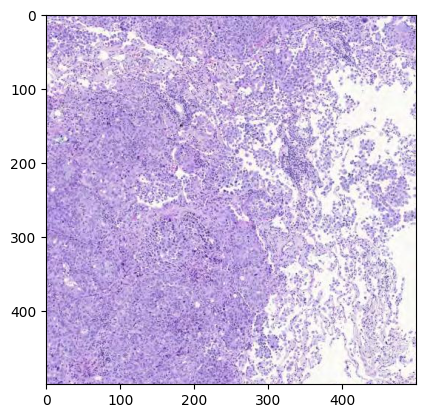

# Accessing data through DICOMweb

The DICOMweb interface is available for accessing IDC data. This interface could be especially useful for efficiently downloading small(er) parts of large digital pathology images. While the entire pathology whole-slide image (WSI) pyramid can reach gigabytes in size, the part that is needed for a specific visualization or analysis task can be rather small and localized to the specific image tiles at a given resolution.  


New to DICOM WSI? Check out our [introductory tutorial](https://github.com/ImagingDataCommons/IDC-Tutorials/blob/master/notebooks/pathomics/getting_started_with_digital_pathology.ipynb) to learn how slide microscopy images are organized in DICOM.


Detailed information on the DICOMweb endpoints that are available to access IDC data is provided here. In brief, there are two DICOM stores \- the [IDC-maintained DICOM store](https://learn.canceridc.dev/data/organization-of-data/dicom-stores#idc-maintained-dicom-store-via-proxy) and the [Google-maintained DICOM store](https://learn.canceridc.dev/data/organization-of-data/dicom-stores#dicom-store-maintained-by-google-healthcare) \- available and we recommend that you familiarize yourself with the documentation to learn about the differences between the two, and select the option that is optimal for your use case.


Code snippets included in this article are also replicated in [this Google Colab tutorial notebook](https://github.com/ImagingDataCommons/IDC-Tutorials/blob/master/notebooks/advanced_topics/idc_dcmweb_access.ipynb) for your convenience.


## Unique identifiers: locating the relevant slides

IDC uses DICOM for data organization, and every image contains metadata organized following the data model documented [here](https://learn.canceridc.dev/data/data-model). Each slide corresponds to a DICOM Series, uniquely identified by the `SeriesInstanceUID`, which in turn belongs to a DICOM Study identified by the `StudyInstanceUID`. You will need these two identifiers to access any DICOM slide using DICOMweb! 

Since IDC contains many terabytes of images, you will typically want to first select images/slides that meet your needs. IDC offers various interfaces to explore and subset the data, starting from the [IDC Portal](https://learn.canceridc.dev/tutorials/portal-tutorial), to the Python package `idc-index` (covered in [this tutorial](https://github.com/ImagingDataCommons/IDC-Tutorials/blob/master/notebooks/pathomics/slide_microscopy_metadata_search.ipynb)) and BigQuery SQL interfaces (see [this tutorial](https://github.com/ImagingDataCommons/IDC-Tutorials/blob/master/notebooks/getting_started/part3_exploring_cohorts.ipynb)). We strongly recommend you work through the referenced tutorials, but for the purposes of this tutorial, we will demonstrate how you can locate UIDs of a slide that corresponds to pancreas tissue.

First, install `idc-index` with `pip install —upgrade idc-index` (`--upgrade` part is very important to make sure you are working with the latest data release of IDC!).

Next, the following snippet demonstrates how to select slides of pancreas tissue (you can also select by the lens magnification, stain, and many other attributes - see [this tutorial](https://github.com/ImagingDataCommons/IDC-Tutorials/blob/master/notebooks/pathomics/slide_microscopy_metadata_search.ipynb) for details).

```python
from idc_index import IDCClient

# Instantiate the client
idc_client = IDCClient()
idc_client.fetch_index('sm_index')


# Filter the slides
query = """
SELECT index.StudyInstanceUID, sm_index.SeriesInstanceUID
FROM sm_index
JOIN index ON sm_index.SeriesInstanceUID = index.SeriesInstanceUID
WHERE Modality = 'SM' AND primaryAnatomicStructure_CodeMeaning = 'Pancreas'
"""

pancreas_slides = idc_client.sql_query(query)
```

Next, we select the first slide and will use its StudyInstanceUID and SeriesInstanceUID in the subsequent sections of the code.

```python
sample_study_uid = pancreas_slides['StudyInstanceUID'][0]
sample_series_uid = pancreas_slides['SeriesInstanceUID'][0]
sample_study_uid, sample_series_uid
```

`('2.25.25332367070577326639024635995523878122', '1.3.6.1.4.1.5962.99.1.3380245274.1362068963.1639762817818.2.0')`


## Reading slide regions via DICOMweb

There are (at least) the following two Python libraries available that facilitate access to a DICOM store via dicomweb: 

- [wsidicom](https://github.com/imi-bigpicture/wsidicom)   
- [ez-wsi-dicomweb](https://github.com/GoogleCloudPlatform/EZ-WSI-DICOMweb)

Both libraries can be installed using pip:   
```python
pip install wsidicom  
pip install ez-wsi-dicomweb
```

wsidicom is based upon the [dicomweb_client](https://github.com/ImagingDataCommons/dicomweb-client) Python library, while ez-wsi-dicomweb includes its own DICOMweb implementation. 


Note that you can use wsidicom with both, the IDC-maintained and the Google-maintained DICOM store, while ez-wsi-dicomweb only works with the Google-maintained store. 


The following code snippets show exemplarily how to use each of the libraries to access a subregion from a DICOM slide identified by the following UIDs we selected earlier:
 
- DICOM StudyInstanceUID = 2.25.25332367070577326639024635995523878122
- DICOM SeriesInstanceUID = 1.3.6.1.4.1.5962.99.1.3380245274.1362068963.1639762817818.2.0

### wsidicom

When you work with wsidicom, the first step requires setting up [dicomweb_client](https://github.com/ImagingDataCommons/dicomweb-client)’s `DICOMwebClient`: 

```python
from dicomweb_client.api import DICOMwebClient  
from dicomweb_client.ext.gcp.session_utils import create_session_from_gcp_credentials
```

If you are accessing the Google-maintained DICOM store, you need to authenticate with your Google credentials first and set up an authorized session for the DICOMwebClient. 


As discussed in the corresponding documentation page we mentioned earlier, Google-hosted DICOM store may not contain the latest version of IDC data! You will encounter access issues for slides that are not present. If this the case, you will need to use the IDC-hosted DICOM store instead!



```python
from google.colab import auth  
auth.authenticate_user()

# Create authorized session  
session = create_session_from_gcp_credentials()

# Set-up a DICOMwebClient using the dicomweb_client library  
google_dicom_store_url = 'https://healthcare.googleapis.com/v1/projects/nci-idc-data/locations/us-central1/datasets/idc/dicomStores/idc-store-v20/dicomWeb'  
dw_client = DICOMwebClient(  
    url=dicom_store_url,  
    session=session  
)
```

Otherwise, you can skip ahead and just set up your DICOMwebClient using the proxy URL.   

```python
# Set-up a DICOMwebClient using the dicomweb_client library  
idc_dicom_store_url = 'https://proxy.imaging.datacommons.cancer.gov/current/viewer-only-no-downloads-see-tinyurl-dot-com-slash-3j3d9jyp/dicomWeb'

dw_client = DICOMwebClient(url=idc_dicom_store_url)
```

#### Slide access with wsidicom

You now need to wrap the previously set-up `DICOMwebClient` into wsidicom’s `WsiDicomWebClient`. Then you can use the `open_web()` functionality to find, open and investigate your slide of interest:  

```python
import wsidicom  
import matplotlib.pyplot as plt

wsidicom_client = wsidicom.WsiDicomWebClient(dw_client)  
slide = wsidicom.WsiDicom.open_web(wsidicom_client,  
    study_uid='2.25.25332367070577326639024635995523878122',  
    series_uids='1.3.6.1.4.1.5962.99.1.3380245274.1362068963.1639762817818.2.0'  
)  
print(slide)
```

`[0]: Pyramid of levels:` 

      `[0]: Level: 0, size: Size(width=171359, height=74498) px, mpp: SizeMm(width=0.2472, height=0.2472) um/px Instances:         [0]: default z: 0.0 default path: 1 ImageData <wsidicom.web.wsidicom_web_image_data.WsiDicomWebImageData object at 0x7d0f16444c50>`

      `[1]: Level: 2, size: Size(width=42839, height=18624) px, mpp: SizeMm(width=0.988817311328, height=0.988817311328) um/px Instances:         [0]: default z: 0.0 default path: 1 ImageData <wsidicom.web.wsidicom_web_image_data.WsiDicomWebImageData object at 0x7d0f16445410>`
      
      `[2]: Level: 4, size: Size(width=10709, height=4656) px, mpp: SizeMm(width=3.955546250817, height=3.955546250817) um/px Instances:         [0]: default z: 0.0 default path: 1 ImageData <wsidicom.web.wsidicom_web_image_data.WsiDicomWebImageData object at 0x7d0f165271d0>`
      
      `[3]: Level: 6, size: Size(width=2677, height=1164) px, mpp: SizeMm(width=15.823662607396, height=15.823662607396) um/px Instances:         [0]: default z: 0.0 default path: 1 ImageData <wsidicom.web.wsidicom_web_image_data.WsiDicomWebImageData object at 0x7d0f14192750>`

To access a certain part of a slide, wsidicom offers the `read_region()` functionality: 

```python
# Access and visualize 500x500px subregion at level 4, starting from pixel (1000,1000)  
region = slide.read_region(location=(1000, 1000), level=4, size=(500, 500))  
plt.imshow(region)  
plt.show()
```

<div align="center"></div>

### ez-wsi-dicomweb

The following code shows how to set-up an interface for DICOMweb with ez-wsi-dicomweb. You can only use this interface for accessing data from the Google-maintained DICOM store which means, authentication with you Google account is required. 

```python
from ez_wsi_dicomweb import dicomweb_credential_factory  
from ez_wsi_dicomweb import dicom_slide  
from ez_wsi_dicomweb import local_dicom_slide_cache_types  
from ez_wsi_dicomweb import dicom_web_interface  
from ez_wsi_dicomweb import patch_generator  
from ez_wsi_dicomweb import pixel_spacing  
from ez_wsi_dicomweb.ml_toolkit import dicom_path

from google.colab import auth  
auth.authenticate_user()

google_dicom_store_url = 'https://healthcare.googleapis.com/v1/projects/nci-idc-data/locations/us-central1/datasets/idc/dicomStores/idc-store-v20/dicomWeb'  
study_uid = '2.25.25332367070577326639024635995523878122'  
series_uid = '1.3.6.1.4.1.5962.99.1.3380245274.1362068963.1639762817818.2.0'

series_path_str = (  
      f'{google_dicom_store_url}'  
      f'/studies/{study_uid}'  
      f'/series/{series_uid}'  
)  
series_path = dicom_path.FromString(series_path_str)  
dcf = dicomweb_credential_factory.CredentialFactory()  
dwi = dicom_web_interface.DicomWebInterface(dcf)
```

The slide, slide level information and slide regions can be accessed as follows. To accelerate image retrieval, ez-wsi-dicomweb can be configured to fetch frames in blocks and cache them for subsequent use. For more information, check out [this notebook](https://github.com/GoogleCloudPlatform/EZ-WSI-DICOMweb/blob/main/ez_wsi_demo.ipynb), section “Enabling EZ-WSI DICOMweb Frame Cache”.   

```python
ds = dicom_slide.DicomSlide(  
    dwi=dwi,  
    path=series_path,  
    enable_client_slide_frame_decompression = True  
)

# More information: https://github.com/GoogleCloudPlatform/EZ-WSI-DICOMweb/blob/main/ez_wsi_demo.ipynb
ds.init_slide_frame_cache(  optimization_hint=local_dicom_slide_cache_types.CacheConfigOptimizationHint.MINIMIZE_LATENCY  
)
```
```python
# Investigate existing levels and their dimensions  
for level in ds.levels:  
    print(f'Level {level.level_index} has pixel dimensions (row, col): {level.height, level.width}')
```

`Level 1 has pixel dimensions (row, col): (74498, 171359)`
`Level 2 has pixel dimensions (row, col): (18624, 42839)`
`Level 3 has pixel dimensions (row, col): (4656, 10709)`
`Level 4 has pixel dimensions (row, col): (1164, 2677)`

```python
# Access and visualize 500x500px subregion at level 3, starting from pixel (1000,1000)  
level = ds.get_level_by_index(3)  
region = ds.get_patch(level=level, x=1000, y=1000, width=500, height=500).image_bytes()  
plt.imshow(region)  
plt.show()
```

<div align="center"></div>

## Iterating through tiles using DICOMweb

To iterate over and access image tiles you can simply wrap the functionality presented above into your own function that iterates over the coordinates of interest to you. In case you prefer to iterate over the frames as they are stored within the DICOM file, wsidicom does also offer a [`read_tile()`](https://github.com/imi-bigpicture/wsidicom/blob/8372612cbbcce972c70bfc0fd2922655ec886c5c/wsidicom/wsidicom.py#L716) method.  
Iteration over a slide and accessing tiles from an area defined by a tissue mask can be quite easily achieved using ez-wsi-dicomweb’s DICOMPatchGenerator as described in [this notebook](https://github.com/GoogleCloudPlatform/EZ-WSI-DICOMweb/blob/main/ez_wsi_demo.ipynb) in section “Generating patches from a level image”. 

## Recommendations

Both libraries —ez-wsi-dicomweb and wsidicom— can be recommended for reliable DICOMweb access to IDC data. Based on our experience, ez-wsi-dicomweb typically delivers faster performance likely due to its caching capabilities and is specifically designed to efficiently access image patches from a Google DICOM store for AI model training. Wsidicom, on the other hand, is more general-purpose offering extensive functionality for accessing DICOM files (images as well as annotation files) both from local disk or from the cloud via DICOMweb. It is important to note that when running code locally, access times may be slightly longer compared to cloud-based (such as in a Colab notebook) execution.