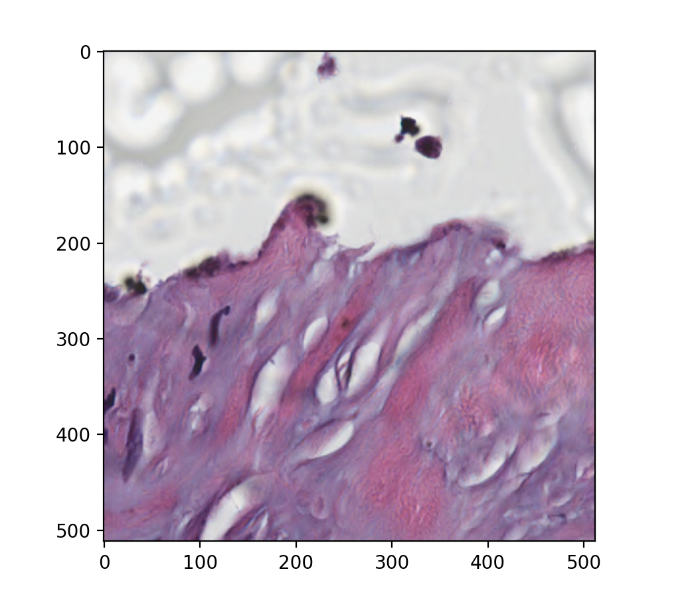

# Directly loading DICOM objects from Google Cloud or AWS in Python

DICOM files in the IDC are stored as "blobs" on the cloud, with one copy housed on Google Cloud Storage (GCS) and another on Amazon Web Services (AWS) S3 storage. By using the right tools, these blobs can be wrapped to appear as "file-like" objects to Python DICOM libraries, enabling intelligent loading of DICOM files directly from cloud storage as if they were local files without having to first download them onto a local drive.


Code snippets included in this article are also replicated in this Google Colab tutorial notebook for you convenience: [https://github.com/ImagingDataCommons/IDC-Tutorials/blob/master/notebooks/advanced\_topics/gcs\_aws\_direct\_access.ipynb](https://github.com/ImagingDataCommons/IDC-Tutorials/blob/master/notebooks/advanced_topics/gcs_aws_direct_access.ipynb)


### Reading files with Pydicom

[Pydicom](https://pydicom.github.io/pydicom/stable/index.html) is popular library for working with DICOM files in Python. Its [dcmread](https://pydicom.github.io/pydicom/stable/reference/generated/pydicom.filereader.dcmread.html#pydicom.filereader.dcmread) function is able to accept any "file-like" object, meaning you can read a file straight from a cloud blob if you know its path. See [this page](../organization-of-data/files-and-metadata.md#storage-buckets) for information on finding the paths of the blobs for DICOM objects in IDC. The `dcmread` function also has some other options that allow you to control what is read. For example you can choose to read only the metadata and not the pixel data, or read only certain attributes. In the following two sections, we demonstrate these abilities using first Google Cloud Storage blobs and then AWS S3 blobs.

**Mapping IDC DICOM series to bucket URLs**

All of the image data available from IDC is replicated between public Google Cloud Storage (GCS) and AWS buckets. pip-installable [idc-index](https://github.com/imagingdatacommons/idc-index) package provides convenience functions to get URLs of the files corresponding to a given DICOM series.

```python
from idc_index import IDCClient


# Create IDCClient for looking up bucket URLs
idc_client = IDCClient()

# Get the list of GCS file URLs in Google bucket from SeriesInstanceUID
gcs_file_urls = idc_client.get_series_file_URLs(
    seriesInstanceUID="1.3.6.1.4.1.14519.5.2.1.131619305319442714547556255525285829796",
    source_bucket_location="gcs",
)

# Get the list of AWS file URLs in AWS bucket from SeriesInstanceUID
aws_file_urls = idc_client.get_series_file_URLs(
    seriesInstanceUID="1.3.6.1.4.1.14519.5.2.1.131619305319442714547556255525285829796",
    source_bucket_location="aws",
)
```

**From Google Cloud Storage blobs**

The [official Python SDK for Google Cloud Storage](https://cloud.google.com/python/docs/reference/storage/latest/) (installable from pip and PyPI as `google-cloud-storage`) provides a "file-like" interface allowing other Python libraries, such as Pydicom, to work with blobs as if they were "normal" files on the local filesystem.

To read from a GCS blob with Pydicom, first create a storage client and blob object, representing a remote blob object stored on the cloud, then simply use the `.open('rb')` method to create a readable file-like object that can be passed to the `dcmread` function.

```python
from pydicom import dcmread
from pydicom.datadict import keyword_dict
from google.cloud import storage
from idc_index import IDCClient


# Create IDCClient for looking up bucket URLs
idc_client = IDCClient()

# Create a client and bucket object representing the IDC public data bucket
gcs_client = storage.Client.create_anonymous_client()

# This example uses a CT series in the IDC.
# get the list of file URLs in Google bucket from the SeriesInstanceUID
file_urls = idc_client.get_series_file_URLs(
    seriesInstanceUID="1.3.6.1.4.1.14519.5.2.1.131619305319442714547556255525285829796",
    source_bucket_location="gcs",
)

# URLs will look like this:
# s3://idc-open-data/668029cf-41bf-4644-b68a-46b8fa99c3bc/f4fe9671-0a99-4b6d-9641-d441f13620d4.dcm
(_, _, bucket_name, folder_name, file_name) = file_urls[0].split("/")
blob_key = f"{folder_name}/{file_name}"

# These objects represent the bucket and a single image blob within the bucket
bucket = gcs_client.bucket(bucket_name)
blob = bucket.blob(blob_key)

# Read the whole file directly from the blob
with blob.open("rb") as reader:
    dcm = dcmread(reader)

# Read metadata only (no pixel data)
with blob.open("rb", chunk_size=5_000) as reader:
    dcm = dcmread(reader, stop_before_pixels=True)

# Read only specific attributes, identified by their tag
# (here the Manufacturer and ManufacturerModelName attributes)
with blob.open("rb", chunk_size=5_000) as reader:
    dcm = dcmread(
        reader,
        specific_tags=[keyword_dict['Manufacturer'], keyword_dict['ManufacturerModelName']],
    )
    print(dcm)
```

Reading only metadata or only specific attributes will reduce the amount of data that needs to be pulled down under some circumstances and therefore make the loading process faster. This depends on the size of the attributes being retrieved, the `chunk_size` (a parameter of the `open()` method that controls how much data is pulled in each HTTP request to the server), and the position of the requested element within the file (since it is necessary to seek through the file until the requested attributes are found, but any data after the requested attributes need not be pulled). If you are not retrieving entire images, we strongly recommend specifying a `chunk_size` (in bytes) because the default value is around 40MB, which is typically far larger than the optimal value for accessing metadata attributes or individual frames (see later).

This works because running the [open](https://cloud.google.com/python/docs/reference/storage/latest/google.cloud.storage.blob.Blob#google_cloud_storage_blob_Blob_open) method on a Blob object returns a [BlobReader](https://cloud.google.com/python/docs/reference/storage/latest/google.cloud.storage.fileio.BlobReader) object, which has a "file-like" interface (specifically the `seek`, `read`, and `tell` methods).

**From AWS S3 blobs**

The `s3fs` [package](https://s3fs.readthedocs.io/en/latest/) provides "file-like" interface for accessing S3 blobs. It can be installed with `pip install s3fs`. The following example repeats the above example using the counterpart of the same blob on AWS S3.

```python
import s3fs
from pydicom import dcmread
from pydicom.datadict import keyword_dict

from idc_index import IDCClient


# Create IDCClient for looking up bucket URLs
idc_client = IDCClient()

# This example uses a CT series in the IDC (same as above).
# Get the list of file URLs in AWS bucket from SeriesInstanceUID
file_urls = idc_client.get_series_file_URLs(
    seriesInstanceUID="1.3.6.1.4.1.14519.5.2.1.131619305319442714547556255525285829796",
    source_bucket_location="aws",
)

# Configure a client to avoid the need for AWS credentials
s3_client = s3fs.S3FileSystem(
  anon=True,  # no credentials needed to access public data
  default_block_size=50_000,  # ~50kB data pulled in each request
  use_ssl=False  # disable encryption for a speed boost
)

with s3_client.open(file_urls[0], 'rb') as reader:
    dcm = dcmread(reader)

# Read metadata only (no pixel data)
with s3_client.open(file_urls[0], 'rb') as reader:
    dcm = dcmread(reader, stop_before_pixels=True)

# Read only specific attributes, identified by their tag
# (here the Manufacturer and ManufacturerModelName attributes)
with s3_client.open(file_urls[0], 'rb') as reader:
    dcm = dcmread(
        reader,
        specific_tags=[keyword_dict['Manufacturer'], keyword_dict['ManufacturerModelName']],
    )
    print(dcm)
```

Similar to the `chunk_size` parameter in GCS, the `default_block_size` is crucially important for determining how efficient this is. Its default value is around 50MB, which will result in orders of magnitude more data than necessary being pulled than is needed to retrieve metadata. In the above example, we set it to 50kB.

### Frame-level access with Highdicom

[Highdicom](https://highdicom.readthedocs.io) is a higher-level library providing several features to work with images and image-derived DICOM objects. As of the release 0.25.1, its various reading methods (including [imread](https://highdicom.readthedocs.io/en/latest/package.html#highdicom.imread), [segread](https://highdicom.readthedocs.io/en/latest/package.html#highdicom.seg.segread), [annread](https://highdicom.readthedocs.io/en/latest/package.html#highdicom.ann.annread), and [srread](https://highdicom.readthedocs.io/en/latest/package.html#highdicom.sr.srread)) can read any file-like object, including Google Cloud blobs and S3 blobs opened with `s3fs`.

A particularly useful feature when working with blobs is ["lazy" frame retrieval](https://highdicom.readthedocs.io/en/latest/image.html#lazy) for images and segmentations. This downloads only the image metadata when the file is initially loaded, uses it to create a frame-level index, and downloads specific frames as and when they are requested by the user. This is especially useful for large multiframe files (such as those found in slide microscopy or multi-segment binary or fractional segmentations) as it can significantly reduce the amount of data that needs to be downloaded to access a subset of the frames.

In this first example, we use lazy frame retrieval to load only a specific spatial patch from a large whole slide image from the IDC using GCS.

```python
import numpy as np
import highdicom as hd
import matplotlib.pyplot as plt
from google.cloud import storage
from pydicom import dcmread

from idc_index import IDCClient

# Create IDCClient for looking up bucket URLs
idc_client = IDCClient()

# Install additional component of idc-index to resolve SM instances to file URLs
idc_client.fetch_index("sm_instance_index")

# Given SeriesInstanceUID of an SM series, find the instance that corresponds to the
# highest resolution base layer of the image pyramid
query = """
SELECT SOPInstanceUID, TotalPixelMatrixColumns
FROM sm_instance_index
WHERE SeriesInstanceUID = '1.3.6.1.4.1.5962.99.1.1900325859.924065538.1719887277027.4.0'
ORDER BY TotalPixelMatrixColumns DESC
LIMIT 1
"""
result = idc_client.sql_query(query)

# Get URL corresponding to the base layer instance in the Google Storage bucket
base_layer_file_url = idc_client.get_instance_file_URL(
    sopInstanceUID=result.iloc[0]["SOPInstanceUID"],
    source_bucket_location="gcs"
)

# Create a storage client and use it to access the IDC's public data bucket
gcs_client = storage.Client.create_anonymous_client()

(_,_, bucket_name, folder_name, file_name) = base_layer_file_url.split("/")
blob_key = f"{folder_name}/{file_name}"

bucket = gcs_client.bucket(bucket_name)
base_layer_blob = bucket.blob(blob_key)

# Read directly from the blob object using lazy frame retrieval
with base_layer_blob.open(mode="rb", chunk_size=500_000) as reader:
    im = hd.imread(reader, lazy_frame_retrieval=True)

    # Grab an arbitrary region of tile full pixel matrix
    region = im.get_total_pixel_matrix(
        row_start=15000,
        row_end=15512,
        column_start=17000,
        column_end=17512,
        dtype=np.uint8
    )

# Show the region
plt.imshow(region)
plt.show()
```

Running this code should produce an output that looks like this:

<div align="center"></div>

The next example repeats this on the same image in AWS S3:

```python
import numpy as np
import highdicom as hd
import matplotlib.pyplot as plt
from pydicom import dcmread
import s3fs

from idc_index import IDCClient

# Create IDCClient for looking up bucket URLs
idc_client = IDCClient()

# Install additional component of idc-index to resolve SM instances to file URLs
idc_client.fetch_index("sm_instance_index")

# Given SeriesInstanceUID of an SM series, find the instance that corresponds to the
# highest resolution base layer of the image pyramid
query = """
SELECT SOPInstanceUID, TotalPixelMatrixColumns
FROM sm_instance_index
WHERE SeriesInstanceUID = '1.3.6.1.4.1.5962.99.1.1900325859.924065538.1719887277027.4.0'
ORDER BY TotalPixelMatrixColumns DESC
LIMIT 1
"""
result = idc_client.sql_query(query)

# Get URL corresponding to the base layer instance in the AWS S3 bucket
base_layer_file_url = idc_client.get_instance_file_URL(
    sopInstanceUID=result.iloc[0]["SOPInstanceUID"],
    source_bucket_location="aws"
)

# Create a storage client and use it to access the IDC's public data bucket
# Configure a client to avoid the need for AWS credentials
s3_client = s3fs.S3FileSystem(
  anon=True,  # no credentials needed to access public data
  default_block_size=500_000,  # ~500kB data pulled in each request
  use_ssl=False  # disable encryption for a speed boost
)

# Read directly from the blob object using lazy frame retrieval
with s3_client.open(base_layer_file_url, 'rb') as reader:
    im = hd.imread(reader, lazy_frame_retrieval=True)

    # Grab an arbitrary region of tile full pixel matrix
    region = im.get_total_pixel_matrix(
        row_start=15000,
        row_end=15512,
        column_start=17000,
        column_end=17512,
        dtype=np.uint8
    )

# Show the region
plt.imshow(region)
plt.show()
```

In both cases, we set the `chunk_size`/`default_block_size` to around 500kB, which should be enough to ensure each frame can be retrieved in a single request while minimizing further unnecessary data retrieval.

As a further example, we use lazy frame retrieval to load only a specific set of segments from a large multi-organ segmentation of a CT image in the IDC stored in binary format (in binary segmentations, each segment is stored using a separate set of frames) using GCS.

```python
import highdicom as hd
from google.cloud import storage
from idc_index import IDCClient


# Create IDCClient for looking up bucket URLs
idc_client = IDCClient()

# Get the file URL corresponding to the segmentation of a CT series
# containing a large number of different organs - the same one as used in the
# IDC Portal front page
file_urls = idc_client.get_series_file_URLs(
    seriesInstanceUID="1.2.276.0.7230010.3.1.3.313263360.15787.1706310178.804490",
    source_bucket_location="gcs"
)

(_, _, bucket_name, folder_name, file_name) = file_urls[0].split("/")

# Create a storage client and use it to access the IDC's public data package
gcs_client = storage.Client.create_anonymous_client()
bucket = gcs_client.bucket(bucket_name)

blob_name = f"{folder_name}/{file_name}"
blob = bucket.blob(blob_name)

# Open the blob with "segread" using the "lazy frame retrieval" option
with blob.open(mode="rb", chunk_size=500_000) as reader:
    seg = hd.seg.segread(reader, lazy_frame_retrieval=True)

    # Find the segment number corresponding to the liver segment
    selected_segment_numbers = seg.get_segment_numbers(segment_label="Liver")

    # Read in the selected segments lazily
    volume = seg.get_volume(
        segment_numbers=selected_segment_numbers,
        combine_segments=True,
    )

# Print dimensions of the liver segment volume
print(volume.shape)
```

See [this](https://highdicom.readthedocs.io/en/latest/image.html) page for more information on highdicom's `Image` class, and [this](https://highdicom.readthedocs.io/en/latest/seg.html) page for the `Segmentation` class.

### The importance of offset tables for slide microscopy (SM) images

Achieving good performance for the Slide Microscopy frame-level retrievals requires the presence of either a "Basic Offset Table" or "Extended Offset Table" in the file. These tables specify the starting positions of each frame within the file's byte stream. Without an offset table being present, libraries such as highdicom have to parse through the pixel data to find markers that tell it where frame boundaries are, which involves pulling down significantly more data and is therefore very slow. This mostly eliminates the potential speed benefits of frame-level retrieval. Unfortunately there is no simple way to know whether a file has an offset table without downloading the pixel data and checking it. If you find that an image takes a long time to load initially, it is probably because highdicom is constucting the offset table itself because it wasn't included in the file.

Most IDC images do include an offset table, but some of the older pathology slide images do not. [This page](https://github.com/ImagingDataCommons/idc-wsi-conversion?tab=readme-ov-file#overview) contains some notes about whether individual collections include offset tables.

You can also check whether an image file (including pixel data) has an offset table using pydicom like this:

```python
import pydicom


dcm = pydicom.dcmread("...")  # Any method to read from file/cloud storage


if not dcm.file_meta.TransferSyntaxUID.is_encapsulated:
    print(
        "This image does not use an encapsulated (compressed) transfer "
        "syntax, so offset tables are not required."
    )
else:
    # Check metadata for the extended offset table
    print("Has Extended Offset Table:", "ExtendedOffsetTable" in dcm)

    # The start of the PixelData element will be a 4 byte item tag for the offset table,
    # which should always be present. The following 4 bytes gives the length of the offset
    # table. If it is non-zero, the offset table is present
    has_basic_offset_table = dcm.PixelData[4:8] != b'\x00\x00\x00\x00'
    print("Has Basic Offset Table:", has_basic_offset_table)

```

To do this from a remote Google Cloud Storage blob without needing to pull all the pixel data, you can do something like this:

```python
import os
from pydicom import dcmread
from google.cloud import storage


def check_offset_table(blob_key: str):
    """Print information on the offset table in an IDC blob."""
    # Create a storage client and use it to access the IDC's public data package
    gcs_client = storage.Client.create_anonymous_client()

    # Blob object for the particular file you want to check
    blob = gcs_client.bucket("idc-open-data").blob(blob_key)

    # Open the blob object for remote reading with a ~500kB chunk size
    with blob.open(mode="rb", chunk_size=500_000) as reader:
        # Read the file with stop_before_pixels=True, this moves the cursor
        # position to the start of the pixel data attribute
        dcm = dcmread(reader, stop_before_pixels=True)

        if not dcm.file_meta.TransferSyntaxUID.is_encapsulated:
            print(
                "This image does not use an encapsulated (compressed) transfer "
                "syntax, so offset tables are not required."
            )
        else:
            # The presence of the extended offset table in the loaded metadata can be
            # checked straightforwardly
            has_extended_offset_table = "ExtendedOffsetTable" in dcm
            print("Has Extended Offset Table:", has_extended_offset_table)

            # Read the next tag, should be the pixel data tag
            tag = reader.read(4)
            assert tag == b'\xe0\x7f\x10\x00', "Expected pixel data tag"

            # Skip over VR (2 bytes), reserved (2 bytes), and pixel data length (4
            # bytes), giving 8 bytes total. Refer to
            # https://dicom.nema.org/medical/dicom/current/output/chtml/part05/sect_A.4.html#table_A.4-2
            reader.seek(8, os.SEEK_CUR)

            # Read the item tag for the offset table item
            item_tag = reader.read(4)
            assert item_tag == b'\xfe\xff\x00\xe0', "Expected item tag"

            # Read the 32bit length of the pixel data's basic offset table
            length = reader.read(4)

            # If the length of the offset table is non-zero, the offset table exists
            has_basic_offset_table = (length != b'\x00\x00\x00\x00')
            print("Has Basic Offset Table:", has_basic_offset_table)


# Example with no offset table (NLST-LSS collection)
check_offset_table("4a30ffd2-8489-427b-9a83-03f4cf28534d/ad46e1e3-b37c-434b-a67a-5bacbcc608d9.dcm")

# Example with basic offset table (CCDI-MCI collection)
check_offset_table("763fe058-7d25-4ba7-9b29-fd3d6c41dc4b/210f0529-c767-4795-9acf-bad2f4877427.dcm")

# Example with extended offset table (CMB-MML collection)
check_offset_table("79f38b50-4df4-4358-9271-f28aeac573d7/23b9272a-34ef-49ca-833f-84329a18c1e4.dcm")
```
