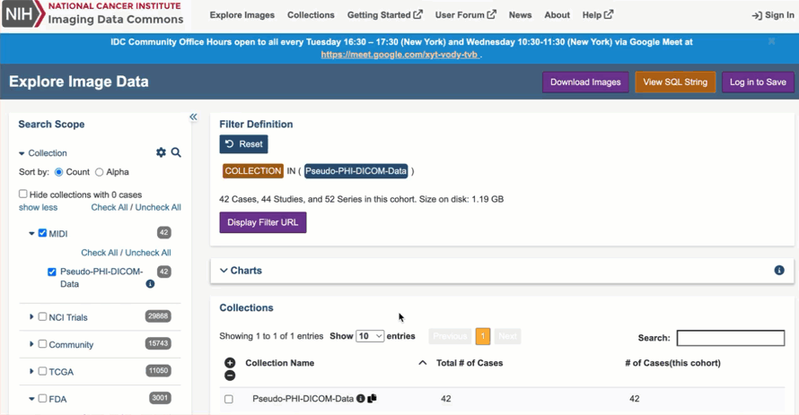

# Downloading data

Depending on whether you would like to download data interactively or programmatically, we provide two recommended tools to help you.

### Command-line or programmatic download: idc-index python package

[`idc-index`](https://github.com/ImagingDataCommons/idc-index) is a python package designed to simplify access to IDC data. Assuming you have Python installed on your computer (if for some reason you do not have Python, you can check out legacy download instructions [here](downloading-data-with-s5cmd.md)), you can get this package with `pip` like this:

```shell-session
pip install idc-index --upgrade
```

Once installed, you can use it to explore, search, select and download corresponding files as shown in the examples below. You can also take a look at a short tutorial on using `idc-index` [here](https://github.com/ImagingDataCommons/IDC-Tutorials/blob/master/notebooks/labs/idc_rsna2023.ipynb).

#### Command line download interface

With the `idc-index` package you get command line scripts that aim to make download simple.

Have a .s5cmd manifest file you downloaded from IDC Portal or from the records in the IDC Zenodo community? Get the corresponding files as follows (you will also get download progress bar and the downloaded files will be organized in the collection/patient/study/series folder hierarchy!):

```sh
idc download manifest_file.s5cmd
```

You can use the same command to download files corresponding to any collection, patient, study or series, referred to by the identifiers you can copy from the portal!&#x20;


<figure><figcaption><p>Copy collection ID from the IDC Portal interface</p></figcaption></figure>

```sh
$ idc download pseudo_phi_dicom_data
2024-09-04 17:59:50,944 - Downloading from IDC v18 index
2024-09-04 17:59:50,952 - Identified matching collection_id: ['pseudo_phi_dicom_data']
2024-09-04 17:59:50,959 - Total size of files to download: 1.27 GB
2024-09-04 17:59:50,959 - Total free space on disk: 29.02233088GB
2024-09-04 17:59:51,151 - Not using s5cmd sync as the destination folder is empty or sync or progress bar is not requested
2024-09-04 17:59:51,156 - Initial size of the directory: 0 bytes
2024-09-04 17:59:51,156 - Approximate size of the files that need to be downloaded: 1274140000.0 bytes
Downloading data:   7%|█████                                                                     | 86.3M/1.27G [00:13<03:06, 6.36MB/s]
```

Similarly, you can copy identifiers for patient/study/series and download the corresponding content!

```sh
# download all files for patient ID 100002
$ idc download 100002
# download all files for DICOM StudyInstanceUID 1.2.840.113654.2.55.192012426995727721871016249335309434385
$ idc download 1.2.840.113654.2.55.192012426995727721871016249335309434385
# download all files for DICOM SeriesInstanceUID 1.2.840.113654.2.55.305538394446738410906709753576946604022
$ idc download 1.2.840.113654.2.55.305538394446738410906709753576946604022
```

#### Programmatic download

```python
from idc_index import index

client = IDCClient()

# get identifiers of all collections available in IDC
all_collection_ids = client.get_collections()

# download files for the specific collection, patient, study or series
client.download_from_selection(collection_id="rider_pilot", \
                               downloadDir="/some/dir")
                               
client.download_from_selection(patientId="rider_pilot", \
                               downloadDir="/some/dir")

client.download_from_selection(studyInstanceUID= \
     "1.3.6.1.4.1.14519.5.2.1.6279.6001.175012972118199124641098335511", \
     downloadDir="/some/dir")
                               
client.download_from_selection(seriesInstanceUID=\
     "1.3.6.1.4.1.14519.5.2.1.6279.6001.141365756818074696859567662357", \
     downloadDir="/some/dir")
                               

```

`idc-index` includes a variety of other helper functions, such as download from the manifest created using IDC portal, automatic generation of the viewer URLs, information about disk space needed for a given collection, and more. We are very interested in your feedback to define the additional functionality to add to this package! Please reach out via [IDC Forum](https://discourse.canceridc.dev/) if you have any suggestions.

### Interactive download: 3D Slicer SlicerIDCBrowser extension

[3D Slicer](https://www.slicer.org/) is a free open source, cross-platform, extensible desktop application developed to support a variety of medical imaging research use cases.

IDC maintains [SlicerIDCBrowser](https://github.com/ImagingDataCommons/SlicerIDCBrowser), an extension of 3D Slicer, developed to support direct access to IDC data from your desktop. You will need to [install](https://download.slicer.org/) a recent 3D Slicer 5.7.0 preview application (installers are available for Windows, Mac and Linux), and next use 3D Slicer ExtensionManager to install SlicerIDCBrowser extension. Take a look at the quick demo video in [this post](https://discourse.canceridc.dev/t/sliceridcbrowser-extension-released/515) if you have never used 3D Slicer ExtensionManager before.

Once installed, you can use SlicerIDCBrowser in one of the two modes:

1. **As an interface to explore IDC data**: you can select individual collections, cases and DICOM studies and download items of interest directly into 3D Slicer for subsequent visualization and analysis.
2. **As download tool**: download IDC content based on the manifest you created using IDC Portal, or identifiers of the individual cases, DICOM studies or series.&#x20;

<figure><figcaption><p>Copy identifiers for the studies/series of interest from the IDC Portal</p></figcaption></figure>

<figure><figcaption><p>Insert the identifiers in the appropriate fields, or download content defined by the s5cmd manifest</p></figcaption></figure>
