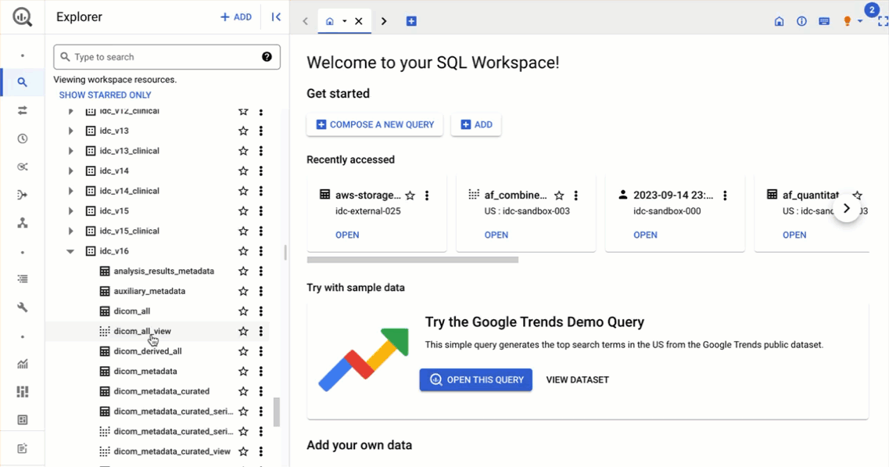

# BigQuery tables

BQ **tables** are organized in BQ **datasets**. BQ datasets are not unlike folders on your computer, but contain tables related to each other instead of files. BQ datasets, in turn, are organized under Google Cloud Platform (GCP) **projects**. GCP projects can be thought of as containers that are managed by a particular organization. To continue with the file system analogy, think about projects as hard drives that contain folders.

This may be a good time for you to complete [Part 1 of the IDC "Getting started" tutorial series](https://github.com/ImagingDataCommons/IDC-Tutorials/blob/master/notebooks/getting_started/part1_prerequisites.ipynb), so that you are able to open the tables and datasets we will be discussing in the following paragraphs!

Let's map the aforementioned project-dataset-table hierarchy to the concrete locations that contain IDC data.

### IDC BigQuery datasets

All of the IDC tables are stored under the `bigquery-public-data` project. That project is managed by Google Public Datasets Program, and contains many public BQ datasets, beyond those maintained by IDC.

All of the IDC tables are organized into datasets by data release version. If you complete the tutorial mentioned above, open the BQ console, and scroll down the list of datasets, you will find those that are named starting with the `idc_v` prefix - those are IDC datasets.&#x20;

<figure><figcaption><p>Some of the BigQuery datasets curated by IDC.</p></figcaption></figure>

Following the prefix, you will find the number that corresponds to the IDC data release version. IDC data has released versions numbered starting from 1 and are incremented by one for each subsequent release. As of writing this, the most recent version of IDC is 23, and you can find dataset `idc_v23` corresponding to this version.

In addition to `idc_v23` you will find a dataset named `idc_v23_clinical`. That dataset contains clinical data accompanying IDC collections. We started clinical data ingestion in IDC v11. If you want to learn more about the organization and searching of clinical data, take a look at the [clinical data documentation](clinical.md).

Finally, you will also see two special datasets: `idc_current` and `idc_current_clinical`. Those two datasets are essentially aliases, or links, to the versioned datasets corresponding to the latest release of IDC data.&#x20;


If you want to explore the latest content of IDC - use `current` datasets.&#x20;

If you want to make sure your queries and data selection are reproducible - always use the version numbered datasets!


### IDC BigQuery tables

Before we dive into discussing the individual tables maintained by IDC, there is just one more BigQuery-specific concept you need to learn: the _view_. A BigQuery view is a table that is defined by an SQL query that is run every time you query the view (you can read more about BQ views in [this article](https://cloud.google.com/bigquery/docs/views-intro)).&#x20;

BQ views can be very handy when you want to simplify your queries by factoring out the part of the query that is often reused. But a key disadvantage of BQ views over tables is the reduced performance and increased cost due to re-running the query each time you query the view.

As we will discuss further, most of the tables maintained by IDC are created by joining and/or post-processing other tables. Because of this we rely heavily on BQ views to improve transparency of the provenance of those "derived" tables. BQ views can be easily distinguished from the tables in a given dataset by a different icon. IDC datasets also follow a convention that all views in the versioned datasets include suffix `_view` in the name, and are accompanied by the result of running the query used by the view in a table that has the same name _sans_ the `_view` suffix. See the figure below for an illustration of this convention.

<figure><figcaption><p>In this example, <code>dicom_all_view</code> is a BQ view, as indicated by the icon to the left from the table name. <code>dicom_all</code> table is the result of running the query that defines the <code>dicom_all_view</code>. </p></figcaption></figure>

If you are ever curious (and you should be, at least once in a while!) about the queries behind individual views, you can click on the view in the BQ console, and see the query in the "Details" tab. Try this out yourself to check the query for [`dicom_all_view`](https://console.cloud.google.com/bigquery?p=bigquery-public-data\&d=idc_current\&t=dicom_all_view\&page=table)

<figure><figcaption><p>Yes, you can view the query of a view!</p></figcaption></figure>

Now that we reviewed the main concepts behind IDC tables organization, it is time to explain the sources of metadata contained in those tables. Leaving `_clinical` datasets aside, IDC tables are populated from one of the two sources:

* DICOM metadata extracted from the DICOM files hosted by IDC, and various derivative tables that simplify access to specific DICOM metadata items;
* collection-level and auxiliary metadata, which is not stored in DICOM tags, but is either received by IDC from other sources, or is populated by IDC as part of data curation (these include Digital Object Identifiers, description of the collections, hashsums, etc).

The set of BQ tables and views has grown over time. The enumeration below documents the BQ tables and views as of IDC v23. Some of these tables will not be found in earlier IDC BigQuery datasets.

#### Foundation tables

#### `dicom_metadata`


Table in BigQuery: [`dicom_metadata`](https://console.cloud.google.com/bigquery?p=bigquery-public-data\&d=idc_current\&t=dicom_metadata\&page=table)


Each row in the `dicom_metadata` table holds the DICOM metadata of an instance in the corresponding IDC version. There is a single row for each DICOM instance in the corresponding IDC version, and the columns correspond to the DICOM attributes encountered in the data across all of the ingested instances.

IDC utilizes the standard capabilities of the Google Healthcare API to extract all of the DICOM metadata from the hosted collections into a single BQ table. Conventions of how DICOM attributes of various types are converted into BQ form are covered in the [Understanding the BigQuery DICOM schema](https://cloud.google.com/healthcare/docs/how-tos/dicom-bigquery-schema) Google Healthcare API documentation article.&#x20;

The `dicom_metadata` table contains DICOM metadata extract from the files included in the given IDC data release. I.E., the `dicom_metadata` table in some IDC BQ dataset, e.g. dataset idc\_v22, will contain the metadata of only the DICOM instances in IDC version 22. The amount and variety of the DICOM files grows with the new releases, and the schema of this table reflects the organization of the metadata in each IDC release. Non-sequence attributes, such as `Modality` or `SeriesInstanceUID`, once encountered in any one file will result in the corresponding column being introduced to the table schema (i.e., if we have column `X` in IDC release 11, in all likelihood it will also be present in all of the subsequent releases).&#x20;

Sequence DICOM attributes, however,  may have content that is highly variable across different DICOM instances (especially in Structured Reports). Those attributes will map to the [`STRUCT` BQ SQL type](https://cloud.google.com/bigquery/docs/reference/standard-sql/data-types#struct_type), and it is not unusual to see drastic differences in the corresponding columns of the table between different releases.

`dicom_metadata` can be used to conduct detailed explorations of the metadata content, and build cohorts using fine-grained controls not accessible from the IDC portal. Note that the `dicom_all` table, described below, is probably a better choice for such explorations.&#x20;


Due to the existing limitations of Google Healthcare API, not all of the DICOM attributes are extracted and are available in BigQuery tables. Specifically:

* sequences that have more than 15 levels of nesting are not extracted (see [https://cloud.google.com/bigquery/docs/nested-repeated](https://cloud.google.com/bigquery/docs/nested-repeated)) - we believe this limitation does not affect the data stored in IDC
* sequences that contain around 1MiB of data are dropped from BigQuery export and RetrieveMetadata output currently. 1MiB is not an exact limit, but it can be used as a rough estimate of whether or not the API will drop the tag (this limitation was not documented as of writing this) - we know that some of the instances in IDC will be affected by this limitation. The fix for this limitation is targeted for sometime in 2021, according to the communication with Google Healthcare support.


#### `auxiliary_metadata`


Table in BigQuery: [`auxiliary_metadata`](https://console.cloud.google.com/bigquery?p=bigquery-public-data\&d=idc_current\&t=auxiliary_metadata\&page=table)


This table defines the contents of the corresponding IDC version. There is a row for each instance in the version. We group the attributes for convenience:

Collection attributes:

* `collection_name:` Collection name as used externally by IDC webapp)
* `collection_id:` Collection ID as used internally by IDC webapp and accepted by the IDC API
* `collection_timestamp:` Datetime when the IDC data in the collection was last revised
* `collection_hash`: md5 hash of the of this version of the collection containing this instance
* `collection_init_idc_version:` The IDC version in which the collection containing this instance first appeared
* `collection_revised_idc_version:` The IDC version in which this version of the collection containing this instance first appeared

Patient attributes:

* `submitter_case_id:`The Patient ID assigned by the submitter of this data. This is the same as the DICOM PatientID
*   `idc_case_id:`IDC generated UUID that uniquely identifies the patient containing this instance

    This is needed because DICOM PatientIDs are not required to be globally unique
* `patient_hash`: md5 hash of this version of the patient/case containing this instance
* `patient_init_idc_version:` The IDC version in which the patient containing this instance first appeared
* `patient_revised_idc_version:` The IDC version in which this version of the patient/case containing this instance first appeared

Study attributes:

* `StudyInstanceUID:` DICOM UID of the study containing this instance
* `study_uuid:`IDC assigned UUID that identifies a version of the study containing this instance.
* `study_instances:` The number of instances in the study containing this instance
* `study_hash`: md5 hash of the data in this version of the study containing this instance
* `study_init_idc_version:` The IDC version in which the study containing this instance first appeared
* `study_revised_idc_version:` The IDC version in which this version of the study containing this instance first appeared

Series attributes:

* `SeriesInstanceUID:` DICOM UID of the series containing this instance
* `series_uuid:`IDC assigned UUID that identifies the version of the series containing this instance
* `series_gcs_url`: URL of the Google Cloud Storage (GCS) folder of the series containing this instance
* `series_aws_url`: URL of the Amazon Web Services (AWS) folder of the series containing this instance
* `source_doi:` The DOI of an information page corresponding to the original data collection or analysis results that is the source of this instance
* `source_url:` The URL of an information page that describes the original collection or analysis result that is the source of this instance
* `versioned_source_doi`: If non-null, the DOI of a wiki page that describes the original collection or analysis result that includes this version of this instance
* `series_instances:` The number of instances in the series containing this instance
* `series_hash`: md5 hash of the data in the this version of the series containing this instance
* `access:` Collection access status: 'Public' or 'Limited'. (Currently all data is 'Public')
* `series_init_idc_version:` The IDC version in which the series containing this instance first appeared
* `series_revised_idc_version:` The IDC version in which this version of the series containing this instance first appeared

Instance attributes:

* `SOPInstanceUID:` DICOM UID of this instance.
* `instance_uuid:`IDC assigned UUID that identifies the version of this instance.
* `gcs_url:` The GCS URL of a file containing the version of this instance that is identified by this `series_uuid/instance_uuid`
* `gcs_bucket` : Name of the Google Cloud Storage (GCS) bucket containing the current version of this instance
* `aws_url:` The AWS URL of a file containing the version of this instance that is identified by this `series_uuid/instance_uuid`
* `aws_bucket` : Name to the Amazon Web Services (AWS) bucket containing the current version of this instance
* `instance_hash`: the md5 hash of this version of this instance
* `instance_size:` the size, in bytes, of this version of this instance
* `instance_init_idc_version:` The IDC version in which this instance first appeared
* `instance_revised_idc_version:` The IDC version in which this version of this instance first appeared
* `license_url:` The URL of a web page that describes the license governing this version of this instance
* `license_long_name:` A long form name of the license governing this version of this instance
* `license_short_name:` A short form name of the license governing this version of this instance

#### `mutable_metadata`


Table in BigQuery: [`mutable_metadata`](https://console.cloud.google.com/bigquery?p=bigquery-public-data\&d=idc_current\&t=original_collections_metadata\&page=table)


Some non-DICOM metadata may change over time. This includes the GCS and AWS URLs of instance data, the license of an instance, the accessibility of each instance and the URL of an instance's associated description page. BigQuery metadata tables such as the auxiliary\_metadata and dicom\_all tables in an IDC per-version dataset are never revised even when such metadata changes. However, tables in the datasets of previous IDC versions can be joined with the mutable\_metadata table to obtain the current values of these mutable attributes.

The table has one row for each version of each instance:

* `crdc_instance_uuid`: The uuid of an instance version
* `crdc_series_uuid`: The uuid of a series version that contains this instance version
* `crdc_study_uuid`: The uuid of a study version that contains the series version
* `gcs_url`: URL to the Google Cloud Storage (GCS) object containing this instance version
* `aws_url`: URL to the Amazon Web Services (AWS) object containing this instance version
* `access`: Current access status of this instance (Public or Limited)
* `source_url`: The URL of a page that describes the original collection or analysis result that includes this instance
* `source_doi`: The DOI of a page that describes the original collection or analysis result that includes this instance
* `versioned_source_doi`: If non-null, the DOI of a wiki page that describes the original collection or analysis result that includes this version of this instance
* `license_long_name`: Long name of license of this analysis result
* `license_short_name`: Short name of license of this analysis result
* `license_url`: URL of license of this analysis result

#### `original_collections_metadata`


Table in BigQuery: [`original_collections_metadata`](https://console.cloud.google.com/bigquery?p=bigquery-public-data\&d=idc_current\&t=original_collections_metadata\&page=table)


This table is comprised of IDC data collection-level metadata for the original TCIA data collections hosted by IDC, for the most part corresponding to the content available in [this table at TCIA](https://www.cancerimagingarchive.net/collections/). One row per collection:

* `collection_name`:Collection name as used externally by IDC webapp
* `collection_id`: Collection ID as used internally by IDC webapp
* `CancerTypes`: Summary of cancer types in this collection
* `TumorLocations`: Body location that was studied
* `Subjects`: Number of subjects in the collection
* `Species:` Species of collection subjects
* `Sources`: A repeated record of
  * `Access`: Limited or Public (currently only Public)
  * `source_doi`: DOI that can be resolved at doi.org to a collection information page
  * `source_url`: URL of collection information page
  * `ImageType`: Enumeration of image types/modalities in this source
  * `license`: a record of
    * `license_url`: URL of license of this (sub)collection
    * `license_long_name`: Long name of license of this (sub)collection
    * `license_short_name`: Short name of license of this (sub)collection
  * `Citation`: Citation to be used for this source
* `SupportingData:`Type(s) of additional data available
* `Program:` The program to which this collection belongs
* `Status:`Collection status: "Ongoing" or "Complete"
* `Updated:` Most recent update date reported by the collection source
* `Description:` Description of the collection (HTML format)

#### `analysis_results_metadata`


Table in BigQuery: [`analysis_results_metadata`](https://console.cloud.google.com/bigquery?p=bigquery-public-data\&d=idc_current\&t=analysis_results_metadata\&page=table)


Metadata for the TCIA analysis results hosted by IDC, for the most part corresponding to the content available in [this table at TCIA](https://www.cancerimagingarchive.net/tcia-analysis-results/). One row per analysis result:

* `ID:` Results ID
* `Title:` Descriptive title
* `Access:` Limited of Public (currently all Public)
* `source_doi:`DOI that can be resolved at doi.org to the information page for this analysis result
* `source_url:` URL of a the information page for this analysis result
* `CancerTypes:`Types of cancer analyzed
* `TumorLocations:`Body locations that were studied
* `Subjects:`Number of subjects whose data was analyzed
* `Collections:` collection\_names of original data collections analyzed
* `Updated:` Date when results were last updated
* `license_url:` URL of license of this analysis result
* `license_long_name:` Long name of license of this analysis result
* `license_short_name:` Short name of license of this analysis result
* `description:` Description of analysis result
* `Citation:` Citation to be used for this source

#### `version_metadata`


Table in BigQuery: [`version_metadata`](https://console.cloud.google.com/bigquery?p=bigquery-public-data\&d=idc_current\&t=version_metadata\&page=table)


Metadata for each IDC version, one row per version:

* `idc_version`: IDC version number
* `version_hash`: MD5 hash of hashes of collections in this version
* `version_timestamp`: Version creation timestamp

#### `idc_pivot`

A table that is the basis for the queries performed by the IDC web app.

#### Derived tables and views

The following tables and views consist of metadata derived from one or more other IDC tables for the convenience of the user. For each such table, `<table_name>`, there is also a corresponding view, `<table_name>_view`, that, when queried, generates an equivalent table.  Several of these tables/views are discussed more completely [here](../../dicom/derived-objects/).

These views are intended as a reference; each view's SQL is available to be used for further investigation. However, the SQL that defines each IDC view is not available from the BQ console. We therefore include it here.

#### `dicom_all`, `dicom_all_view`


Table in BigQuery: [`dicom_all`](https://console.cloud.google.com/bigquery?p=bigquery-public-data\&d=idc_current\&t=dicom_all\&page=table)



Table in BigQuery: [`dicom_all_view`](https://console.cloud.google.com/bigquery?p=bigquery-public-data\&d=idc_current\&t=dicom_all_view\&page=table)


All columns from `dicom_metadata` together with selected date from the `auxiliary_metadata`, `original_collections_metadata`, and `analysis_results_metadata` tables.

`dicom_all_view`  SQL:

```googlesql
WITH
  aux AS (
  SELECT am.*, arm.ID as analysis_result_id
  FROM `nci-idc-bigquery-data.idc_current.auxiliary_metadata` am
  LEFT JOIN `nci-idc-bigquery-data.idc_current.analysis_results_metadata` arm
  ON (LOWER(am.source_doi) = LOWER(arm.source_doi))
  ),
  pre_dicom_all AS (
  SELECT
    aux.collection_name AS collection_name,
    aux.collection_id AS collection_id,
    aux.collection_timestamp AS collection_timestamp,
    aux.collection_hash as collection_hash,
    aux.collection_init_idc_version AS collection_init_idc_version,
    aux.collection_revised_idc_version AS collection_revised_idc_version,
    data_collections.TumorLocations AS collection_tumorLocation,
    data_collections.Species AS collection_species,
    data_collections.CancerTypes AS collection_cancerType,
    aux.access AS access,
    aux.idc_case_id as idc_case_id,
    aux.patient_hash as patient_hash,
    aux.patient_init_idc_version AS patient_init_idc_version,
    aux.patient_revised_idc_version AS patient_revised_idc_version,
    aux.study_uuid as crdc_study_uuid,
    aux.study_hash as study_hash,
    aux.study_init_idc_version AS study_init_idc_version,
    aux.study_revised_idc_version AS study_revised_idc_version,
    aux.series_uuid as crdc_series_uuid,
    aux.series_gcs_url as series_gcs_url,
    aux.series_aws_url as series_aws_url,
    aux.series_hash as series_hash,
    aux.series_init_idc_version AS series_init_idc_version,
    aux.series_revised_idc_version AS series_revised_idc_version,
    aux.SOPInstanceUID AS SOPInstanceUID,
    aux.instance_uuid as crdc_instance_uuid,
    aux.gcs_url as gcs_url,
    aux.gcs_bucket as gcs_bucket,
    aux.aws_url as aws_url,
    aux.aws_bucket as aws_bucket,
    aux.instance_size as instance_size,
    aux.instance_hash as instance_hash,
    aux.instance_init_idc_version AS instance_init_idc_version,
    aux.instance_revised_idc_version AS instance_revised_idc_version,
    aux.Source_DOI as Source_DOI,
    aux.Source_URL as Source_URL,
    aux.versioned_source_doi as Versioned_Source_DOI,
    aux.analysis_result_id as analysis_result_id,
    aux.license_url as license_url,
    aux.license_long_name as license_long_name,
    aux.license_short_name as license_short_name,
--     aux.collection_name AS tcia_api_collection_id,
--     aux.collection_id AS idc_webapp_collection_id,
--     data_collections.Location as tcia_tumorLocation,
--     data_collections.Species as tcia_species,
--     data_collections.CancerType as tcia_cancerType
   FROM
    aux
  INNER JOIN
    `nci-idc-bigquery-data.idc_current.original_collections_metadata` AS data_collections
  ON
    aux.collection_id = data_collections.collection_id)

  SELECT
    pda.collection_name AS collection_name,
    pda.collection_id AS collection_id,
    pda.collection_timestamp AS collection_timestamp,
    pda.collection_hash as collection_hash,
    pda.collection_init_idc_version AS collection_init_idc_version,
    pda.collection_revised_idc_version AS collection_revised_idc_version,
    pda.collection_tumorLocation AS collection_tumorLocation,
    pda.collection_species AS collection_species,
    pda.collection_cancerType AS collection_cancerType,
    pda.access AS access,
    dcm.PatientID as PatientID,
    pda.idc_case_id as idc_case_id,
    pda.patient_hash as patient_hash,
    pda.patient_init_idc_version AS patient_init_idc_version,
    pda.patient_revised_idc_version AS patient_revised_idc_version,
    dcm.StudyInstanceUID AS StudyInstanceUID,
    pda.crdc_study_uuid as crdc_study_uuid,
    pda.study_hash as study_hash,
    pda.study_init_idc_version AS study_init_idc_version,
    pda.study_revised_idc_version AS study_revised_idc_version,
    dcm.SeriesInstanceUID AS SeriesInstanceUID,
    pda.crdc_series_uuid as crdc_series_uuid,
    pda.series_gcs_url as series_gcs_url,
    pda.series_aws_url as series_aws_url,
    pda.series_hash as series_hash,
    pda.series_init_idc_version AS series_init_idc_version,
    pda.series_revised_idc_version AS series_revised_idc_version,
    dcm.SOPInstanceUID AS SOPInstanceUID,
    pda.crdc_instance_uuid as crdc_instance_uuid,
    pda.gcs_url as gcs_url,
    pda.gcs_bucket as gcs_bucket,
    pda.aws_url as aws_url,
    pda.aws_bucket as aws_bucket,
    pda.instance_size as instance_size,
    pda.instance_hash as instance_hash,
    pda.instance_init_idc_version AS instance_init_idc_version,
    pda.instance_revised_idc_version AS instance_revised_idc_version,
    pda.Source_DOI as Source_DOI,
    pda.Source_URL as Source_URL,
    pda.Versioned_Source_DOI as Versioned_Source_DOI,
    pda.analysis_result_id as analysis_result_id,
    pda.license_url as license_url,
    pda.license_long_name as license_long_name,
    pda.license_short_name as license_short_name,
    dcm.* except(SOPInstanceUID, PatientID, StudyInstanceUID, SeriesInstanceUID)
  FROM pre_dicom_all pda
  INNER JOIN
    `nci-idc-bigquery-data.idc_current.dicom_metadata` AS dcm
  ON
    pda.SOPInstanceUID = dcm.SOPInstanceUID
```

#### `segmentations`, `segmentations_view`


Table in BigQuery: [`segmentations`](https://console.cloud.google.com/bigquery?p=bigquery-public-data\&d=idc_current\&t=segmentations\&page=table)



Table in BigQuery: [`segmentations_view`](https://console.cloud.google.com/bigquery?p=bigquery-public-data\&d=idc_current\&t=segmentations_view\&page=table)


This table is derived from `dicom_all` to simplify access to the attributes of DICOM Segmentation objects available in IDC. Each row in this table corresponds to one DICOM Segmentation instance segment.

`segmentations_view` SQL:

```googlesql
WITH
  segmentations AS (
  WITH
    segs AS (
    SELECT
      PatientID,
      StudyInstanceUID,
      SeriesInstanceUID,
      SOPInstanceUID,
      FrameOfReferenceUID,
      SegmentSequence
    FROM
      `nci-idc-bigquery-data.idc_current.dicom_metadata`
    WHERE
      # more reliable than Modality = "SEG"
      SOPClassUID = "1.2.840.10008.5.1.4.1.1.66.4" )
  SELECT
    PatientID,
    StudyInstanceUID,
    SeriesInstanceUID,
    SOPInstanceUID,
    FrameOfReferenceUID,
    CASE ARRAY_LENGTH(unnested.AnatomicRegionSequence)
      WHEN 0 THEN NULL
    ELSE
    STRUCT( unnested.AnatomicRegionSequence [
    OFFSET
      (0)].CodeValue AS CodeValue,
      unnested.AnatomicRegionSequence [
    OFFSET
      (0)].CodingSchemeDesignator AS CodingSchemeDesignator,
      unnested.AnatomicRegionSequence [
    OFFSET
      (0)].CodeMeaning AS CodeMeaning )
  END
    AS AnatomicRegion,
    CASE ( ARRAY_LENGTH(unnested.AnatomicRegionSequence) > 0
      AND ARRAY_LENGTH( unnested.AnatomicRegionSequence [
      OFFSET
        (0)].AnatomicRegionModifierSequence ) > 0 )
      WHEN TRUE THEN unnested.AnatomicRegionSequence [ OFFSET (0)].AnatomicRegionModifierSequence [ OFFSET (0)] #unnested.AnatomicRegionSequence[OFFSET(0)].AnatomicRegionModifierSequence,
    ELSE
    NULL
  END
    AS AnatomicRegionModifier,
    CASE ARRAY_LENGTH(unnested.SegmentedPropertyCategoryCodeSequence)
      WHEN 0 THEN NULL
    ELSE
    unnested.SegmentedPropertyCategoryCodeSequence [
  OFFSET
    (0)]
  END
    AS SegmentedPropertyCategory,
    CASE ARRAY_LENGTH(unnested.SegmentedPropertyTypeCodeSequence)
      WHEN 0 THEN NULL
    ELSE
    unnested.SegmentedPropertyTypeCodeSequence [
  OFFSET
    (0)]
  END
    AS SegmentedPropertyType,
    #unnested.SegmentedPropertyTypeCodeSequence,
    #unnested.SegmentedPropertyTypeModifierCodeSequence,
    unnested.SegmentAlgorithmType,
	unnested.SegmentAlgorithmName,
    unnested.SegmentNumber,
    unnested.TrackingUID,
    unnested.TrackingID
  FROM
    segs
  CROSS JOIN
    UNNEST(SegmentSequence) AS unnested),
  sampled_sops AS (
  SELECT
    SOPInstanceUID AS seg_SOPInstanceUID,
    ReferencedSeriesSequence[SAFE_OFFSET(0)].ReferencedInstanceSequence[SAFE_OFFSET(0)].ReferencedSOPInstanceUID AS rss_one,
    ReferencedImageSequence[SAFE_OFFSET(0)].ReferencedSOPInstanceUID AS ris_one,
    SourceImageSequence[SAFE_OFFSET(0)].ReferencedSOPInstanceUID AS sis_one
  FROM
    `nci-idc-bigquery-data.idc_current.dicom_all`
  WHERE
    Modality="SEG"
    AND SOPClassUID = "1.2.840.10008.5.1.4.1.1.66.4" ),
  coalesced_ref AS (
  SELECT
    *,
    COALESCE(rss_one, ris_one, sis_one) AS referenced_sop
  FROM
    sampled_sops)
SELECT
  segmentations.*,
  dicom_all.SeriesInstanceUID AS segmented_SeriesInstanceUID,
  CONCAT("https://viewer.imaging.datacommons.cancer.gov/viewer/", segmentations.StudyInstanceUID,"?seriesInstanceUID=",segmentations.SeriesInstanceUID,",",dicom_all.SeriesInstanceUID) AS viewer_url,
FROM
  coalesced_ref
JOIN
  `nci-idc-bigquery-data.idc_current.dicom_all` AS dicom_all
ON
  coalesced_ref.referenced_sop = dicom_all.SOPInstanceUID
RIGHT JOIN
  segmentations
ON
  segmentations.SOPInstanceUID = coalesced_ref.seg_SOPInstanceUID
```

#### `measurement_groups`, `measurement_groups_view`


Table in BigQuery: [`measurement_groups`](https://console.cloud.google.com/bigquery?p=bigquery-public-data\&d=idc_current\&t=measurement_groups\&page=table)



Table in BigQuery: [`measurement_groups_view`](https://console.cloud.google.com/bigquery?p=bigquery-public-data\&d=idc_current\&t=measurement_groups_view\&page=table)


This table is derived from `dicom_all` to simplify access to the measurement groups encoded in DICOM Structured Report TID 1500 objects available in IDC. Specifically, this table contains measurement groups corresponding to the "Measurement group" content item in the [TID 1500 Measurement report](https://dicom.nema.org/medical/dicom/current/output/chtml/part16/chapter_A.html#sect_TID_1500) DICOM SR objects.

Each row corresponds to one TID1500 measurement group.

`measurement_groups_view` SQL:

```googlesql
WITH
  measurementGroups AS (
  WITH
    contentSequenceLevel1 AS (
    WITH
      structuredReports AS (
      SELECT
        PatientID,
        SOPInstanceUID,
        SeriesInstanceUID,
        SeriesDescription,
        ContentSequence
      FROM
        `nci-idc-bigquery-data.idc_current.dicom_metadata`
      WHERE
        ( SOPClassUID = "1.2.840.10008.5.1.4.1.1.88.11"
          OR SOPClassUID = "1.2.840.10008.5.1.4.1.1.88.22"
          OR SOPClassUID = "1.2.840.10008.5.1.4.1.1.88.33"
          OR SOPClassUID = "1.2.840.10008.5.1.4.1.1.88.34"
          OR SOPClassUID = "1.2.840.10008.5.1.4.1.1.88.35" )
        AND ARRAY_LENGTH(ContentTemplateSequence) <> 0
        AND ContentTemplateSequence [
      OFFSET
        (0)].TemplateIdentifier = "1500"
        AND ContentTemplateSequence [
      OFFSET
        (0)].MappingResource = "DCMR" )
    SELECT
      PatientID,
      SOPInstanceUID,
      SeriesInstanceUID,
      SeriesDescription,
      contentSequence
    FROM
      structuredReports
    CROSS JOIN
      UNNEST(ContentSequence) AS contentSequence )
  SELECT
    PatientID,
    SOPInstanceUID,
    SeriesInstanceUID,
    SeriesDescription,
    contentSequence,
    measurementGroup_number
  FROM
    contentSequenceLevel1
  CROSS JOIN
    UNNEST (contentSequence.ContentSequence) AS contentSequence
  WITH
  OFFSET
    AS measurementGroup_number
  WHERE
    contentSequence.ValueType = "CONTAINER"
    AND contentSequence.ConceptNameCodeSequence [
  OFFSET
    (0)].CodeMeaning = "Measurement Group" ),
  measurementGroups_withTrackingID AS (
  SELECT
    SOPInstanceUID,
    PatientID,
    SeriesInstanceUID,
    SeriesDescription,
    measurementGroup_number,
    unnestedContentSequence.TextValue AS trackingIdentifier,
    measurementGroups.contentSequence
  FROM
    measurementGroups
  CROSS JOIN
    UNNEST(contentSequence.ContentSequence) AS unnestedContentSequence
  WHERE
    unnestedContentSequence.ValueType = "TEXT"
    AND ( unnestedContentSequence.ConceptNameCodeSequence [
    OFFSET
      (0)].CodeValue = "112039"
      AND unnestedContentSequence.ConceptNameCodeSequence [
    OFFSET
      (0)].CodingSchemeDesignator = "DCM" ) ),
  measurementGroups_withTrackingUID AS (
  SELECT
    SOPInstanceUID,
    SeriesInstanceUID,
    measurementGroup_number,
    unnestedContentSequence.UID AS trackingUniqueIdentifier
  FROM
    measurementGroups
  CROSS JOIN
    UNNEST(contentSequence.ContentSequence) AS unnestedContentSequence
  WHERE
    unnestedContentSequence.ValueType = "UIDREF"
    AND ( unnestedContentSequence.ConceptNameCodeSequence [
    OFFSET
      (0)].CodeValue = "112040"
      AND unnestedContentSequence.ConceptNameCodeSequence [
    OFFSET
      (0)].CodingSchemeDesignator = "DCM" ) ),
  measurementGroups_withSegmentation AS (
  SELECT
    SOPInstanceUID,
    measurementGroup_number,
    unnestedContentSequence.ReferencedSOPSequence[
  OFFSET
    (0)].ReferencedSOPInstanceUID AS segmentationInstanceUID,
    unnestedContentSequence.ReferencedSOPSequence[
  OFFSET
    (0)].ReferencedSegmentNumber AS segmentationSegmentNumber
  FROM
    measurementGroups
  CROSS JOIN
    UNNEST(contentSequence.ContentSequence) AS unnestedContentSequence
  WHERE
    unnestedContentSequence.ValueType = "IMAGE"
    AND unnestedContentSequence.ReferencedSOPSequence[
  OFFSET
    (0)].ReferencedSOPClassUID = "1.2.840.10008.5.1.4.1.1.66.4" ),
  measurementGroups_withSourceSeries AS (
  SELECT
    SOPInstanceUID,
    measurementGroup_number,
    unnestedContentSequence.UID AS sourceSegmentedSeriesUID
  FROM
    measurementGroups
  CROSS JOIN
    UNNEST(contentSequence.ContentSequence) AS unnestedContentSequence
  WHERE
    unnestedContentSequence.ValueType = "UIDREF"
    AND ( unnestedContentSequence.ConceptNameCodeSequence [
    OFFSET
      (0)].CodeValue = "121232"
      AND unnestedContentSequence.ConceptNameCodeSequence [
    OFFSET
      (0)].CodingSchemeDesignator = "DCM" ) ),
  measurementGroups_withFinding AS (
  SELECT
    SOPInstanceUID,
    measurementGroup_number,
    unnestedContentSequence.ConceptCodeSequence [
  OFFSET
    (0)] AS finding
  FROM
    measurementGroups
  CROSS JOIN
    UNNEST(contentSequence.ContentSequence) AS unnestedContentSequence
  WHERE
    unnestedContentSequence.ValueType = "CODE"
    AND ( unnestedContentSequence.ConceptNameCodeSequence [
    OFFSET
      (0)].CodeValue = "121071"
      AND unnestedContentSequence.ConceptNameCodeSequence [
    OFFSET
      (0)].CodingSchemeDesignator = "DCM" ) ),
  measurementGroups_withFindingSite AS (
  SELECT
    SOPInstanceUID,
    measurementGroup_number,
    unnestedContentSequence.ConceptCodeSequence [
  OFFSET
    (0)] AS findingSite
  FROM
    measurementGroups
  CROSS JOIN
    UNNEST(contentSequence.ContentSequence) AS unnestedContentSequence
  WHERE
    unnestedContentSequence.ValueType = "CODE"
	  AND ( (unnestedContentSequence.ConceptNameCodeSequence [
	OFFSET
	  (0)].CodeValue = "G-C0E3"
	  AND unnestedContentSequence.ConceptNameCodeSequence [
	OFFSET
	  (0)].CodingSchemeDesignator = "SRT" ) OR  
		   (unnestedContentSequence.ConceptNameCodeSequence [
	OFFSET
	  (0)].CodeValue = "363698007"
	  AND unnestedContentSequence.ConceptNameCodeSequence [
	OFFSET
	  (0)].CodingSchemeDesignator = "SCT" ) ) )
	  
SELECT
  mWithUID.SOPInstanceUID,
  mWithUID.SeriesInstanceUID,
  mWithUID.measurementGroup_number,
  mWithUID.trackingUniqueIdentifier,
  mWithID.trackingIdentifier,
  mWithID.PatientID,
  mWithID.SeriesDescription,
  mWithFinding.finding,
  mWithFindingSite.findingSite,
  mWithSourceSeries.sourceSegmentedSeriesUID,
  mWithSegmentation.segmentationInstanceUID,
  dicom_metadata.SeriesInstanceUID AS segmentationSeriesUID,
  mWithSegmentation.segmentationSegmentNumber[SAFE_OFFSET(0)] as segmentationSegmentNumber,
  mWithID.contentSequence
FROM
  measurementGroups_withTrackingUID AS mWithUID
JOIN
  measurementGroups_withTrackingID AS mWithID
  ---
ON
  mWithID.SOPInstanceUID = mWithUID.SOPInstanceUID
  AND mWithID.measurementGroup_number = mWithUID.measurementGroup_number
JOIN
  measurementGroups_withFinding AS mWithFinding
ON
  mWithID.SOPInstanceUID = mWithFinding.SOPInstanceUID
  AND mWithID.measurementGroup_number = mWithFinding.measurementGroup_number
JOIN
  measurementGroups_withFindingSite AS mWithFindingSite
ON
  mWithID.SOPInstanceUID = mWithFindingSite.SOPInstanceUID
  AND mWithID.measurementGroup_number = mWithFindingSite.measurementGroup_number
JOIN
  measurementGroups_withSourceSeries AS mWithSourceSeries
ON
  mWithID.SOPInstanceUID = mWithSourceSeries.SOPInstanceUID
  AND mWithID.measurementGroup_number = mWithSourceSeries.measurementGroup_number
JOIN
  measurementGroups_withSegmentation AS mWithSegmentation
ON
  mWithID.SOPInstanceUID = mWithSegmentation.SOPInstanceUID
  AND mWithID.measurementGroup_number = mWithSegmentation.measurementGroup_number
  ---
JOIN
  `nci-idc-bigquery-data.idc_current.dicom_metadata` AS dicom_metadata
ON
  mWithSegmentation.segmentationInstanceUID = dicom_metadata.SOPInstanceUID
ORDER BY
  trackingUniqueIdentifier
```

#### `qualitative_measurements`, `qualitative_measurements_view`


Table in BigQuery: [`qualitative_measurements`](https://console.cloud.google.com/bigquery?p=bigquery-public-data\&d=idc_current\&t=qualitative_measurements\&page=table)



Table in BigQuery: [`qualitative_measurements_view`](https://console.cloud.google.com/bigquery?p=bigquery-public-data\&d=idc_current\&t=qualitative_measurements_view\&page=table)


This table is derived from `dicom_all` to simplify access to the qualitative measurements in DICOM SR TID1500 objects. It contains coded evaluation results extracted from the DICOM SR TID1500 objects. Each row in this table corresponds to a single qualitative measurement extracted.&#x20;

`qualitative_measurements_view` SQL:

```googlesql
WITH
  contentSequenceLevel3 AS (
  SELECT
    PatientID,
    SOPInstanceUID,
    SeriesInstanceUID,
    measurementGroup_number,
    segmentationInstanceUID,
    segmentationSeriesUID,
    segmentationSegmentNumber,
    sourceSegmentedSeriesUID,
    trackingIdentifier,
    trackingUniqueIdentifier,
    contentSequence.ConceptNameCodeSequence [
  OFFSET
    (0)] AS ConceptNameCodeSequence,
    contentSequence.ConceptCodeSequence [
  OFFSET
    (0)] AS ConceptCodeSequence
  FROM
    `nci-idc-bigquery-data.idc_current.measurement_groups`
  CROSS JOIN
    UNNEST (contentSequence.ContentSequence) AS contentSequence
  WHERE
    contentSequence.ValueType = "CODE" ),
  findingsAndFindingSites AS (
  WITH
    findings AS (
    SELECT
      PatientID,
      SOPInstanceUID,
      measurementGroup_number,
      segmentationInstanceUID,
      segmentationSeriesUID,
      segmentationSegmentNumber,
      sourceSegmentedSeriesUID,
      trackingIdentifier,
      trackingUniqueIdentifier,
      ConceptCodeSequence AS finding
    FROM
      contentSequenceLevel3
    WHERE
      ConceptNameCodeSequence.CodeValue = "121071"
      AND ConceptNameCodeSequence.CodingSchemeDesignator = "DCM" ),
    findingSites AS (
    SELECT
      PatientID,
      SOPInstanceUID,
      measurementGroup_number,
      ConceptCodeSequence AS findingSite
    FROM
      contentSequenceLevel3
    WHERE
      ConceptNameCodeSequence.CodeValue = "G-C0E3"
      AND ConceptNameCodeSequence.CodingSchemeDesignator = "SRT" )
  SELECT
    findings.PatientID,
    findings.SOPInstanceUID,
    findings.finding,
    findings.segmentationInstanceUID,
    findings.segmentationSeriesUID,
    findings.segmentationSegmentNumber,
    findings.sourceSegmentedSeriesUID,
    findings.trackingIdentifier,
    findings.trackingUniqueIdentifier,
    findingSites.findingSite,
    findingSites.measurementGroup_number
  FROM
    findings
  JOIN
    findingSites
  ON
    findings.SOPInstanceUID = findingSites.SOPInstanceUID
    AND findings.measurementGroup_number = findingSites.measurementGroup_number )
SELECT
  contentSequenceLevel3.PatientID,
  contentSequenceLevel3.SOPInstanceUID,
  contentSequenceLevel3.SeriesInstanceUID,
  findingsAndFindingSites.measurementGroup_number,
  findingsAndFindingSites.segmentationInstanceUID,
  findingsAndFindingSites.segmentationSeriesUID,
  findingsAndFindingSites.segmentationSegmentNumber,
  findingsAndFindingSites.sourceSegmentedSeriesUID,
  findingsAndFindingSites.trackingIdentifier,
  findingsAndFindingSites.trackingUniqueIdentifier,
  contentSequenceLevel3.ConceptNameCodeSequence AS Quantity,
  contentSequenceLevel3.ConceptCodeSequence AS Value,
  findingsAndFindingSites.finding,
  findingsAndFindingSites.findingSite
FROM
  contentSequenceLevel3
JOIN
  findingsAndFindingSites
ON
  contentSequenceLevel3.SOPInstanceUID = findingsAndFindingSites.SOPInstanceUID
  AND contentSequenceLevel3.measurementGroup_number = findingsAndFindingSites.measurementGroup_number
WHERE
  # exclude
  ( ConceptNameCodeSequence.CodeMeaning <> "121071"
    AND ConceptNameCodeSequence.CodingSchemeDesignator <> "DCM" ) AND # Finding
  ( ConceptNameCodeSequence.CodeMeaning <> "G-C0E3"
    AND ConceptNameCodeSequence.CodingSchemeDesignator <> "SRT" ) # Finding Site
  # correctness check: adding the below should result in a 36 rows column (4 segmented lesions, with 9 evaluations per each)
  #    AND
  #  contentSequenceLevel3.PatientID = "LIDC-IDRI-0001"
```

#### `quantitative_measurements`, `quantitative_measurements_view`


Table in BigQuery: [`quantitative_measurements`](https://console.cloud.google.com/bigquery?p=bigquery-public-data\&d=idc_current\&t=quantitative_measurements\&page=table)



Table in BigQuery: [`quantitative_measurements_view`](https://console.cloud.google.com/bigquery?p=bigquery-public-data\&d=idc_current\&t=quantitative_measurements_view\&page=table)


This table is derived from `dicom_all` to simplify access to the quantitative measurements in DICOM SR TID1500 objects. It contains quantitative evaluation results extracted from the DICOM SR TID1500 objects. Each row in this table corresponds to a single quantitative measurement extracted.

`quantitative_measurments_view` SQL:

```googlesql
WITH
  ---
  contentSequenceLevel3numeric AS (
  SELECT
    PatientID,
    SOPInstanceUID,
    SeriesInstanceUID,
	  SeriesDescription,
    measurementGroup_number,
    segmentationInstanceUID,
    segmentationSeriesUID,
    segmentationSegmentNumber,
    sourceSegmentedSeriesUID,
    trackingIdentifier,
    trackingUniqueIdentifier,
    contentSequence.ConceptNameCodeSequence [
  SAFE_OFFSET
    (0)] AS ConceptNameCodeSequence,
    contentSequence.MeasuredValueSequence [
  SAFE_OFFSET
    (0)] AS MeasuredValueSequence,
    contentSequence.MeasuredValueSequence [
  SAFE_OFFSET
    (0)].MeasurementUnitsCodeSequence [
  SAFE_OFFSET
    (0)] AS MeasurementUnits,
    contentSequence.ContentSequence
  FROM
    `nci-idc-bigquery-data.idc_current.measurement_groups`
  CROSS JOIN
    UNNEST (contentSequence.ContentSequence) AS contentSequence
  WHERE
    contentSequence.ValueType = "NUM" ),
  ---
  contentSequenceLevel3codes AS (
  SELECT
    PatientID,
    SOPInstanceUID,
	  SeriesDescription,
    measurementGroup_number,
    segmentationInstanceUID,
    segmentationSeriesUID,
    segmentationSegmentNumber,
    sourceSegmentedSeriesUID,
    trackingIdentifier,
    trackingUniqueIdentifier,
    contentSequence.ConceptNameCodeSequence [
  SAFE_OFFSET
    (0)] AS ConceptNameCodeSequence,
    contentSequence.ConceptCodeSequence [
  SAFE_OFFSET
    (0)] AS ConceptCodeSequence,
  contentSequence.ContentSequence AS ContentSequence 
  FROM
    `nci-idc-bigquery-data.idc_current.measurement_groups`
  CROSS JOIN
    UNNEST (contentSequence.ContentSequence) AS contentSequence
  WHERE
    contentSequence.ValueType = "CODE" ),
  ---
  contentSequenceLevel3uidrefs AS (
  SELECT
    contentSequence.ConceptNameCodeSequence [
  SAFE_OFFSET
    (0)] AS ConceptNameCodeSequence,
    contentSequence.ConceptCodeSequence [
  SAFE_OFFSET
    (0)] AS ConceptCodeSequence,
    measurementGroup_number
  FROM
    `nci-idc-bigquery-data.idc_current.measurement_groups`
  CROSS JOIN
    UNNEST (contentSequence.ContentSequence) AS contentSequence
  WHERE
    contentSequence.ValueType = "UIDREF"
    AND ConceptCodeSequence [
  SAFE_OFFSET
    (0)].CodeMeaning = "Tracking Unique Identifier" ),
  ---
  findings AS (
  SELECT
    PatientID,
    SOPInstanceUID,
	SeriesDescription,
    ConceptCodeSequence AS finding,
    measurementGroup_number,
    segmentationInstanceUID,
    segmentationSeriesUID,
    segmentationSegmentNumber,
    sourceSegmentedSeriesUID,
    trackingIdentifier,
    trackingUniqueIdentifier,
  FROM
    contentSequenceLevel3codes
  WHERE
    ConceptNameCodeSequence.CodeValue = "121071"
    AND ConceptNameCodeSequence.CodingSchemeDesignator = "DCM" ),
  ---
  findingSites AS (
  SELECT
    PatientID,
    SOPInstanceUID,
	SeriesDescription,
    ConceptCodeSequence AS findingSite,
    measurementGroup_number,
    CASE ( 
      ContentSequence[SAFE_OFFSET(0)].ConceptNameCodeSequence[SAFE_OFFSET(0)].CodeValue = "272741003" AND 
      ContentSequence[SAFE_OFFSET(0)].ConceptNameCodeSequence[SAFE_OFFSET(0)].CodingSchemeDesignator = "SCT")
            WHEN TRUE THEN STRUCT( contentSequenceLevel3codes.ContentSequence [ SAFE_OFFSET (0)].ConceptCodeSequence [ SAFE_OFFSET (0)].CodeValue AS CodeValue, contentSequenceLevel3codes.ContentSequence [ SAFE_OFFSET (0)].ConceptCodeSequence [ SAFE_OFFSET (0)].CodingSchemeDesignator AS CodingSchemeDesignator, contentSequenceLevel3codes.ContentSequence [ SAFE_OFFSET (0)].ConceptCodeSequence [ SAFE_OFFSET (0)].CodeMeaning AS CodeMeaning )
    ELSE
    STRUCT(NULL as CodeValue,NULL as CodingSchemeDesignator,NULL as CodeMeaning)
  END
    AS lateralityModifier,     # added
  FROM
    contentSequenceLevel3codes
  WHERE
    (ConceptNameCodeSequence.CodeValue = "G-C0E3"
    AND ConceptNameCodeSequence.CodingSchemeDesignator = "SRT" ) OR 
    (ConceptNameCodeSequence.CodeValue = "363698007"
    AND ConceptNameCodeSequence.CodingSchemeDesignator = "SCT" ) ), 
  ---
  findingsAndFindingSites AS (
  SELECT
    findings.PatientID,
    findings.SOPInstanceUID,
	  findings.SeriesDescription,
    findings.finding,
    findingSites.findingSite,
    findingSites.lateralityModifier,
    findingSites.measurementGroup_number,
    findings.segmentationInstanceUID,
    findings.segmentationSeriesUID,
    findings.segmentationSegmentNumber,
    findings.sourceSegmentedSeriesUID,
    findings.trackingIdentifier,
    findings.trackingUniqueIdentifier
  FROM
    findings
  JOIN
    findingSites
  ON
    findings.SOPInstanceUID = findingSites.SOPInstanceUID
    AND findings.measurementGroup_number = findingSites.measurementGroup_number ) ---
  # correctness check: the below should result in 11 rows (this is how many segments/measurement
    # groups are there for each QIN-HEADNCK-01-0139 segmentation
    #SELECT
    #  *
    #FROM
    #  findingsAndFindingSites
    #WHERE
    #  SOPInstanceUID = "1.2.276.0.7230010.3.1.4.8323329.18336.1440004659.731760"
    ---
  SELECT
    contentSequenceLevel3numeric.PatientID,
    contentSequenceLevel3numeric.SOPInstanceUID,
    contentSequenceLevel3numeric.SeriesInstanceUID,
	  contentSequenceLevel3numeric.SeriesDescription,
    contentSequenceLevel3numeric.measurementGroup_number,
    findingsAndFindingSites.segmentationInstanceUID,
    findingsAndFindingSites.segmentationSeriesUID,
    findingsAndFindingSites.segmentationSegmentNumber,
    findingsAndFindingSites.sourceSegmentedSeriesUID,
    findingsAndFindingSites.trackingIdentifier,
    findingsAndFindingSites.trackingUniqueIdentifier,
    contentSequenceLevel3numeric.ConceptNameCodeSequence AS Quantity,
    CASE ( ARRAY_LENGTH(contentSequenceLevel3numeric.ContentSequence) > 0
      AND contentSequenceLevel3numeric.ContentSequence [
    SAFE_OFFSET
      (0)].ConceptNameCodeSequence [
    SAFE_OFFSET
      (0)].CodeValue = "121401"
      AND contentSequenceLevel3numeric.ContentSequence [
    SAFE_OFFSET
      (0)].ConceptNameCodeSequence [
    SAFE_OFFSET
      (0)].CodingSchemeDesignator = "DCM" )
      WHEN TRUE THEN STRUCT( contentSequenceLevel3numeric.ContentSequence [ SAFE_OFFSET (0)].ConceptCodeSequence [ SAFE_OFFSET (0)].CodeValue AS CodeValue, contentSequenceLevel3numeric.ContentSequence [ SAFE_OFFSET (0)].ConceptCodeSequence [ SAFE_OFFSET (0)].CodingSchemeDesignator AS CodingSchemeDesignator, contentSequenceLevel3numeric.ContentSequence [ SAFE_OFFSET (0)].ConceptCodeSequence [ SAFE_OFFSET (0)].CodeMeaning AS CodeMeaning )
    ELSE
    STRUCT(NULL as CodeValue,NULL as CodingSchemeDesignator,NULL as CodeMeaning)
  END
    AS derivationModifier,
    findingsAndFindingSites.lateralityModifier, 
    SAFE_CAST( contentSequenceLevel3numeric.MeasuredValueSequence.NumericValue [
    SAFE_OFFSET
      (0)] AS NUMERIC ) AS Value,
    contentSequenceLevel3numeric.MeasurementUnits AS Units,
    findingsAndFindingSites.finding,
    findingsAndFindingSites.findingSite
  FROM
    contentSequenceLevel3numeric
  JOIN
    findingsAndFindingSites
  ON
    contentSequenceLevel3numeric.SOPInstanceUID = findingsAndFindingSites.SOPInstanceUID
    AND contentSequenceLevel3numeric.measurementGroup_number = findingsAndFindingSites.measurementGroup_number ---
    # correctness check: for this patient, there should be 12 rows: 4 segmented nodules, with 3 numeric evaluations for each
    #WHERE
    #  contentSequenceLevel3numeric.PatientID = "LIDC-IDRI-0001"
    ---
    # correctness check: for this specific instance, there should be 238 rows (11 segments)
    #WHERE
    #  contentSequenceLevel3numeric.SOPInstanceUID = "1.2.276.0.7230010.3.1.4.8323329.18336.1440004659.731760"
    #where contentSequenceLevel3numeric.PatientID LIKE "%QIN%"

```

#### `dicom_metadata_curated`, `dicom_metadata_curated_view`


Table in BigQuery: [`dicom_metadata_curated`](https://console.cloud.google.com/bigquery?p=bigquery-public-data\&d=idc_current\&t=dicom_metadata_curated\&page=table)



Table in BigQuery: [`dicom_metadata_curated_view`](https://console.cloud.google.com/bigquery?p=bigquery-public-data\&d=idc_current\&t=dicom_metadata_curated_view\&page=table)


Curated values of DICOM metadata extracted from `dicom_metadata`.

`dicom_metadata_curated_view` SQL:

```googlesql
SELECT
  SOPInstanceUID,
  SAFE_CAST(SliceThickness AS FLOAT64) AS SliceThickness,
  CASE
    WHEN BodyPartExamined IN ('PORT ABDOMEN', 'J BRZUSZNA', 'ABD', 'BD BD MR ABDOME', 'BD CT ABD WO_W', 'J brzuszna') THEN 'ABDOMEN'
    WHEN BodyPartExamined IN ('Pelvis') THEN 'PELVIS'
    WHEN BodyPartExamined IN ('PET_ABDOMEN_PEL', 'CT ABD PELVIS', 'ABD PEL', 'ABD PELV', 'ABDOMEN PEL', 'ABDOMEN PELVIS', 'ABDOMEN TO PEL', 'ABDOMEN_PELVIS', 'ABDPEL', 'ABDOMEN_PELVIS C', 'PET_ABDOMEN_PELV') THEN 'ABDOMENPELVIS'
    WHEN BodyPartExamined IN ('TH CT CHEST WO',
    'SPI CHEST 5MM',
    'PORT CHEST',
    'PET_CT SCAN CHE',
    'CTA CHEST',
    'CT CHEST W_ENHA',
    'CT CHEST WITH C',
    'CT CHEST WO CE',
    'AP PORTABLE CHE',
    'CHEST COMPUTED',
    'CHEST INF',
    'CHEST NO GRID',
    'CHEST PE',
    'Chest',
    'CT CHEST W_ENHAN',
    'CHEST COMPUTED T',
    'PET_CT SCAN CHES',
    'AP PORTABLE CHES') THEN 'CHEST'
    WHEN BodyPartExamined IN ('MR BRAIN W CON', 'MR NEURO BRAIN', 'BRAIN W/WO_AH', 'BRAIN W/WO_AH32') THEN 'BRAIN'
    WHEN BodyPartExamined IN ('CHEST_TO_PELVIS',
    'CAP',
    'CAP INFUSION',
    'CHABDPELV',
    'CHEST ABD PEL',
    'CHEST ABD PELVI',
    'CHEST TO PEL',
    'CHEST TO PELVIS',
    'CHEST_ABD_PEL',
    'CHEST ABD PELVIS') THEN 'CHESTABDPELVIS'
    WHEN BodyPartExamined IN ('CERVICAL_SPINE') THEN 'CSPINE'
    WHEN BodyPartExamined IN ('THORAXABD',
    'CT_CHABD',
    'CHEST ABDOMEN',
    'CHEST_ABDOMEN',
    'CHEST/ABD') THEN 'CHESTABDOMEN'
    WHEN BodyPartExamined IN ('CT 3PHASE REN', 'Kidney') THEN 'KIDNEY'
    WHEN BodyPartExamined IN ('THORAX CT _AH05',
    'THORAX CT _OT01',
    'CT THORAX W CNT',
    'Thorax') THEN 'THORAX'
    WHEN BodyPartExamined IN ('HEAD_NECK', 'HEAD-AND-NECK', 'HEAD-NECK', 'HEADANDNECK') THEN 'HEADNECK'
    WHEN BodyPartExamined IN ('LUMBO-SACRAL SP',
    'LUMBO-SACRAL SPI') THEN 'LSSPINE'
    WHEN BodyPartExamined IN ('NECK TO PELVIS', 'NECKCHESTABDPEL') THEN 'NECKCHESTABDPELV'
    WHEN BodyPartExamined IN ('THORACIC SPINE') THEN 'TSPINE'
    WHEN BodyPartExamined IN ('WHOLE BODY') THEN 'WHOLEBODY'
  ELSE
  BodyPartExamined
END
  AS BodyPartExamined
FROM
  `nci-idc-bigquery-data.idc_current.dicom_metadata` AS dcm

```

#### `dicom_metadata_curated_series_level`, `dicom_metadata_curated_series_level_view`


Table in BigQuery: [`dicom_metadata_curated_series_level`](https://console.cloud.google.com/bigquery?p=bigquery-public-data\&d=idc_current\&t=dicom_metadata_curated_series_level\&page=table)



Table in BigQuery: [`dicom_metadata_curated_series_level_view`](https://console.cloud.google.com/bigquery?p=bigquery-public-data\&d=idc_current\&t=dicom_metadata_curated_series_level_view\&page=table)


Curated columns from `dicom_metadata` that have been aggregated/cleaned up to describe content at the series level. Each row in this table corresponds to a DICOM instance in IDC. The columns are curated by defining queries that apply transformations to the original values of DICOM attributes.

`dicom_metadata_curated_series_level_view` SQL:

```googlesql
WITH
  temp_table AS (
  SELECT
    dicom_all.SeriesInstanceUID,
    ANY_VALUE(Modality) AS Modality,
    STRING_AGG(DISTINCT(collection_id),",") AS collection_id,
    ANY_VALUE(OpticalPathSequence[SAFE_OFFSET(0)].ObjectiveLensPower) AS ObjectiveLensPower,
    MAX(DISTINCT(TotalPixelMatrixColumns)) AS max_TotalPixelMatrixColumns,
    MAX(DISTINCT(TotalPixelMatrixRows)) AS max_TotalPixelMatrixRows,
    MAX(DISTINCT(`Columns`)) AS max_Columns,
    MAX(DISTINCT(`Rows`)) AS max_Rows,
    MIN(DISTINCT(SAFE_CAST(PixelSpacing[SAFE_OFFSET(0)] AS FLOAT64))) AS min_spacing_0,
    MIN(SAFE_CAST(SharedFunctionalGroupsSequence[SAFE_OFFSET(0)].PixelMeasuresSequence[SAFE_OFFSET(0)]. PixelSpacing[SAFE_OFFSET(0)] AS FLOAT64)) AS fg_min_spacing_0,
    ARRAY_AGG(DISTINCT(CONCAT(SpecimenDescriptionSequence[SAFE_OFFSET(0)].PrimaryAnatomicStructureSequence[SAFE_OFFSET(0)].CodingSchemeDesignator,":", SpecimenDescriptionSequence[SAFE_OFFSET(0)].PrimaryAnatomicStructureSequence[SAFE_OFFSET(0)].CodeValue, ":", SpecimenDescriptionSequence[SAFE_OFFSET(0)].PrimaryAnatomicStructureSequence[SAFE_OFFSET(0)].CodeMeaning)) IGNORE NULLS)[SAFE_OFFSET(0)] AS primaryAnatomicStructure_code_str,
    ARRAY_AGG(DISTINCT(CONCAT(SpecimenDescriptionSequence[SAFE_OFFSET(0)].PrimaryAnatomicStructureSequence[SAFE_OFFSET(0)].PrimaryAnatomicStructureModifierSequence[SAFE_OFFSET(0)].CodingSchemeDesignator,":", SpecimenDescriptionSequence[SAFE_OFFSET(0)].PrimaryAnatomicStructureSequence[SAFE_OFFSET(0)].PrimaryAnatomicStructureModifierSequence[SAFE_OFFSET(0)].CodeValue, ":", SpecimenDescriptionSequence[SAFE_OFFSET(0)].PrimaryAnatomicStructureSequence[SAFE_OFFSET(0)].PrimaryAnatomicStructureModifierSequence[SAFE_OFFSET(0)].CodeMeaning)) IGNORE NULLS)[SAFE_OFFSET(0)] AS primaryAnatomicStructureModifier_code_str,

    ARRAY_AGG(DISTINCT(CONCAT(OpticalPathSequence[SAFE_OFFSET(0)].IlluminationTypeCodeSequence[SAFE_OFFSET(0)].CodingSchemeDesignator,":", OpticalPathSequence[SAFE_OFFSET(0)].IlluminationTypeCodeSequence[SAFE_OFFSET(0)].CodeValue, ":", OpticalPathSequence[SAFE_OFFSET(0)].IlluminationTypeCodeSequence[SAFE_OFFSET(0)].CodeMeaning)) IGNORE NULLS)[SAFE_OFFSET(0)] AS illuminationType_code_str,
  FROM
    `nci-idc-bigquery-data.idc_current.dicom_all` AS dicom_all
  GROUP BY
    SeriesInstanceUID
  ),

SpecimenPreparationSequence_unnested AS (
      SELECT
        SeriesInstanceUID,
        concept_name_code_sequence.CodeMeaning AS cnc_cm,
        concept_name_code_sequence.CodingSchemeDesignator AS cnc_csd,
        concept_name_code_sequence.CodeValue AS cnc_val,
        concept_code_sequence.CodeMeaning AS ccs_cm,
        concept_code_sequence.CodingSchemeDesignator AS ccs_csd,
        concept_code_sequence.CodeValue AS ccs_val,
      FROM `bigquery-public-data.idc_v18.dicom_all`,
      UNNEST(SpecimenDescriptionSequence[SAFE_OFFSET(0)].SpecimenPreparationSequence) as preparation_unnest_step1,
      UNNEST(preparation_unnest_step1.SpecimenPreparationStepContentItemSequence) as preparation_unnest_step2,
      UNNEST(preparation_unnest_step2.ConceptNameCodeSequence) as concept_name_code_sequence,
      UNNEST(preparation_unnest_step2.ConceptCodeSequence) as concept_code_sequence
    ),

    slide_embedding AS (
    SELECT
      SeriesInstanceUID,
      ARRAY_AGG(DISTINCT(CONCAT(ccs_cm,":",ccs_csd,":",ccs_val))) as embeddingMedium_code_str
    FROM SpecimenPreparationSequence_unnested
    WHERE (cnc_csd = 'SCT' and cnc_val = '430863003') -- CodeMeaning is 'Embedding medium'
    GROUP BY SeriesInstanceUID
    ),

    slide_fixative AS (
    SELECT
      SeriesInstanceUID,
      ARRAY_AGG(DISTINCT(CONCAT(ccs_cm, ":", ccs_csd,":",ccs_val))) as tissueFixative_code_str
    FROM SpecimenPreparationSequence_unnested
    WHERE (cnc_csd = 'SCT' and cnc_val = '430864009') -- CodeMeaning is 'Tissue Fixative'
    GROUP BY SeriesInstanceUID
    ),

    slide_staining AS (
    SELECT
      SeriesInstanceUID,
      ARRAY_AGG(DISTINCT(CONCAT(ccs_cm, ":", ccs_csd,":",ccs_val))) as staining_usingSubstance_code_str,
    FROM SpecimenPreparationSequence_unnested
    WHERE (cnc_csd = 'SCT' and cnc_val = '424361007') -- CodeMeaning is 'Using substance'
    GROUP BY SeriesInstanceUID
    )

SELECT
  temp_table.SeriesInstanceUID,
  temp_table.Modality,
  -- Embedding Medium
  ARRAY(
    SELECT IF(code IS NULL, NULL, SPLIT(code, ':')[SAFE_OFFSET(0)])
    FROM UNNEST(embeddingMedium_code_str) AS code
  ) AS embeddingMedium_CodeMeaning,
  ARRAY(
    SELECT IF(code IS NULL, NULL,
              IF(STRPOS(code, ':') = 0, NULL,
                 SUBSTR(code, STRPOS(code, ':') + 1)))
    FROM UNNEST(embeddingMedium_code_str) AS code
  ) AS embeddingMedium_code_designator_value_str,
  -- Tissue Fixative
  ARRAY(
    SELECT IF(code IS NULL, NULL, SPLIT(code, ':')[SAFE_OFFSET(0)])
    FROM UNNEST(tissueFixative_code_str) AS code
  ) AS tissueFixative_CodeMeaning,
  ARRAY(
    SELECT IF(code IS NULL, NULL,
              IF(STRPOS(code, ':') = 0, NULL,
                 SUBSTR(code, STRPOS(code, ':') + 1)))
    FROM UNNEST(tissueFixative_code_str) AS code
  ) AS tissueFixative_code_designator_value_str,
  -- Staining using substance
  ARRAY(
    SELECT IF(code IS NULL, NULL, SPLIT(code, ':')[SAFE_OFFSET(0)])
    FROM UNNEST(staining_usingSubstance_code_str) AS code
  ) AS staining_usingSubstance_CodeMeaning,
  ARRAY(
    SELECT IF(code IS NULL, NULL,
              IF(STRPOS(code, ':') = 0, NULL,
                 SUBSTR(code, STRPOS(code, ':') + 1)))
    FROM UNNEST(staining_usingSubstance_code_str) AS code
  ) AS staining_usingSubstance_code_designator_value_str,

  if(COALESCE(min_spacing_0, fg_min_spacing_0) = 0, 0,
    round(COALESCE(min_spacing_0, fg_min_spacing_0) ,CAST(2 -1-floor(log10(abs(COALESCE(min_spacing_0, fg_min_spacing_0) ))) AS INT64))) AS min_PixelSpacing_2sf,
  COALESCE(max_TotalPixelMatrixColumns, max_Columns) AS max_TotalPixelMatrixColumns,
  COALESCE(max_TotalPixelMatrixRows, max_Rows) AS max_TotalPixelMatrixRows,
  SAFE_CAST(ObjectiveLensPower as INT) as ObjectiveLensPower,
  CONCAT(SPLIT(primaryAnatomicStructure_code_str,":")[SAFE_OFFSET(0)],":",SPLIT(primaryAnatomicStructure_code_str,":")[SAFE_OFFSET(1)]) as primaryAnatomicStructure_code_designator_value_str,
  SPLIT(primaryAnatomicStructure_code_str,":")[SAFE_OFFSET(2)] as primaryAnatomicStructure_CodeMeaning,
  CONCAT(SPLIT(primaryAnatomicStructureModifier_code_str,":")[SAFE_OFFSET(0)],":",SPLIT(primaryAnatomicStructureModifier_code_str,":")[SAFE_OFFSET(1)]) as primaryAnatomicStructureModifier_code_designator_value_str,
  SPLIT(primaryAnatomicStructureModifier_code_str,":")[SAFE_OFFSET(2)] as primaryAnatomicStructureModifier_CodeMeaning,

  CONCAT(SPLIT(illuminationType_code_str,":")[SAFE_OFFSET(0)],":",SPLIT(illuminationType_code_str,":")[SAFE_OFFSET(1)]) as illuminationType_code_designator_value_str,
  SPLIT(illuminationType_code_str,":")[SAFE_OFFSET(2)] as illuminationType_CodeMeaning,
FROM
  temp_table
LEFT JOIN slide_embedding on temp_table.SeriesInstanceUID = slide_embedding.SeriesInstanceUID
LEFT JOIN slide_fixative on temp_table.SeriesInstanceUID = slide_fixative.SeriesInstanceUID
LEFT JOIN slide_staining on temp_table.SeriesInstanceUID = slide_staining.SeriesInstanceUID
```

### Collection-specific BigQuery tables

Most clinical data is found in the [idc\_v\<idc\_version>\_clinical datasets](clinical.md). However, a few tables of clinical data are found in the idc\_v\<idc\_version> datasets.

#### TCGA

The following tables contain TCGA-specific metadata:

* `tcga_biospecimen_rel9:` biospecimen metadata
* `tcga_clinical_rel9:` clinical metadata

