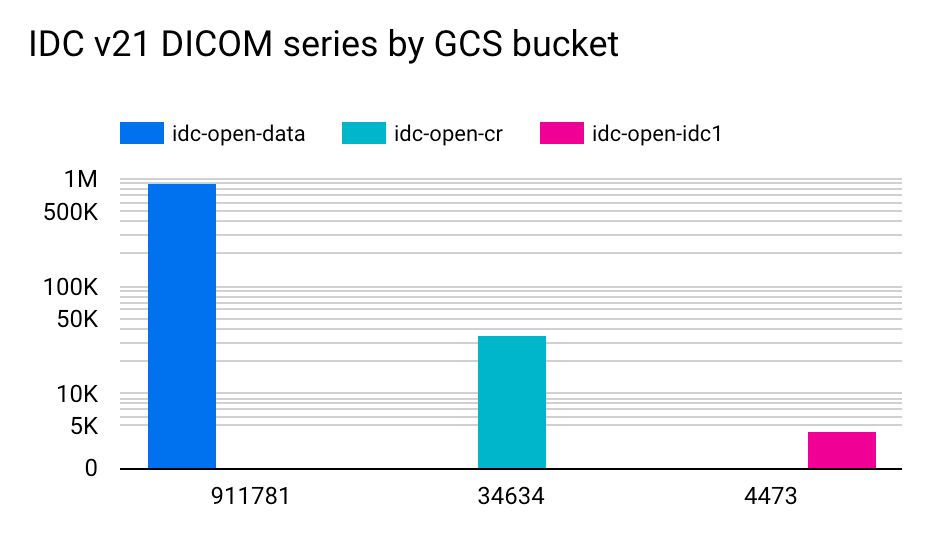

# DICOM stores

If you would like to access IDC data via [DICOMweb interface](https://www.dicomstandard.org/using/dicomweb), you have two options:&#x20;

1. IDC-maintained DICOM store available via proxy
2. DICOM store maintained by Google Healthcare

In the following we provide details for each of those options.

### IDC-maintained DICOM store via proxy

This store contains all of the data for the current IDC data release. It does not require authentication and is available via the following DICOMweb URL of the proxy (you can ignore the "viewer-only-no-downloads" part in the URL, it is a legacy constraint that is no longer applicable).

DICOMweb URL:


```
https://proxy.imaging.datacommons.cancer.gov/current/viewer-only-no-downloads-see-tinyurl-dot-com-slash-3j3d9jyp/dicomWeb
```


**Limitations**:

* since all requests go through the proxy before reaching the DICOM store, you may experience reduced performance as compared to direct access you can achieve using the store described in the following section
* there are per-IP and overall daily quotas, as described in IDC [Proxy policy](../../portal/proxy-policy.md), that may not be sufficient for your use case

### DICOM store maintained by Google Healthcare

This store replicates all of the data from the `idc-open-data` bucket, which contains most of the data in IDC (learn more about the organization of data in IDC buckets from [this documentation article](files-and-metadata.md#storage-buckets)).&#x20;

DICOMweb URL (note the store name includes the IDC data release version that corresponds to its content: `idc-store-v23`):


```
https://healthcare.googleapis.com/v1/projects/nci-idc-data/locations/us-central1/datasets/idc/dicomStores/idc-store-v23/dicomWeb
```


This DICOM store is documented in [https://cloud.google.com/healthcare-api/docs/resources/public-datasets/idc](https://cloud.google.com/healthcare-api/docs/resources/public-datasets/idc).&#x20;

**Limitations**:

* most, but not all of the IDC data is available in this store
* authentication with a Google account is required (anyone signed in with a Google account can access this interface, no whitelisting is required!)
* since this DICOM store is not maintained directly by the IDC team, it may lag behind the latest IDC release in content in the future
* If you experience errors accessing this store, fill out this form to whitelist specific account for access. You can see current status from the [IDC health page](https://imagingdatacommons.github.io/idc-health-monitor/).

## DICOMweb usage tutorials

Check out [this tutorial](../downloading-data/dicomweb-access.md) and the accompanying Colab notebook to learn more.

## Frequently Asked Questions

### When you say most data is available in the Google Healthcare maintained DICOM store - what is "most"?

_TL;DR: as of IDC v21, it is 95.89% of all of the DICOM series available in IDC (IDC-maintained DICOM store has all of the 100%)._

<figure><figcaption></figcaption></figure>

The Google Healthcare maintained DICOM store contains the latest versions of the DICOM series stored in the `idc-open-data` Google Storage bucket (see [this article](files-and-metadata.md#storage-buckets) for details on buckets organization).

You can get the exact number of DICOM series in each of the buckets with the following python code (before running it, do `pip install --upgrade idc-index`):

```python
from idc_index import IDCClient

c=IDCClient()

query = """
SELECT aws_bucket, COUNT(DISTINCT(SeriesInstanceUID)) AS num_series
FROM index
GROUP BY aws_bucket
ORDER BY num_series DESC
"""

c.sql_query(query)
```

As of IDC v21, the result of running the code above is the following, showing that 95.89% of DICOM series in IDC are available from the Google Healthcare maintained DICOM store (IDC-maintained DICOM store has all of the 100%).

```

aws_bucket	   num_series
idc-open-data	   911781
idc-open-data-cr    34634
idc-open-data-two    4473
```

### Are the two DICOM stores kept in sync?

_TL;DR: our goal is to have the two stores in sync within 1-2 weeks of each IDC data release._

The DICOM store maintained by IDC is updated by the IDC team with each new release.&#x20;

The DICOM store maintained by Google Healthcare is populated after the release. We hope to have that done within 1-2 weeks after the IDC release. As a new release of IDC data is out, there will be a new DICOM store maintained by Google Healthcare, and the connection to the IDC release version will be indicated in the store name. I.e., when the new IDC data release is out, whenever you are able to access `https://healthcare.googleapis.com/v1/projects/nci-idc-data/locations/us-central1/datasets/idc/dicomStores/` **idc-store-v\<release\_number>**`/dicomWeb` , it is expected to be in sync.
