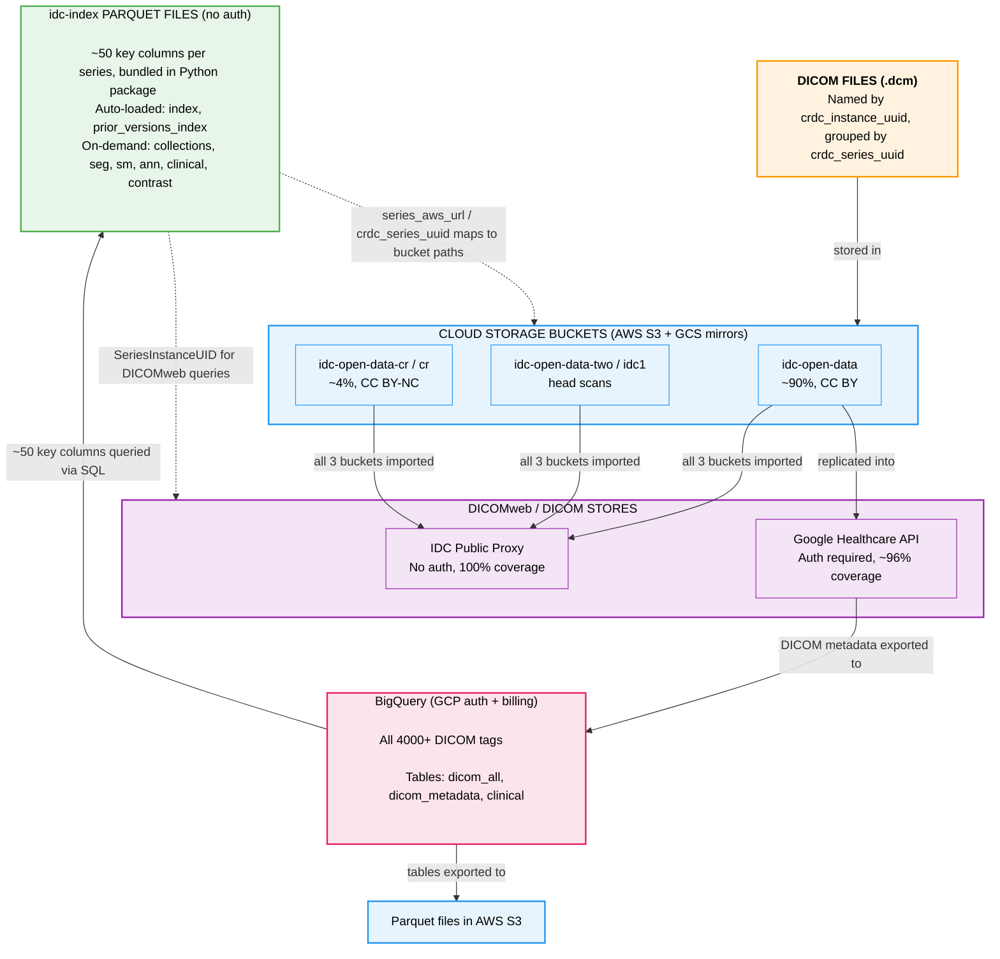

# Files and metadata


We gratefully acknowledge [Google Public Data Program](https://console.cloud.google.com/marketplace/product/bigquery-public-data/nci-idc-data) and the [AWS Open Data Sponsorship Program](https://registry.opendata.aws/nci-imaging-data-commons/) that support public hosting of IDC-curated content, and cover out-of-cloud egress fees!



```mermaid
graph TB
    DCM["<b>DICOM FILES (.dcm)</b><br/>Named by crdc_instance_uuid, grouped by crdc_series_uuid"]

    DCM -->|"stored in"| BUCKETS

    subgraph BUCKETS["CLOUD STORAGE BUCKETS (AWS S3 + GCS mirrors)"]
        direction LR
        B1["idc-open-data<br/>~90%, CC BY"]
        B2["idc-open-data-two / idc1<br/>head scans"]
        B3["idc-open-data-cr / cr<br/>~4%, CC BY-NC"]
    end

    B1 & B2 & B3 -->|"all 3 buckets imported"| PROXY
    B1 -->|"replicated into"| GHC

    subgraph STORES["DICOMweb / DICOM STORES"]
        direction LR
        PROXY["IDC Public Proxy<br/>No auth, 100% coverage"]
        GHC["Google Healthcare API<br/>Auth required, ~96% coverage"]
    end

    GHC -->|"DICOM metadata exported to"| BQ

    subgraph BQ["BigQuery (GCP auth + billing)"]
        BQ_DESC["All 4000+ DICOM tags &nbsp; &nbsp; &nbsp; &nbsp; &nbsp; &nbsp; &nbsp; &nbsp; &nbsp; &nbsp;<br/>Tables: dicom_all, dicom_metadata, clinical"]
    end

    BQ -->|"~50 key columns queried via SQL"| IDX
    BQ -->|"tables exported to"| S3BQ
    S3BQ["Parquet files in AWS S3"]

    subgraph IDX["idc-index PARQUET FILES (no auth)"]
        IDX_DESC["~50 key columns per series, bundled in Python package &nbsp; &nbsp; &nbsp; &nbsp; &nbsp;<br/>Auto-loaded: index, prior_versions_index<br/>On-demand: collections, seg, sm, ann, clinical, contrast"]
    end

    IDX -.->|"SeriesInstanceUID for DICOMweb queries"| STORES
    IDX -.->|"series_aws_url / crdc_series_uuid maps to bucket paths"| BUCKETS

    style DCM fill:#fff3e0,stroke:#FF9800,stroke-width:2px,color:#000
    style BUCKETS fill:#e8f4fd,stroke:#2196F3,stroke-width:2px,color:#000
    style B1 fill:#e8f4fd,stroke:#2196F3,color:#000
    style B2 fill:#e8f4fd,stroke:#2196F3,color:#000
    style B3 fill:#e8f4fd,stroke:#2196F3,color:#000
    style STORES fill:#f3e5f5,stroke:#9C27B0,stroke-width:2px,color:#000
    style PROXY fill:#f3e5f5,stroke:#9C27B0,color:#000
    style GHC fill:#f3e5f5,stroke:#9C27B0,color:#000
    style BQ fill:#fce4ec,stroke:#E91E63,stroke-width:2px,color:#000
    style BQ_DESC fill:#fce4ec,stroke:none,color:#000
    style IDX fill:#e8f5e9,stroke:#4CAF50,stroke-width:2px,color:#000
    style S3BQ fill:#e8f4fd,stroke:#2196F3,stroke-width:2px,color:#000
    style IDX_DESC fill:#e8f5e9,stroke:none,color:#000
```

Let's start with the overall principles of how we organize data in IDC.

IDC brings you (as of v23) over 95 TB of publicly available DICOM images and image-derived content. We share those with you as DICOM files, and those DICOM files are available in cloud-based **storage buckets** - both in Google and AWS.&#x20;

Sharing just the files, however, is not particularly helpful. With that much data, it is no longer practical to just download all of those files to later sort through them to select those you need.&#x20;


Think of IDC as a library, where each file is a book. With that many books, it is not feasible to read them all, or even open each one to understand what is inside. Libraries are of little use without a catalog! &#x20;


To provide you with a catalog of our data, along with the files, we maintain _metadata_ that makes it possible to understand what is contained within files, and select the files that are of interest for your project, so that you can download just the files you need.&#x20;

In the following we describe organization of both the storage buckets containing the files, and the metadata catalog that you can use to select files that meet your needs. As you go over this documentation, please consider completing our ["Getting started" tutorial](https://github.com/ImagingDataCommons/IDC-Tutorials/tree/master/notebooks/getting_started) - it will give you the opportunity to apply the knowledge you gain by reading this article while interacting with the data, and should help better understand this content.

## Storage Buckets


Storage Buckets are basic containers in Google Cloud Storage and AWS S3 that provide storage for data objects (you can read more about the relevant terms in the Google Cloud Storage documentation [here](https://cloud.google.com/storage/docs/key-terms) and in S3 [here](https://aws.amazon.com/s3/)).


All IDC DICOM file data for all IDC data versions across all of the [collections hosted by IDC](https://imaging.datacommons.cancer.gov/collections/) are mirrored between Google Cloud Storage (GCS) and AWS S3 buckets.&#x20;

Currently all DICOM files are maintained in buckets that allow for free egress within or out of the cloud. This is enabled through the partnership of IDC with [Google Public Data Program](https://console.cloud.google.com/marketplace/product/gcp-public-data-idc/nci-idc-data) and the [AWS Open Data Sponsorship Program](https://registry.opendata.aws/nci-imaging-data-commons/).&#x20;

<figure><figcaption></figcaption></figure>

<table><thead><tr><th>Data category</th><th width="424.5574951171875">Cloud provider and bucket name</th></tr></thead><tbody><tr><td>Data covered by a non-restrictive license (CC-BY or like) and not labeled as such that <strong>may</strong> contain head scans. This category contains >90% of the data in IDC.</td><td><strong>AWS</strong>: <code>idc-open-data</code><br><strong>GCS</strong>: <code>idc-open-data</code><br>(until IDC v19, we utilized GCS bucket <code>public-datasets-idc</code> before it was superseded by <code>idc-open-data</code>)</td></tr><tr><td>Collections that <strong>may</strong> contain head scans. This is done for the collections that were labeled as such by TCIA, in case there is a change in policy and we need to treat such images in any special way in the future.</td><td><strong>AWS</strong>: <code>idc-open-data-two</code><br><strong>GCS</strong>: <code>idc-open-idc1</code></td></tr><tr><td>Data that is covered by a license that restricts commercial use (CC-NC). Note that the license information is available programmatically at the granularity of the individual files, as explained in <a href="https://github.com/ImagingDataCommons/IDC-Tutorials/blob/master/notebooks/getting_started/part3_exploring_cohorts.ipynb">this tutorial</a> - you do not need to check the bucket name to get the license information!</td><td><strong>AWS</strong>: <code>idc-open-data-cr</code><br><strong>GCS</strong>: <code>idc-open-cr</code></td></tr></tbody></table>

Within each bucket files are organized in folders, each folder containing files corresponding to a single DICOM series. On ingestion, we assign each DICOM series and each DICOM instance a UUID, in order to be able to support [data versioning](../data-versioning.md) (when needed). These UUIDs are available in our metadata indices, and are used to organize the content of the buckets: for each version of a DICOM instance having instance UUID `instance_uuid` in a version of a series version having UUID `series_uuid`, the file name is:

`<series_uuid>/<instance_uuid>.dcm`

Corresponding files have the same object name in GCS and S3, though the name of the containing buckets will be different.

## Metadata

IDC metadata tables are provided to help you navigate IDC content and narrow down to the specific files that meet your research interests.

As a step in data ingestion process (summarized [earlier](./)), IDC extracts all of the DICOM metadata, merges it with collection-level and some other metadata attributes not available from DICOM, ingests collection-level clinical tables and stores the result in **Google BigQuery tables**. Google [BigQuery (BQ)](https://cloud.google.com/bigquery) is a massively-parallel analytics engine ideal for working with tabular data.  Data stored in BQ can be accessed using [standard SQL](https://cloud.google.com/bigquery/docs/reference/standard-sql/enabling-standard-sql) queries. We talk more about those in the subsequent sections of the documentation!

Searching BigQuery tables requires you to sign in with a Google Account! If this poses a problem for you, there are several alternatives.


`idc-index` provides access to the metadata aggregated at the DICOM series level. BigQuery and Parquet files provide metadata at the granularity of individual DICOM instances (files).


#### Python _idc-index_ package

A small subset of most critical metadata attributes available in IDC BigQuery tables is extracted and made available via the [`idc-index` python package](https://github.com/ImagingDataCommons/idc-index).&#x20;

If you are just starting with IDC, you can skip the details covering the content of BigQuery tables, and proceed to [this tutorial](https://github.com/ImagingDataCommons/IDC-Tutorials/blob/master/notebooks/getting_started/part2_searching_basics.ipynb) that will help you learn the basics of searching IDC metadata using `idc-index`. But for the sake of example, you would select and download MR DICOM series available in IDC as follows.

```bash
pip install --upgrade idc-index
```


```python
from idc_index import IDCClient

# instantiate the client
client = IDCClient()

# define and execute the query
selection_query = """
SELECT SeriesInstanceUID
FROM index
WHERE Modality = 'MR'
"""
selection_result = client.sql_query(selection_query)

# download the first series from the list
client.download_dicom_series(seriesInstanceUID=selection_result["SeriesInstanceUID"].values[0],downloadDir=".")
```


#### Parquet files available via a cloud bucket

While the idc-index is based on a series level subset of IDC BQ data, we also export all the content available via BigQuery into Parquet ([https://parquet.apache.org/](https://parquet.apache.org/)) files, and which are available from our public AWS bucket! Using open-source tools such as DuckDB ([https://duckdb.org/](https://duckdb.org/)) you can query those files using SQL queries, without relying on BigQuery (although, running complex queries may require significant resources from your runtime environment!).&#x20;

The exported Parquet files are located in the IDC-maintained AWS `idc-open-metadata` bucket, which is updated every time IDC has a new data release. The exported tables are organized under the folder `bigquery_export` in that bucket, with each sub-folder corresponding to a BigQuery dataset.

Assuming you have `s5cmd` installed, you can list the exported datasets as follows.

<pre data-overflow="wrap"><code>$ s5cmd --no-sign-request ls s3://idc-open-metadata/bigquery_export/
                                  DIR  idc_current/
                                  DIR  idc_current_clinical/
                                  DIR  idc_v1/
                                  DIR  idc_v10/
                                  DIR  idc_v11/
                                  DIR  idc_v11_clinical/
                                  DIR  idc_v12/
                                  DIR  idc_v12_clinical/
                                  DIR  idc_v13/
                                  DIR  idc_v13_clinical/
                                  DIR  idc_v14/
                                  DIR  idc_v14_clinical/
                                  DIR  idc_v15/
                                  DIR  idc_v15_clinical/
                                  DIR  idc_v16/
                                  DIR  idc_v16_clinical/
                                  DIR  idc_v17/
                                  DIR  idc_v17_clinical/
                                  DIR  idc_v18/
                                  DIR  idc_v18_clinical/
                                  DIR  idc_v19/
                                  DIR  idc_v19_clinical/
                                  DIR  idc_v2/
                                  DIR  idc_v20/
                                  DIR  idc_v20_clinical/
<strong>                                  DIR  idc_v21/
</strong>                                  DIR  idc_v21_clinical/
                                  DIR  idc_v22/
                                  DIR  idc_v22_clinical/
                                  DIR  idc_v23/
                                  DIR  idc_v23_clinical/
<strong>                                  DIR  idc_v3/
</strong>                                  DIR  idc_v4/
                                  DIR  idc_v5/
                                  DIR  idc_v6/
                                  DIR  idc_v7/
                                  DIR  idc_v8/
                                  DIR  idc_v9/
</code></pre>

The `idc_current` and `idc_current_clinical` datasets always contain the most recent version of data. As an example, the `dicom_all` table for the latest (current) IDC release can be accessed as `s3://idc-open-metadata/bigquery_export/idc_current/dicom_all` (since the table is quite large, the export result is not a single file, but a folder containing thousands of Parquet files.


```
$ s5cmd --no-sign-request ls s3://idc-open-metadata/bigquery_export/idc_current/dicom_all/
2024/11/23 18:01:07           7545045  000000000000.parquet
2024/11/23 18:01:07           7687834  000000000001.parquet
2024/11/23 18:01:07           7409070  000000000002.parquet
2024/11/23 18:01:07           7527558  000000000003.parquet
...
...
2024/11/23 18:00:14           7501451  000000004997.parquet
2024/11/23 18:00:14           7521972  000000004998.parquet
2024/11/23 18:00:14           7575037  000000004999.parquet
2024/09/12 18:20:05            588723  000000005000.parquet
```


You can query those tables/parquet files without downloading them, as shown in the following snippet. Depending on the query you are trying to execute, you may need a lot of patience!


```python
import duckdb

# Connect to DuckDB (in-memory)
con = duckdb.connect()

# Install and load the httpfs extension for S3 access
con.execute("INSTALL httpfs;")
con.execute("LOAD httpfs;")

# No credentials needed for public buckets

# Query all Parquet files in the public S3 folder
selection_query = """
SELECT SeriesInstanceUID
FROM read_parquet('s3://idc-open-metadata/bigquery_export/idc_current/dicom_all/*.parquet') AS dicom_all
WHERE Modality = 'MR'
LIMIT 1
"""
selection_result = con.execute(selection_query).fetchdf()
print(selection_result['SeriesInstanceUID'].values[0])
```

