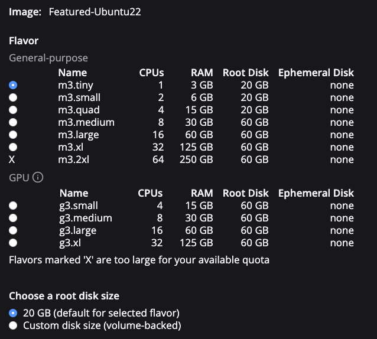

# Files and metadata

Let's start with the overall principles of how we organize data in IDC.

IDC brings you (as of v16) over 45 TB of publicly available DICOM images and image-derived content. We share those with you as DICOM files, and those DICOM files are available in cloud-based **storage buckets** - both in Google and AWS.&#x20;

Sharing just the files, however, is not particularly helpful. With that much data, it is no longer practical to just download all of those files to later sort through them to select those you need.&#x20;


Think of IDC as a library, where each file is a book. With that many books, it is no feasible to read them all, or even open each one to understand what is inside. Libraries are of little use without a catalog! &#x20;


To provide you with a catalog of our data, along with the files, we maintain _metadata_ that makes it possible to understand what is contained within files, and select the files that are of interest for your project, so that you can download just the files you need. We make that metadata available in **BigQuery tables** searchable using standard SQL.

## BigQuery Tables and Views


Google [BigQuery (BQ)](https://cloud.google.com/bigquery) is a massively-parallel analytics engine ideal for working with tabular data. Data stored in BQ can be accessed using [standard SQL](https://cloud.google.com/bigquery/docs/reference/standard-sql/enabling-standard-sql) queries.


IDC utilizes BigQuery tables to organize metadata accompanying the files we host. If you have never worked with BigQuery before, you need to understand the basics of data organization in BigQuery (BQ).&#x20;

BQ **tables** are organized in BQ **datasets**. BQ datasets are not unlike folders on your computer, but contain tables related to each other instead of files. BQ datasets, in turn, are organized under Google Cloud **projects**. GCP projects can be thought of as containers that are managed by a particular organization. To continue with the file system analogy, think about projects as hard drives that contain folders.

This may be a good time for you to complete [Part 1 of the IDC "Getting started" tutorial series](https://github.com/ImagingDataCommons/IDC-Tutorials/blob/master/notebooks/getting\_started/part1\_prerequisites.ipynb), so that you are able to open the tables and datasets we will be discussing in the following paragraphs!

Let's map the aforementioned project-dataset-table hierarchy to the concrete locations that contain IDC data.

### IDC BigQuery datasets

All of the IDC tables are stored under the `bigquery-public-data` project. That project is managed by Google Public Datasets Program, and contains many public BQ datasets, beyond those maintained by IDC.

All of the IDC tables are organized into datasets by data release version. If you complete the tutorial mentioned above, open the BQ console, and scroll down the list of datasets, you will find those that are named starting with the `idc_v` prefix - those are IDC datasets.&#x20;

<figure><figcaption><p>Some of the BigQuery datasets curated by IDC.</p></figcaption></figure>

Following the prefix, you will find the number that corresponds to the IDC data release version. IDC data releases version numbers start from 1 and are incremented by one for each subsequent release. As of writing this, the most recent version of IDC is 16, and you can find dataset `idc_v16` corresponding to this version.

In addition to `idc_v16` you will find a dataset named `idc_v16_clinical`. That dataset contains clinical data accompanying IDC collections. We started clinical data ingestion in IDC v11. If you want to learn more about the organization and searching of clinical data, take a look at our [Clinical data introduction notebook](https://github.com/ImagingDataCommons/IDC-Tutorials/blob/master/notebooks/clinical\_data\_intro.ipynb)!

Finally, you will also see two special datasets: `idc_current` and `idc_current_clinical`. Those two datasets are essentially aliases, or links, to the versioned datasets corresponding to the latest release of IDC data.&#x20;


If you want to explore the latest content of IDC - use `current` datasets.&#x20;

If you want to make sure your queries and data selection are reproducible - always use the version numbered datasets!


### IDC BigQuery tables

Before we dive into discussing the individual tables maintained by IDC, there is just one more BigQuery-specific concept you need to learn: the _view_. BigQuery view is a table that is defined by an SQL query that is run every time you query the view (you can read more about BQ views in [this article](https://cloud.google.com/bigquery/docs/views-intro)).&#x20;

BQ views can be very handy when you want to simplify your queries by factoring out the part of the query that is often reused. But a key disadvantage of BQ views over tables is the reduced performance and increased cost due to re-running the query each time you query the view.

As we will discuss further, most of the tables maintained by IDC are created by joining and/or post-processing other tables. Because of this we rely heavily on BQ views to improve transparency of the provenance of those "derived" tables. BQ views can be easily distinguished from the tables in a given dataset by a different icon. IDC datasets also follow a convention that all views in the versioned datasets include suffix `_view` in the name, and are accompanied by the result of running the query used by the view in a table that has the same name _sans_ the `_view` suffix. See the figure below for an illustration of this convention.

<figure><figcaption><p>In this example, <code>dicom_all_view</code> is a BQ view, as indicated by the icon to the left from the table name. <code>dicom_all</code> table is the result of running the query that defines the <code>dicom_all_view</code>. </p></figcaption></figure>

If you are ever curious (and you should be, at least once in a while!) about the queries behind individual views, you can click on the view in the BQ console, and see the query in the "Details" tab. Try this out yourself to check the query for [`dicom_all_view`](https://console.cloud.google.com/bigquery?p=bigquery-public-data\&d=idc\_current\&t=dicom\_all\_view\&page=table)

<figure><figcaption><p>Yes, you can view the query of a view!</p></figcaption></figure>

Now that we reviewed the main concepts behind IDC tables organization, it is time to explain the sources of metadata contained in those tables. Leaving `_clinical` datasets aside, IDC tables are populated from one of the two sources:

* DICOM metadata extracted from the DICOM files hosted by IDC, and various derivative tables that simplify access to specific DICOM metadata items;
* collection-level and auxiliary metadata, which is not stored in DICOM tags, but is either received by IDC from other sources, or is populated by IDC as part of data curation (these include Digital Object Identifiers, description of the collections, hashsums, etc).

The set of BQ tables and views has grown over time. The enumeration below documents the BQ tables and views as of IDC v14. Some of these tables will not be found in earlier IDC BigQuery datasets.

#### `dicom_metadata`

* Table in BigQuery: [`dicom_metadata`](https://console.cloud.google.com/bigquery?p=bigquery-public-data\&d=idc\_current\&t=dicom\_metadata\&page=table)

Each row in the `dicom_metadata` table holds the DICOM metadata of an instance in the corresponding IDC version. There is a single row for each DICOM instance in the corresponding IDC version, and the columns correspond to the DICOM attributes encountered in the data across all of the ingested instances.

IDC utilizes the standard capabilities of the Google Healthcare API to extract all of the DICOM metadata from the hosted collections into a single BQ table. Conventions of how DICOM attributes of various types are converted into BQ form are covered in the [Understanding the BigQuery DICOM schema](https://cloud.google.com/healthcare/docs/how-tos/dicom-bigquery-schema) Google Healthcare API documentation article.&#x20;

`dicom_metadata` table contains DICOM metadata extract from the files included in the given IDC data release. The amount and variety of the DICOM files grows with the new releases, and the schema of this table reflects the organization of the metadata in each IDC release. Non-sequence attributes, such as `Modality` or `SeriesInstanceUID`, once encountered in any one file will result in the corresponding column being introduced to the table schema (i.e., if we have column `X` in IDC release 11, in all likelihood it will also be present in all of the subsequent releases).&#x20;

Sequence DICOM attributes, however,  may have content that is highly variable across different DICOM instances (especially in Structured Reports). Those attributes will map to [`STRUCT` BQ SQL type](https://cloud.google.com/bigquery/docs/reference/standard-sql/data-types#struct\_type), and it is not unusual to see drastic differences in the corresponding columns of the table between different releases.

`dicom_metadata` to conduct detailed explorations of the metadata content, and build cohorts using fine-grained controls not accessible from the IDC portal. Note that the `dicom_all` table, described below, is probably a better choice for such explorations.&#x20;


Due to the existing limitations of Google Healthcare API, not all of the DICOM attributes are extracted and are available in BigQuery tables. Specifically:

* sequences that have more than 15 levels of nesting are not extracted (see [https://cloud.google.com/bigquery/docs/nested-repeated](https://cloud.google.com/bigquery/docs/nested-repeated)) - we believe this limitation does not affect the data stored in IDC
* sequences that contain around 1MiB of data are dropped from BigQuery export and RetrieveMetadata output currently. 1MiB is not an exact limit, but it can be used as a rough estimate of whether or not the API will drop the tag (this limitation was not documented as of writing this) - we know that some of the instances in IDC will be affected by this limitation. The fix for this limitation is targeted for sometime in 2021, according to the communication with Google Healthcare support.


#### `auxiliary_metadata`


Table in BigQuery: [`auxiliary_metadata`](https://console.cloud.google.com/bigquery?p=bigquery-public-data\&d=idc\_current\&t=auxiliary\_metadata\&page=table)


This table defines the contents of the corresponding IDC version. There is a row for each instance in the version. We group the attributes for convenience:

Collection attributes:

* `tcia_api_collection_id:` The ID, as accepted by the TCIA API, of the original data collection containing this instance (will be Null for collections not sourced from TCIA)
* `idc_webapp_collection_id:` The ID, as accepted by the IDC web app, of the original data collection containing this instance
* `collection_id:` The ID, as accepted by the IDC web app. Duplicate of `idc_webapp_collection_id`
* `collection_timestamp:` Datetime when the IDC data in the collection was last revised
* `collection_hash`: md5 hash of the of this version of the collection containing this instance
* `collection_init_idc_version:` The IDC version in which the collection containing this instance first appeared
* `collection_revised_idc_version:` The IDC version in which this version of the collection containing this instance first appeared

Patient attributes:

* `submitter_case_id:`The Patient ID assigned by the submitter of this data. This is the same as the DICOM PatientID
*   `idc_case_id:`IDC generated UUID that uniquely identifies the patient containing this instance

    This is needed because DICOM PatientIDs are not required to be globally unique
* `patient_hash`: md5 hash of this version of the patient/case containing this instance
* `patient_init_idc_version:` The IDC version in which the patient containing this instance first appeared
* `patient_revised_idc_version:` The IDC version in which this version of the patient/case containing this instance first appeared

Study attributes:

* `StudyInstanceUID:` DICOM UID of the study containing this instance
* `study_uuid:`IDC assigned UUID that identifies a version the the study containing this instance.
* `study_instances:` The number instances in the study containing this instance
* `study_hash`: md5 hash of the data in this version of the study containing this instance
* `study_init_idc_version:` The IDC version in which the study containing this instance first appeared
* `study_revised_idc_version:` The IDC version in which this version of the study containing this instance first appeared

Series attributes:

* `SeriesInstanceUID:` DICOM UID of the series containing this instance
* `series_uuid:`IDC assigned UUID that identifies the version of the series containing this instance
* `source_doi:`The DOI of an information page corresponding to the original data collection or analysis results that is the source of this instance
* `source_url:`The URL of an information page that describes the original collection or analysis result that is the source of this instance
* `series_instances:` The number of instances in the series containing this instance
* `series_hash`: md5 hash of the data in the this version of the series containing this instance
* `access:` Collection access status: 'Public' or 'Limited'. (Currently all data is 'Public')
* `series_init_idc_version:` The IDC version in which the series containing this instance first appeared
* `series_revised_idc_version:` The IDC version in which this version of the series containing this instance first appeared

Instance attributes:

* `SOPInstanceUID:` DICOM UID of this instance.
* `instance_uuid:`IDC assigned UUID that identifies the version of this instance.
* `gcs_url:` The GCS URL of a file containing the version of this instance that is identified by this `series_uuid/instance_uuid`
* `aws_url:` The AWS URL of a file containing the version of this instance that is identified by this `series_uuid/instance_uuid`
* `instance_hash`: the md5 hash of this version of this instance
* `instance_size:` the size, in bytes, of this version of this instance
* `instance_init_idc_version:` The IDC version in which this instance first appeared
* `instance_revised_idc_version:` The IDC version in which this version of this instance first appeared
* `license_url:` The URL of a web page that describes the license governing this version of this instance
* `license_long_name:` A long form name of the license governing this version of this instance
* `license_short_name:` A short form name of the license governing this version of this instance

#### `mutable_metadata`


Table in BigQuery: [`mutable_metadata`](https://console.cloud.google.com/bigquery?p=bigquery-public-data\&d=idc\_current\&t=original\_collections\_metadata\&page=table)


Some non-DICOM metadata may change over time. This includes the GCS and AWS URLs of instance data, the accessibility of each instance and the URL of an instance's associated description page. BigQuery metadata tables such as the auxiliary\_metadata and dicom\_all tables are never revised even when such metadata changes. However, tables in the datasets of previous IDC versions can be joined with the mutable\_metadata table to obtain the current values of these mutable attributes.

The table has one row for each version of each instances:

* `crdc_instance_uuid`: The uuid of an instance version
* `crdc_series_uuid`: The uuid of a series version that contains this instance version
* `crdc_study_uuid`: The uuid of a study version that contains the series version
* `gcs_url`: URL to the Google Cloud Storage (GCS) object containing this instance version
* `aws_url`: URL to the Amazon Web Services (AWS) object containing this instance version
* \`access: Current access status of this instance (Public or Limited)
* `source_url`: The URL of a page that describes the original collection or analysis result that includes this instance
* `source_doi`: The DOI of a page that describes the original collection or analysis result that includes this instance

#### `original_collections_metadata`


Table in BigQuery: [`original_collections_metadata`](https://console.cloud.google.com/bigquery?p=bigquery-public-data\&d=idc\_current\&t=original\_collections\_metadata\&page=table)


This table is comprised of IDC data collection-level metadata for the original TCIA data collections hosted by IDC, for the most part corresponding to the content available in [this table at TCIA](https://www.cancerimagingarchive.net/collections/). One row per collection:

* `tcia_api_collection_id:` The collection ID as is accepted by the TCIA AP
* `tcia_wiki_collection_id:` The collection ID as on the TCIA wiki page
* `idc_webapp_collection_id:`The collection ID as accepted by the IDC web app
* `Program:` The program to which this collection belongs
* `Updated:` Most recent update date reported by the collection source
* `Status:`Collection status: "Ongoing" or "Complete"
* `Access:`Collection access conditions: "Limited" or "Public"
* `ImageType:` Enumeration of image types/modalities in the collection
* `Subjects:`Number of subjects in the collection
* `DOI:`DOI that can be resolved at doi.org to the TCIA wiki page for this collection
* `URL:`URL of an information page for this collection
* `CancerType:`Collection source(s) assigned cancer type of this collection
* `SupportingData:`Type(s) of additional data available
* `Species:` Species of collection subjects
* `Location:`Body location that was studied
* `Description:` Description of the collection (HTML format)
* `license_url:` The URL of a web page that describes the license governing this collection
* `license_long_name:` A long form name of the license governing this collection
* `license_short_name:` A short form name of the license governing this collection

#### `analysis_results_metadata`


Table in BigQuery: [`analysis_results_metadata`](https://console.cloud.google.com/bigquery?p=bigquery-public-data\&d=idc\_current\&t=analysis\_results\_metadata\&page=table)


Metadata for the TCIA analysis results hosted by IDC, for the most part corresponding to the content available in [this table at TCIA](https://www.cancerimagingarchive.net/tcia-analysis-results/). One row per analysis result:

* `ID:` Results ID
* `Title:` Descriptive title
* `DOI:`DOI that can be resolved at doi.org to the TCIA wiki page for this analysis result
* `CancerType:`TCIA assigned cancer type of this analysis result
* `Location:`Body location that was studied
* `Subjects:`Number of subjects in the analysis result
* `Collections:` Original collections studied
* `AnalysisArtifactsonTCIA:` Type(s) of analysis artifacts generated
* `Updated:` Data when results were last updated
* `license_url:` The URL of a web page that describes the license governing this collection
* `license_long_name:` A long form name of the license governing this collection
* `license_short_name:` A short form name of the license governing this collection
* `description:` Description of analysis result

#### `version_metadata`


Table in BigQuery: [`version_metadata`](https://console.cloud.google.com/bigquery?p=bigquery-public-data\&d=idc\_current\&t=version\_metadata\&page=table)


Metadata for each IDC version, one row per version:

* `idc_version`: IDC version number
* `version_hash`: MD5 hash of hashes of collections in this version
* `version_timestamp`: Version creation timestamp

The following tables and views consist of metadata derived from one or more other IDC tables tables for convenience of the user. For each such table, `<table_name>`, there is also a corresponding view, `<table_name>_view`, that, when queried, generates an equivalent table. These views are intended as a reference; each view's SQL is available to be used for further investigation.

Several of these tables/views are discussed more completely [here](../../dicom/derived-objects/).

#### `dicom_all`, `dicom_all_view`


Table in BigQuery: [`dicom_all`](https://console.cloud.google.com/bigquery?p=bigquery-public-data\&d=idc\_current\&t=dicom\_all\&page=table)



Table in BigQuery: [`dicom_all_view`](https://console.cloud.google.com/bigquery?p=bigquery-public-data\&d=idc\_current\&t=dicom\_all\_view\&page=table)


All columns from `dicom_metadata` together with selected date from the `auxiliary_metadata`, `original_collections_metadata`, and `analysis_results_metadata` tables.

#### `segmentations`, `segmentations_view`


Table in BigQuery: [`segmentations`](https://console.cloud.google.com/bigquery?p=bigquery-public-data\&d=idc\_current\&t=segmentations\&page=table)



Table in BigQuery: [`segmentations_view`](https://console.cloud.google.com/bigquery?p=bigquery-public-data\&d=idc\_current\&t=segmentations\_view\&page=table)


This table is derived from `dicom_all` to simplify access to the attributes of DICOM Segmentation objects available in IDC. Each row in this table corresponds to one DICOM Segmentation instance segment.

#### `measurement_groups`, `measurement_groups_view`


Table in BigQuery: [`measurement_groups`](https://console.cloud.google.com/bigquery?p=bigquery-public-data\&d=idc\_current\&t=measurement\_groups\&page=table)



Table in BigQuery: [`measurement_groups_view`](https://console.cloud.google.com/bigquery?p=bigquery-public-data\&d=idc\_current\&t=measurement\_groups\_view\&page=table)


This table is derived from `dicom_all` to simplify access to the measurement groups encoded in DICOM Structured Report TID 1500 objects available in IDC. Specifically, this table contains measurement groups corresponding to the "Measurement group" content item in the [TID 1500 Measurement report](https://dicom.nema.org/medical/dicom/current/output/chtml/part16/chapter\_A.html#sect\_TID\_1500) DICOM SR objects.

Each row corresponds to one TID1500 measurement group.

#### `qualitative_measurements`, `qualitative_measurements_view`


Table in BigQuery: [`qualitative_measurements`](https://console.cloud.google.com/bigquery?p=bigquery-public-data\&d=idc\_current\&t=qualitative\_measurements\&page=table)



Table in BigQuery: [`qualitative_measurements_view`](https://console.cloud.google.com/bigquery?p=bigquery-public-data\&d=idc\_current\&t=qualitative\_measurements\_view\&page=table)


This table is derived from `dicom_all` to simplify access to the qualitative measurements in DICOM SR TID1500 objects. It contains coded evaluation results extracted from the DICOM SR TID1500 objects. Each row in this table corresponds to a single qualitative measurement extracted.&#x20;

#### `quantitative_measurements`, `quantitative_measurements_view`


Table in BigQuery: [`quantitative_measurements`](https://console.cloud.google.com/bigquery?p=bigquery-public-data\&d=idc\_current\&t=quantitative\_measurements\&page=table)



Table in BigQuery: [`quantitative_measurements_view`](https://console.cloud.google.com/bigquery?p=bigquery-public-data\&d=idc\_current\&t=quantitative\_measurements\_view\&page=table)


This table is derived from `dicom_all` to simplify access to the quantitative measurements in DICOM SR TID1500 objects. It contains quantitative evaluation results extracted from the DICOM SR TID1500 objects. Each row in this table corresponds to a single quantitative measurement extracted.

#### `dicom_metadata_curated`, `dicom_metadata_curated_view`


Table in BigQuery: [`dicom_metadata_curated`](https://console.cloud.google.com/bigquery?p=bigquery-public-data\&d=idc\_current\&t=dicom\_metadata\_curated\&page=table)



Table in BigQuery: [`dicom_metadata_curated_view`](https://console.cloud.google.com/bigquery?p=bigquery-public-data\&d=idc\_current\&t=dicom\_metadata\_curated\_view\&page=table)


Curated values of DICOM metadata extracted from `dicom_metadata`.

#### `dicom_metadata_curated_series_level`, `dicom_metadata_curated_series_level_view`


Table in BigQuery: [`dicom_metadata_curated_series_lev`](https://console.cloud.google.com/bigquery?p=bigquery-public-data\&d=idc\_current\&t=dicom\_metadata\_curated\_series\_level\&page=table)



Table in BigQuery: [`dicom_metadata_curated_series_level_view`](https://console.cloud.google.com/bigquery?p=bigquery-public-data\&d=idc\_current\&t=dicom\_metadata\_curated\_series\_level\_view\&page=table)


Curated columns from `dicom_metadata` that have been aggregated/cleaned up to describe content at the series level. Each row in this table corresponds to a DICOM instance in IDC. The columns are curated by defining queries that apply transformations to the original values of DICOM attributes.

#### `idc_pivot_v<idc version>`

A view that is the basis for the queries performed by the IDC web app.

### Collection-specific BigQuery tables

Most clinical data is found in the [idc\_v\<idc\_version>\_clinical datasets](clinical.md). However, a few tables of clinical data are found in the idc\_v\<idc\_version> datasets.

#### TCGA

The following tables contain TCGA-specific metadata:

* `tcga_biospecimen_rel9:` biospecimen metadata
* `tcga_clinical_rel9:` clinical metadata

#### NLST


IDC hosts a subset of the NLST clinical data, which was cleared for public sharing. If you need the full clinical data, please visit the [Cancer Data Access System (CDAS) system](https://biometry.nci.nih.gov/cdas/learn/nlst/trial-summary/).


The following tables contain NLST specific metadata. The detailed schema of those tables is available from the [TCIA NLST collection page](https://doi.org/10.7937/tcia.hmq8-j677).

* `nlst_canc`: "Lung Cancer"
* `nlst_ctab`: "SCT Abnormalities"
* `nlst_ctabc`: "SCT Comparison Abnormalities"
* `nlst_prsn`: "Participant"
* `nlst_screen`: "SCT Screening"

## Storage Buckets


Storage Buckets are basic containers in Google Cloud Storage and AWS S3 that provide storage for data objects (you can read more about the relevant terms in the Google Cloud Storage documentation [here](https://cloud.google.com/storage/docs/key-terms) and in S3 [here](https://aws.amazon.com/s3/)).


All IDC DICOM file data for all IDC data versions across all of the [collections hosted by IDC](https://imaging.datacommons.cancer.gov/collections/) are maintained in Google Cloud Storage (GCS) and AWS S3 (S3). Currently all DICOM files are maintained in buckets that allow for free egress within or out of the cloud. This is enabled through the partnership of IDC with [Google Public Data Program](https://console.cloud.google.com/marketplace/product/gcp-public-data-idc/nci-idc-data) and the [AWS Open Data Sponsorship Program](https://registry.opendata.aws/nci-imaging-data-commons/).


Note that only (versions of) DICOM instances have associated files (as discussed in [DICOM Data Model](../../dicom/data-model.md). There are no per-series or per-study files.


The object namespace is hierarchical, where, for each version of a DICOM instance having instance UUID \<instance\_uuid> in a version of a series version having UUID \<series\_uuid>, the file name is:

`<series_uuid>/<instance_uuid>.dcm`

Corresponding files have the same object name in GCS and S3, though the name of the containing buckets will be different.

### UIDs and UUIDs explained with an example

Consider an instance in the CPTAC-CM collection that has this `SOPInstanceUID`: `1.3.6.1.4.1.5962.99.1.171941254.777277241.1640849481094.35.0`\\

It is in a series having this `SeriesInstanceUID`:\
`1.3.6.1.4.1.5962.99.1.171941254.777277241.1640849481094.2.0`

The instance and series were added to the IDC Data set in IDC version 7. At that point, the instance was assigned UUID:\
`5dce0cf0-4694-4dff-8f9e-2785bf179267`\
and the series was assigned this UUID:\
`e127d258-37c2-47bb-a7d1-1faa7f47f47a`

In IDC version 10, a revision of this instance was added (keeping its original `SOPInstanceUID`), and assigned this UUID:\
`21e5e9ce-01f5-4b9b-9899-a2cbb979b542`

Because this instance was revised, the series containing it was implicitly revised. The revised series was thus issued a new UUID:\
`ee34c840-b0ca-4400-a6c8-c605cef17630`

Thus, the initial version of this instance has this file name:\
`e127d258-37c2-47bb-a7d1-1faa7f47f47a/5dce0cf0-4694-4dff-8f9e-2785bf179267.dcm`\
and the revised version of the instance has the this file name:\
`ee34c840-b0ca-4400-a6c8-c605cef17630/21e5e9ce-01f5-4b9b-9899-a2cbb979b542.dcm`

Both versions of the instance are in both AWS and GCS buckets.


```bash
s5cmd --no-sign-request ls s3://idc-open-data/e127d258-37c2-47bb-a7d1-1faa7f47f47a/5dce0cf0-4694-4dff-8f9e-2785bf179267.dcm
2023-04-09 11:49:55    3308170 5dce0cf0-4694-4dff-8f9e-2785bf179267.dcm
```



```bash
s5cmd --no-sign-request --endpoint-url https://storage.googleapis.com ls s3://public-datasets-idc/e127d258-37c2-47bb-a7d1-1faa7f47f47a/5dce0cf0-4694-4dff-8f9e-2785bf179267.dcm
   3308170  2023-04-01T01:21:31Z  gs://public-datasets-idc/e127d258-37c2-47bb-a7d1-1faa7f47f47a/5dce0cf0-4694-4dff-8f9e-2785bf179267.dcm
TOTAL: 1 objects, 3308402 bytes (3.16 MiB)
```


Note that GCS and AWS bucket names are different. In fact, DICOM instance data is distributed across multiple buckets in both GCS and AWS. We will discuss obtaining GCS and AWS URLs more a little later.


It is possible that a series is revised, but one or more instances in the series are not revised. For example if a single instance in a series (assume the series has a uuid \<series\_uuid\_old>) is revised, that instance gets a new UUID, and there is implicitly a new version of the series, which gets a new UUID (call it \<series\_uuid\_new>). If an instance that is not revised has UUID \<invariant\_instance\_uuid>, then its corresponding file in cloud storage will the have name:\
`<series_uuid_old>/<invariant_instance_uuid>.dcm` in the "old" series. But, because that same instance version is in the revised series, there must also be a file in cloud storage named:\
`<series_uuid_new>/<invariant_instance_uuid>.dcm`\
The result will be two distinct but identical files.


Utilities like gsutil, s3 and s5cmd "understand" the implied hierarchy in these file names. Thus the series UUID now acts like the name of a directory that contains all the instance versions in the series version:


```bash
s5cmd --no-sign-request --endpoint-url https://storage.googleapis.com ls s3://public-datasets-idc/ee34c840-b0ca-4400-a6c8-c605cef17630/
2023/04/01 03:00:34           1719696 18c206a6-2db4-45cd-89a2-e83273a38f42.dcm
2023/04/01 03:00:36           3308402 21e5e9ce-01f5-4b9b-9899-a2cbb979b542.dcm
2023/04/01 01:50:29          29477804 3cfc3da3-8389-49f6-a6ee-6ba6406f639e.dcm
2023/04/01 01:50:27         214715792 428590a0-816c-4041-a3ae-676a68411794.dcm
2023/04/01 03:00:30           2301902 57ff4432-c29d-4ccf-964c-0b421302add3.dcm
2023/04/01 03:00:33           3540080 77ff406a-a236-4846-83dd-ae3bd7a6bc71.dcm
```


and similarly for AWS buckets, thus making it easy to transfer all instances in a series from the cloud.

Because file names are more or less opaque, the user will not typically select files by listing the contents of a bucket. Instead, one should use either the IDC Portal or IDC BigQuery tables to identify items of interest and, then, generate a manifest of objects that can be passed to a utility like s5cmd.

## DICOM Stores

IDC utilizes a single Google Healthcare DICOM store to host all of the instances in the current IDC version. That store, however, is primarily intended to support visualization of the data using the OHIF and Slim viewers. At this time, we do not support access of the hosted data via DICOMWeb interface by IDC users. See more details in the [discussion here](https://discourse.canceridc.dev/t/dicomweb-access-to-hosted-collections/69), and please comment about your use case if you have a need to access data via the DICOMweb interface.
