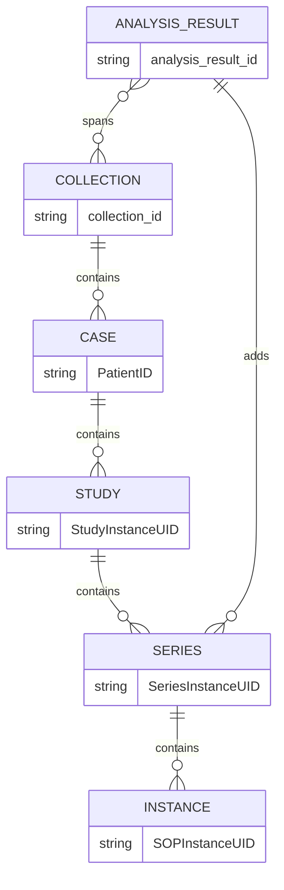

# IDC data model


This page is under development


```mermaid
erDiagram
    COLLECTION ||--o{ CASE: contains
    CASE ||--o{ STUDY : contains
    STUDY ||--o{ SERIES : contains
    SERIES ||--o{ INSTANCE : contains
    ANALYSIS_RESULT ||--o{ SERIES : adds
    ANALYSIS_RESULT }o--o{ COLLECTION : spans

    COLLECTION {
        string collection_id 
    }
    CASE {
        string PatientID
    }
    STUDY {
        string StudyInstanceUID
    }
    SERIES {
        string SeriesInstanceUID
    }
    INSTANCE {
        string SOPInstanceUID
    }
    ANALYSIS_RESULT {
        string analysis_result_id 
    }


```
