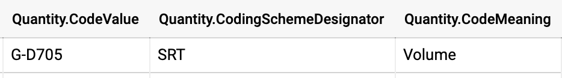
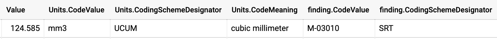

# Coding schemes

One of the fundamental principles of DICOM is the use of _controlled terminologies_, or _lexicons_, or _coding schemes_ \(for the purposes of this guide, these can be used interchangeably\). While using the DICOM data stored in IDC, you will encounter various situations where the data is captured using coded terms.

Controlled terminologies define a set of codes, and sometimes their relationships, that are carefully curated to describe entities for a certain application domain. Consistent use of such terminologies helps with uniform data collection and is critical for harmonization of activities conducted by  independent groups.

When codes are used in DICOM, they are saved as triplets that consist of

* CodeValue: unique identifier for a term
* CodingSchemeDesignator: code for the authority that issued this code
* CodeMeaning: human-readable code description

DICOM relies on various sources of codes, all of which are listed in [PS3.16 Section 8](http://dicom.nema.org/medical/dicom/current/output/chtml/part16/chapter_8.html) of the standard. 

As an example, if you query the [`canceridc-data:idc_views.segmentations`](https://console.cloud.google.com/bigquery?project=canceridc-data&p=canceridc-data&d=idc_views&t=segmentations&page=table) view with the following query in the BQ console:

```sql
SELECT
  *
FROM
  `canceridc-data.idc_views.segmentations`
LIMIT
  10
```

You will see columns that contain coded attributes of the segment. In the example below, the value of `AnatomicRegion` corresponding to the segment is assigned the value \(T-04000, SRT, Breast\), where "SRT" is the coding scheme designator corresponding to the [SNOMED-CT](http://www.snomed.org/) coding scheme.


As another example, quantitative and qualitative measurements extracted from the SR-TID1500 objects are stored in the [`canceridc-data:idc_views.quantitative_measurements`](https://console.cloud.google.com/bigquery?project=canceridc-data&p=canceridc-data&d=idc_views&t=quantitative_measurements&page=table) and [`canceridc-data:idc_views.qualitative_measurements`](https://console.cloud.google.com/bigquery?project=canceridc-data&p=canceridc-data&d=idc_views&t=qualitative_measurements&page=table) views, respectively. If we query those views to see the individual measurements, they also show up as coded items. Each of the quantitative measurements includes a code describing the quantity being measured, the actual numeric value, and a code describing the units of measurement:






