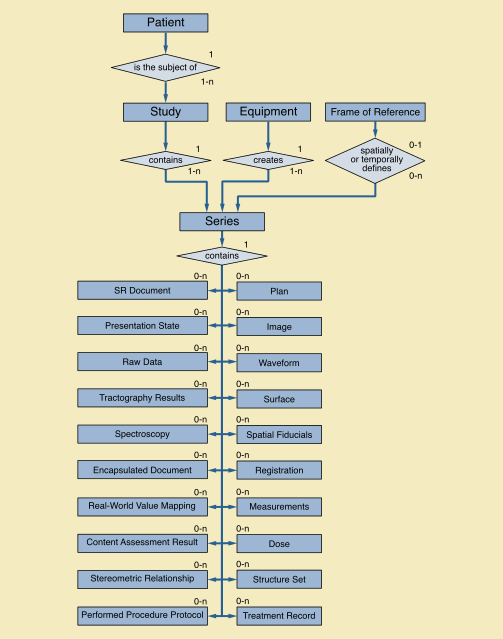

# Data model

DICOM defines its own model to map relevant entities from the real world. That model, as [defined in Part 3 of the standard](http://dicom.nema.org/medical/dicom/current/output/chtml/part03/chapter_7.html), is shown in the figure below.


The DICOM data model is implicit, and is not defined in a machine-readable structured form by the standard!


DICOM data model entities do not always map to DICOM objects! In fact, every DICOM object you will ever encounter in IDC will contain attributes describing various properties of the entries at different levels of the real world data model. Such objects are called _Composite_ Information Objects. The [information model](http://dicom.nema.org/medical/dicom/current/output/chtml/part03/chapter_A.html) of the Composite Information Object Definitions is shown below, and covers all of the composite objects defined by the standard.

As can be observed from this diagram, _"each Composite Instance IOD \[Entity-Relationship\] Model requires that all Composite Instances that are part of a specific Study shall share the same context. That is, all Composite Instances within a specific Patient Study share the same Patient and Study information; all Composite Instances within the same Series share the same Series information; etc."_ \([ref](http://dicom.nema.org/medical/dicom/current/output/chtml/part03/chapter_A.html)\).

Each of the boxes in the diagram above corresponds to _Information Entities \(IEs\)_, which in turn are composed from _Information Modules_. Information Modules group attributes that are related. As an example, [Patient IE included in the MR object](http://dicom.nema.org/medical/dicom/current/output/chtml/part03/sect_A.4.3.html) will include [Patient Information Module](http://dicom.nema.org/medical/dicom/current/output/chtml/part03/sect_C.7.html#sect_C.7.1.1), which in turn will include such attributes as PatientID, PatientName, and PatientSex.


To recap, individual files in IDC buckets are _instances_ of DICOM composite objects. The specific type of object is defined by the`SOPClassUID.`Metadata included in a given object is captured by the _Information Object Definition_ as a list of _Information Entities_. Object definition also contains the list of specific Information Modules for the individual IEs. Note that modules included in a given IE are object-specific, while list of attributes included in a given _Information Module_ is fixed!


