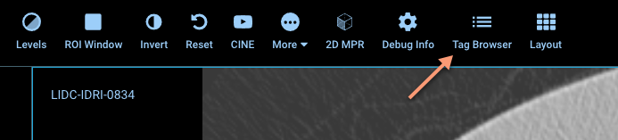

# Introduction to DICOM

IDC relies on DICOM for data modeling, representation and communication. Most of the data stored in IDC is in DICOM format. If you want to use IDC, you (hopefully!) do not need to become a DICOM expert, but you do need to have a basic understanding of how DICOM data is structured, and how to transform DICOM objects into alternative representations that can be used by the tools familiar to you.

This section is not intended to be a comprehensive introduction to the standard, but rather a very brief overview of some of the concepts that you will need to understand to better use IDC data.


If you are looking for an introduction to the DICOM standard, consider this book:

_Digital Imaging and Communications in Medicine (DICOM): A Practical Introduction and Survival Guide_, 2nd Edition by Pianykh, Oleg S. published by Springer (2011). [https://www.springer.com/gp/book/9783642108495](https://www.springer.com/gp/book/9783642108495)


As discussed in [Data organization](../data/organization-of-data/), the main mechanism for accessing the data stored in IDC is by using the storage buckets that contain individual files indexed through other interfaces. Each of the files in the IDC-maintained storage buckets encodes a DICOM object. Each DICOM object is a collection of _data elements_ or _attributes_. Below is an example of a subset of attributes in a DICOM object, as generated by the IDC OHIF Viewer (which can be toggled by clicking the "Tag browser" icon in the IDC viewer toolbar):

The standard defines constraints on what kind of data each of the attributes can contain. Every single attribute defined by the standard is listed in the [DICOM Data Dictionary](http://dicom.nema.org/medical/dicom/current/output/chtml/part06/chapter\_6.html), which defines those constraints:

* Value Representation (VR) defines the type of the data that data element can contain. There are 27 DICOM VRs, and they are defined in [Part 5 of the standard](http://dicom.nema.org/medical/dicom/current/output/chtml/part05/sect\_6.2.html).
* Value Multiplicity (VM) defines the number of items of the prescribed VR that can be contained in a given data element.

What attributes are included in a given object is determined by the type of object (or, to follow the DICOM nomenclature, _Information Object_). [Part 3 of the DICOM standard](http://dicom.nema.org/medical/dicom/current/output/chtml/part03/PS3.3.html) is dedicated to the definitions (IODs) of those objects.


It is critical to recognize that while all of the DICOM files at the high level are structured exactly in the same way and follow the same syntax and encoding rules, interpretation of the content of an individual file is dependent on the specific type of object it encodes!


How do you know what object is encoded in a given file (or _instance_ of the object, using the DICOM lingo)? For this purpose there is an attribute `SOPClassUID` that uniquely identifies the class of the encoded object. The content of this attribute is not easy to interpret, since it is a unique identifier. To map it to the specific object class name, you can consult the complete list of object classes available in [Part 4 here](http://dicom.nema.org/medical/dicom/current/output/chtml/part04/sect\_B.5.html).

When you use the IDC portal to build your cohort, unique identifiers for the object classes are mapped to their names, which are available under the "Object class" group of facets in the search interface.

A somewhat related attribute that hints at the type of object is `Modality`, which is defined by the standard as "Type of equipment that originally acquired the data used to create the images in this Series", and is expected to take one of the values from [this list](http://dicom.nema.org/medical/dicom/current/output/chtml/part03/sect\_C.7.3.html#sect\_C.7.3.1.1.1). However, `Modality` is not equivalent to `SOPClassUID`, and should not be used as a substitute. As an example it is possible that data derived from the original modality could be saved as a different object class, but keep the value of modality identical.


You can see all of the attributes of a DICOM instance using IDC Viewer by clicking the "Tag browser" button in the viewer toolbar, or you can use one of the many publicly available tools to examine the DICOM attributes of a downloaded DICOM file.


