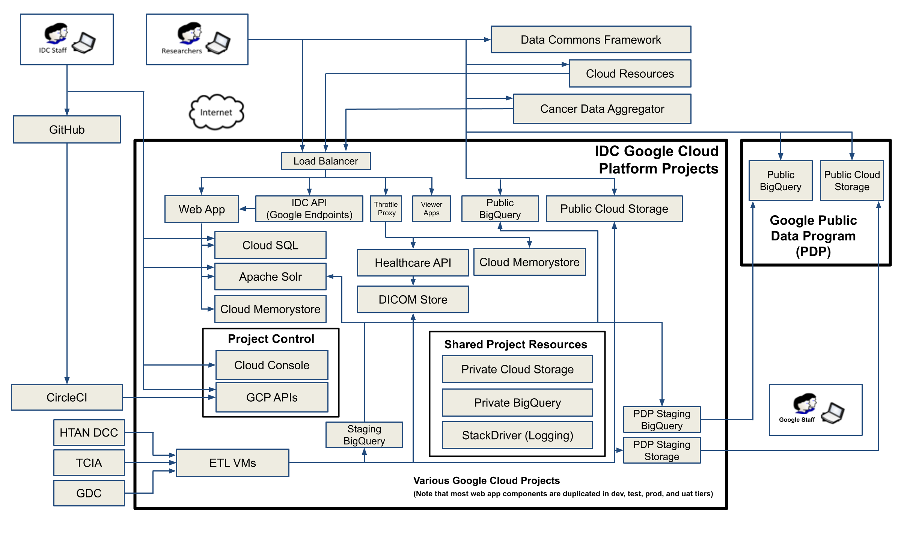

* The following diagram represents, at a high-level, the main components of the IDC system as 
deployed on the Google Cloud Platform, along with the interactions between the components, 
and the entry-points for end-users (“Researchers” in the diagram).  All component 
interactions use HTTPS for secure communications, combined with OAuth2 for authentication.

* First, the diagram indicates that users may interact with the IDC web app (deployed on App 
Engine Flex), accessing the system through the project’s custom load balancer. Other 
pieces of the system available to researchers, that are served by this load balancer, include:

  * __IDC API:__ Computational research scientists, software engineers, and algorithm developers 
    may prefer to access and work with the system directly via: 1) scripting and programming 
    languages such as R, Python, and SQL, 2) command-line tools within the Google Cloud SDK 
    (software development kit) or 3) lower-level parts of the Google API. 
    To serve these users, the IDC API (application programming interface), deployed using 
    Cloud Endpoints, provides programmatic access to Web App functionality.
  * __Viewer Apps:__ Both the OHIF Radiology Viewer and the Slim Pathology Viewer are hosted 
    in static storage in IDC, and can be launched and run in the researcher’s browser, allowing 
    viewing of the IDC image collections.
  * __Throttle Proxy:__ The viewers, mentioned above, use the DICOMWeb protocol to obtain image 
    data from IDC servers. IDC uses the Google Cloud Healthcare API to serve this content, but 
    the viewers communicate with this service via the Throttle Proxy, which is an AppEngine 
    Standard service that enforces daily limits on the amount of data downloaded out of the 
    cloud (since egress costs for this download is borne by IDC). 

* In addition to the above services supported by the IDC load balancer, researchers can access 
  IDC resources using two Google technologies:
  
    * __BigQuery:__ a columnar data-store backed by a massively-parallel analytics engine for storing 
    and querying tabular data
    * __Cloud Storage (GCS):__ a unified object storage, providing regional and multi-regional 
    options with high availability
 

* The IDC has partnered with the Google Public Data Program (PDP) to make most of the data available 
  through Google-owned storage buckets and BigQuery tables. Each data release is placed into the 
  IDC-owned PDP staging buckets and BigQuery datasets, which are subsequently copied by Google 
  into the public PDP resources. There remain a few collections that are held in IDP-managed 
  storage buckets.

* Computationally-adept users, such as computational research scientists, software engineers, and algorithm 
  developers may prefer to access and work with the data more directly via scripting and programming 
  languages such as R, Python, and SQL, or using command-line tools within the Google Cloud 
  SDK (software development kit) or lower-level parts of the Google API.  Such users may invoke 
  the IDC API (application programming interface) deployed using Cloud Endpoints, or they may 
  access the data stores or compute power more directly using the native Google API. 

* IDC operations are managed through the items shown in the lower half of the figure, including 
mostly the Project Control collection, the Shared Project Resources collection, and the ETL VMs. 
These resources are hosted in various Google projects (not shown). For example, ETL VMs run 
in a dedicated "etl processing" project, while logging occurs in all projects, though the 
logs are routed to BigQuery tables in a common administration project. Some of the components 
used are:  
  * __Stackdriver Logging & Monitoring:__ a powerful logging, monitoring and diagnostics service that 
    provides a variety of metrics, dashboards, alerting, log management, reporting, and 
    tracing capabilities. Using these components, all aspects of the IDC interactions 
    and activity are continuously logged and monitored.
  * __BigQuery:__ columnar data-store backed by a massively-parallel analytics engine 
  for storing and querying tabular data 
  * __Google Compute Engine (GCE):__ virtual machines which can be used to run applications or 
  perform analyses
  * __Cloud SQL:__ a relational database for rapid querying of metadata by the web-app
  * __Cloud Storage (GCS):__ a unified object storage, providing regional and multi-regional options with high availability
  * __Google Healthcare:__ storage and analysis technologies customized for healthcare data. Users can also use with the Google Healthcare API
  * __Google Cloud Memorystore for Redis:__  used by the proxy and the WebApp to provide rapid, persistent storage that does not require high availability 
  * __Cloud Functions and Cloud Scheduler:__ short-lived "cron" jobs are run using these two services
