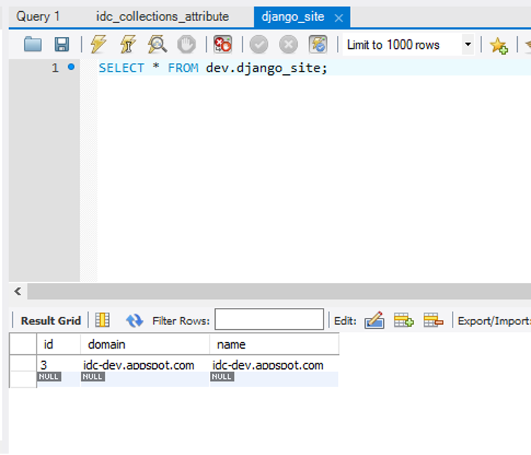
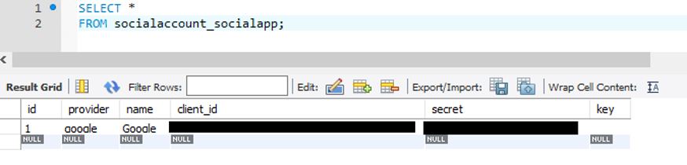
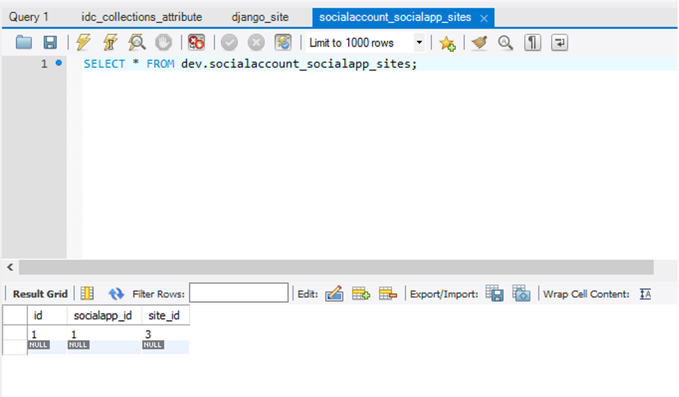

5.2.2 Steps
* Run Django migration to create the Django database

  * This requires that the initial setup and installation steps as outlined by the `install-deps.sh` script have been 
    performed either in a local developer build (see [https://github.com/ImagingDataCommons/IDC-WebApp](https://github.com/ImagingDataCommons/IDC-WebApp) 
    for setup of a development environment) or in a GCE VM. These are:
    * Installation of all major dependencies, including MySQL, Python, Google Cloud SDK, and Django and its required apps
    * Cloning of both IDC-WebApp and IDC-Common repositories
  * Once this skeleton framework is in place:
    * Alter the **DATABASE_HOST**, **DATABASE_NAME**, **DATABASE_USER**, and **DATABASE_PASSWORD** fields in the .env file to 
    reflect the dev-user account on the CloudSQL MySQL database, and that database’s connection fields.
  * If using a local developer build:
    * Start the Django application
    * Start a local SSH session
    * Change directories to /www
    * Run:  
       &nbsp;&nbsp;`python manage.py migrate` (Ubuntu 18.0.4)**_OR_**  
       &nbsp;&nbsp;`python3 manage.py migrate` (Ubuntu 16.0.4)
  * If using a GCE VM or similar unbuilt system:
    * Export the values to environment variables, eg. with:  
           &nbsp;&nbsp;export $(cat [HOMEROOT].env | grep -v ^# | xargs) 2> /dev/null
    * Set **DJANGO_SETTINGS_MODULE** to `idc.settings`
    * From the HOMEROOT directory (i.e. the root directory of the web application repository), run:  
      &nbsp;&nbsp;`python manage.py migrate` (Ubuntu 18.0.4)**_OR_**  
      &nbsp;&nbsp;`python3 manage.py migrate` (Ubuntu 16.0.4)
    * Insert the currently running site into the `django_sites` table. This can be done using the Django admin app or
      using a MySQL client, or by altering and running the `add_site_data.py` script.  An example how this table 
      should look once populated:

* Create the API account and token
  * Run the script `create_api_token.py` found in the `scripts/` directory of the WebApp repository.
  * This will create the API user account, if needed, and assign a token to it. The token will be saved out in a 
  JSON file which can then be added to the idc-deployment-files-xxx bucket for the API to obtain during deployment.
* Insert the Social Application login
  * Add Google to the `socialaccount_socialapp` table and assign it to any sites from django_sites. The 
  client_id and secret columns are populated by the **OAUTH2_CLIENT_ID** and **OAUTH2_CLIENT_SECRET**
  * How these two tables will look when filled:

