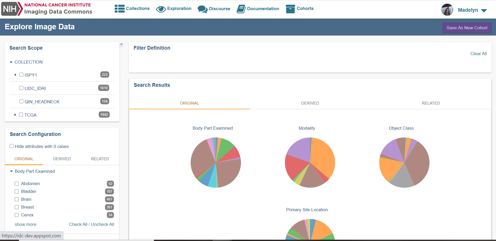
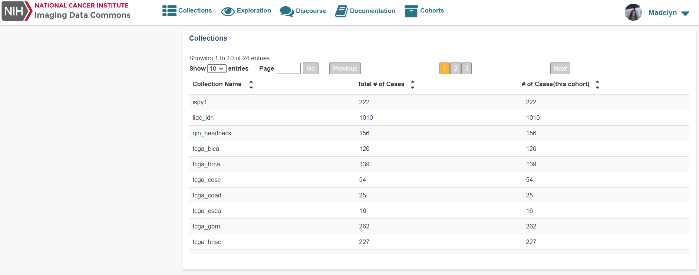
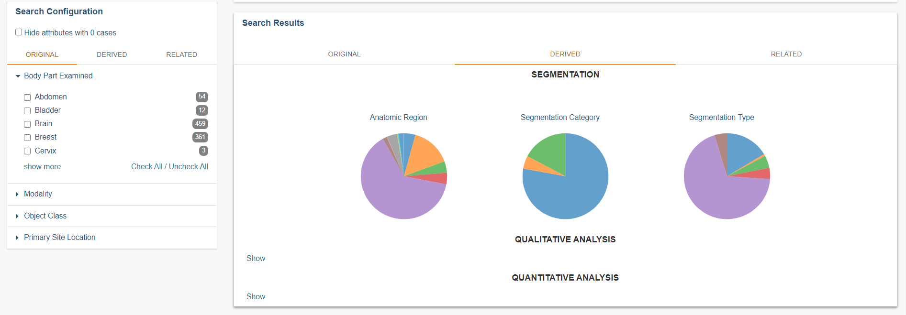
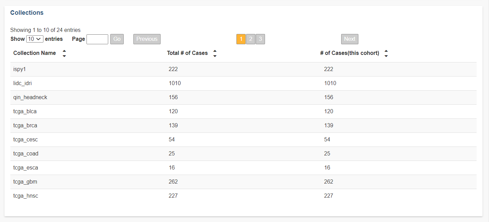
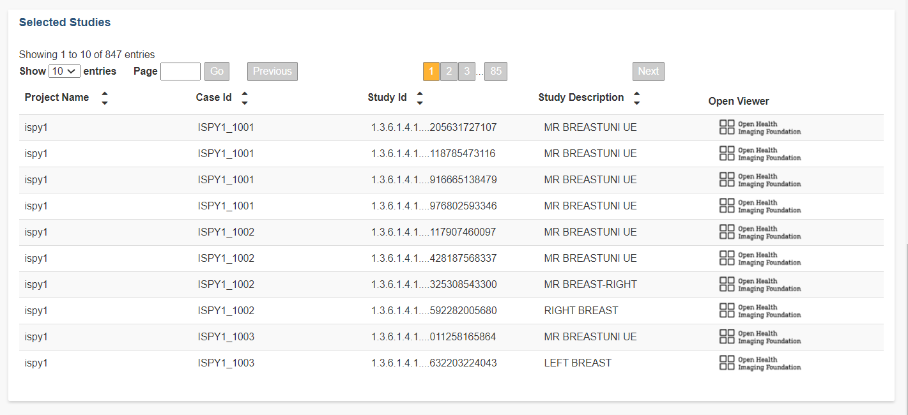

# Data exploration and Cohorts

## Explore Imaging Data

The Imaging Data Commons has four possible navigation options to browse Image data; a **Search Scope** panel, a **Filter Definition** panel, a **Search Configuration** panel, and a **Collections** panel.  
  
Below you will find more details regarding our four primary search panels available:






* **Search Scope panel:** The Search Scope panel is primarily used to filter by collection. We currently have 20+ collection options present.
* **Search Configuration panel:** The Search Configuration panel is the more detailed filter options by utilizing various case, Segmentation, Qualitative, and Quantitative Analyses.  
* **Search Results panel:** The Search Results is the visual representation panel of the detailed filter options we have available in the form of pie charts. 


We will cover more in more detail all the filter options we have available within the Search Configuration panel and the Search Results panel.


* **Collections panel:** The Collections panel can be used to view a Selected Study and/or a Specific Series without any additional filter option selected. 

Each panel provides the same underlying Imaging Data Commons data and metadata.

## Search Configuration and Search Results filter options in detail



### Original Tab

As mentioned within the DICOM documentation this filter set has been built by DICOM objects that are produced by image acquisition equipment - MR, CT or PET images.   
  
For more information please go to our DICOM documentation, that can be found by going to Original Objects\(enter url to page\).

### Derived Tab

All analyzed and post processed data, can easily be filtered with our vast list of Derived filters. 


We currently have 25+ filter options available!


Please visit our DICOM documentation related to Derived data, which can be found by going to the Derived objects\(URL to page\) page.

Below is a brief description of the three main categories we have sorted the Derived objects by within the data Portal.

* **Segmentations:** Built from enhanced multiframe image objects, all of the frames \(slices\) are stored in a single object.
* **Qualitative Analysis:** Built from tools that examine, construct and extracts qualitative evaluations e.g., [dcmqi](https://github.com/QIICR/dcmqi).
* **Quantitative Analysis:** Built from tools that use API extractions for reading, writing, and extracting quantitative measurements.

All derived data generated follows standard-compliant SR-TID1500 object requirements.

### Related Tab

The Cancer Genomic Atlas collection has a rich filter selection for clinical data associated to imaging data. This filter set is useful when working primarily with the collection TCGA.


The number of cases returned when working with this filter may vary due to corresponding data not available for all collections at this time.


For more information on our data structure please visit our Data model\(URL to page\), which will explain the structure in detail.

## Preview of Collections, Studies, and Series within the Imaging Data Commons

### Viewing Collections

The Collections panel we provide is very unique to the rest of the interface. This is in part mainly that it can be used to open Studies and/or Series for all collections we have available with or without other filter options being selected e.g., a Derived filter option.



We currently have available 24 collections for analysis.

### Viewing Studies per Collection

The Selected Studies panel will display all possible series we have available for the collections and/or detailed filter options selected. 

The **Project Name**, **Case Id**, **Study Id**, and **Study Description** is provided for each object.



We provide the ability to view study objects in the [Open Health Imaging Foundation](https://docs.ohif.org/) \(OHIF\) viewer by selecting any option provided in the **Open Viewer** column.

It's possible to also return Imaging Data Commons data in BigQuery that is also displayed in the data Portal. An example query that will return all studies for a selected collection is provided below:

```sql
SELECT PatientID, StudyInstanceUID
FROM `idc-dev-etl.idc_tcia_mvp_wave0.dicom_derived_all`
WHERE collection_id = 'ispy1'
GROUP BY PatientID, StudyInstanceUID
```

This particular example above will return information for the Collection ISPY1.

### Viewing Series per Study per Collection

The Selected Series panel provides the ability to view each series we have available for the Study selected from the Selected Studies panel.   
  
Easily available is the **Study Id**, **Series Number**, **Modality**, **Body Part Examined**, and the **Series Description**. 


The selection of objects in the **Open Viewer** column is slightly different from the objects provided in the Selected Studies panel.


Some objects are only opened by the OHIF viewer at their related Study level and not at the Series level. 


This is highlighted by the Portal interface as a disabled option in the **Open Viewer**  column. 

For more detailed information on the OHIF viewer please visit our Image Visualization documentation.

## Cohort exploration within the Imaging Data Commons ecosystem

TODO - write cohort creation, cohort list table, and download manifest functionality.


  
 

  
  


