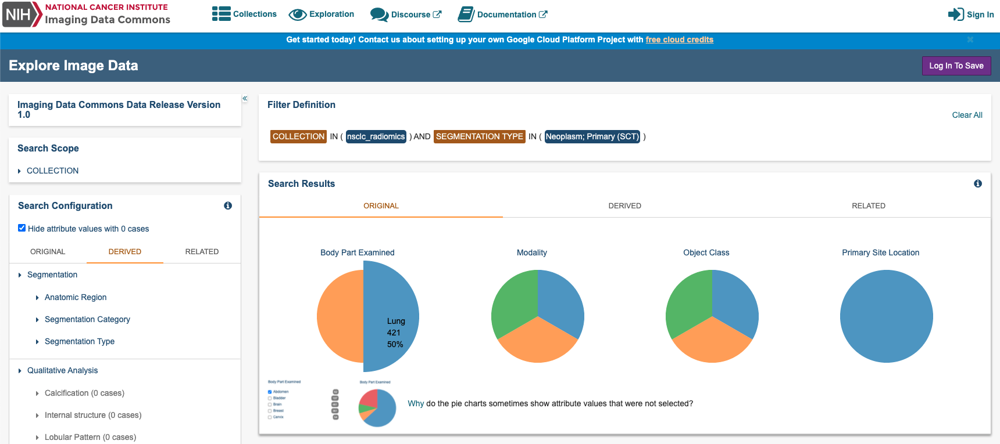
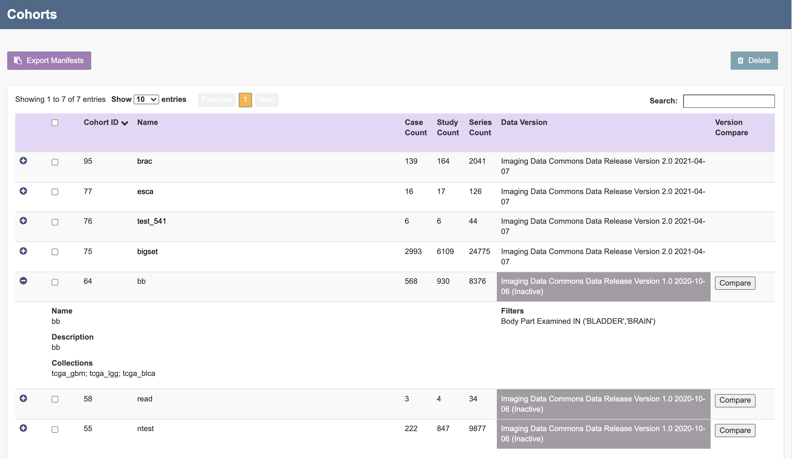
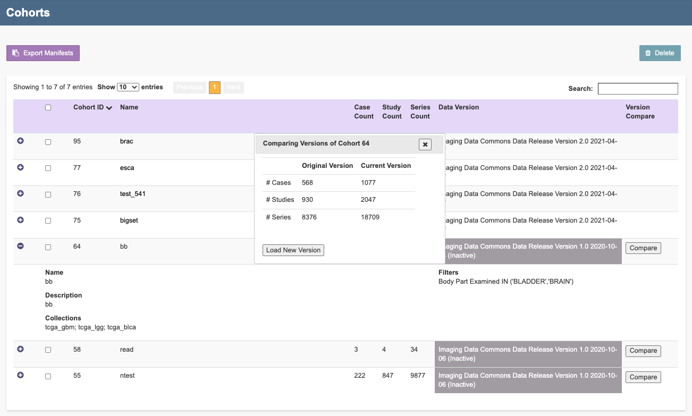

# Exploring data and cohorts

## Exploring imaging data

The Imaging Data Commons Portal user interface has four components to support exploration of Imaging data; a **Search Scope** panel, a **Filter Definition** panel, a **Search Configuration** panel, and a **Collections** panel.  
  
Below you will find more details regarding our four primary search panels available:

You can explore Imaging Data Commons \(IDC\) data and metadata by selecting filters in the Search Scope ****and Search Configuration ****panels on the IDC portal home page. Selecting filters narrows down the available image series to meet your criteria. You can then save your filter selection as a [cohort ](data-exploration-and-cohorts.md#understanding-cohorts)for later use.

* **Search Scope panel:** The Search Scope panel is primarily used to filter by collection. We currently have 20+ collection options present.
* **Search Configuration panel:** The Search Configuration panel is the more detailed attribute filter option by utilizing various case, Segmentation, Qualitative, and Quantitative Analyses.  
* **Search Results panel:** The Search Results is the visual representation panel of the detailed attribute filter options we have available in the form of pie charts. 
* **Collections panel:** The Collections panel can be used to view a Selected Study and/or a Specific Series without any additional attribute option selected. 

  We will cover more in more detail all the attribute options we have available within the Search Configuration panel and the Search Results panel.


The pie charts in the Search Results panel show the number of cases \(or patients\) in your search results by Anatomical Region, Segmentation Category, and Segmentation Type. Hover over a pie slice to see the name of the Anatomical Region, Segmentation Category, and Segmentation Type, number of each, and percent of the total in your search results. 


You can also explore the IDC data without filters. If you want to view a collection's cases, studies, and series, scroll down the IDC portal home page until you reach the Collections panel. Click any link on the Collections panel to view available data about your selection in tabular form in the Filter Definition_, ****_Selected Cases, Selected Studies, and Selected Series panels.


Log in to the portal to [save your filter selections as a cohort](data-exploration-and-cohorts.md#creating-a-cohort).



### **Defining search scope and configuration**

Do the following to define the scope and configuration of your search.

1. In the Search Scope panel, click **COLLECTION** to view the collections in the portal. Over 20 collections are available. 
2. Click the box to the left of a collection name to select one or more collections. You can hover over a collection name to view more information about the collection. 
3. In the Search Configuration panel, select filters on the **Original**, **Derived**, and **Related** tabs to narrow down the available image series. Click any of the filter names on these tabs to view and select the available options. Attribute filter selections in the Search Configuration panel that have no data available are highlighted in grey. Optionally, hide attributes with 0 cases by selecting the checkbox at the top of the panel. The following table describes each of the tabs in this panel.

<table>
  <thead>
    <tr>
      <th style="text-align:left">Tab</th>
      <th style="text-align:left">Description</th>
    </tr>
  </thead>
  <tbody>
    <tr>
      <td style="text-align:left"><b>Original</b>
      </td>
      <td style="text-align:left">This attribute set has been built by DICOM objects that were produced
        by image acquisition equipment (e.g., MR, CT or PET images). This tab also
        includes groups of attributes that are common across all DICOM objects,
        for example, Modality.
        <br />
        <br />For more information, see <a href="../dicom/original-vs-derived-objects.md">Original data</a>.</td>
    </tr>
    <tr>
      <td style="text-align:left"><b>Derived</b>
      </td>
      <td style="text-align:left">
        <p></p>
        <p>You can filter all analyzed and post processed data with Derived attributes.
          Over 25 attribute filter options are available.</p>
        <p></p>
        <p>For more information see, <a href="../dicom/derived-objects.md">Derived data</a>.</p>
        <p></p>
        <p>The IDC portal sorts derived objects by the following categories:</p>
        <p></p>
        <ul>
          <li><b>Segmentations:</b> volumetric annotations of the image regions stored
            as DICOM Segmentation objects</li>
          <li><b>Qualitative Analysis: </b>Qualitative evaluation results (e.g., scores
            or categories associated with image findings) stored in DICOM Structured
            Reporting TID1500 objects</li>
          <li><b>Quantitative Analysis: </b>Quantitative evaluation results (e.g., scores
            or categories associated with image findings) stored in DICOM Structured
            Reporting TID1500 objects</li>
        </ul>
      </td>
    </tr>
    <tr>
      <td style="text-align:left"><b>Related</b>
      </td>
      <td style="text-align:left">
        <p><a href="https://www.cancer.gov/about-nci/organization/ccg/research/structural-genomics/tcga">The Cancer Genome Atlas</a> collections
          have a rich filter selection for clinical data associated with imaging
          data. This filter set is useful when working primarily with the TCGA collections.</p>
        <p>Filter attributes in this tab only filter cases within the TCGA collections.
          Other collections are not affected by these filters.</p>
        <p></p>
        <p>The organization of the TCGA related data is described in detail in the
          <a
          href="https://isb-cancer-genomics-cloud.readthedocs.io/en/latest/sections/BigQuery/ISBCGC-BQ-Projects.html">ISB-CGC documentation</a>.</p>
      </td>
    </tr>
  </tbody>
</table>

### Understanding counts in the search results

The Imaging Data Commons hosts multiple nuances of non-mutually exclusive attributes. This may mean that attributes you did not select appear in your search results. You may want to take this into consideration when analyzing the data in your search results.

On the Search Configuration panel, the number of unique cases \(or patients\) for each attribute within a cohort is constructed by adding the given attribute \(when absent\) to the defined filter. 

On the Search Results panel, each pie chart reports the number of cases \(or patients\) for all values within a given attribute, given the currently defined filter set. Once you select a case, instances that both meet and do not meet the search criteria corresponding to this case affect the charts' content; for example, cases selected based on the presence of CT modality may also contain PET modality, counts of which for that given case also appear in the chart summary.

## Viewing collections, studies, and series

All collections in IDC as well as their total number of cases and number of cases in this cohort appear in the Collections panel. The panel shows the collection name, total number of cases, and total number of cases for this cohort. You can customize your display of this data by choosing how many entries to show by page and move to previous and next pages. 

Click one or more collections to select them. The selected row or rows are highlighted. The available cases for the selected collection\(s\) appear in the Selected Cases panel. Click the up or down arrow to sort the list alphabetically or numerically, as appropriate for the column. 



You must select a collection _before_ you can view data in the Selected Cases, Selected Studies, and Selected Series panels.


### Selecting a case per collection

All cases available for the selected collection appear in the Selected Cases panel. The panel shows the collection name, case ID, total number of studies, and total number of series for each case. You can customize your display of this data by choosing how many entries to show by page and move to previous and next pages.  


Click one or more cases to select them. The selected row or rows are highlighted. The available studies for the selected case\(s\) appear in the Selected Studies panel. Click the up or down arrow to sort the list alphabetically or numerically, as appropriate for the column. 

### Viewing studies **p**er case

All studies available for the selected case appear in the Selected Studies panel. The panel shows the project name, case ID, study ID, and study description for each study. You can customize your display of this data by choosing how many entries to show by page and move to previous and next pages. 


Click one or more studies to select them. The selected row or rows are highlighted. The available series for the selected case\(s\) appear in the Selected Series panel. Click the up or down arrow to sort the list alphabetically or numerically, as appropriate for the column. 

Click the icon in the View column for a study row to view study objects in the IDC Viewer, which is based on the [Open Health Imaging Foundation](https://docs.ohif.org/) \(OHIF\) Viewer.

For more detailed information on the OHIF viewer, see [Visualizing images](visualization.md).

### Viewing a series per study per case

All series available for the selected study appear in the Selected Series panel. The panel shows the study ID, series number, modality, body part examined, and series description for each study. You can customize your display of this data by choosing how many entries to show by page and move to previous and next pages. Click the up or down arrow to sort the list alphabetically or numerically, as appropriate for the column. 


Click the icon in the View column for a study row to view study objects in the IDC Viewer, which is based on the [Open Health Imaging Foundation](https://docs.ohif.org/) \(OHIF\) Viewer.


Some objects can only be opened by the OHIF viewer at their related study level and not at the series level. For these objects, the icon in the View column shows that viewing is disabled. 


For more detailed information on the OHIF viewer, see [Image visualization](visualization.md).

### Viewing data in BigQuery

After you export a cohort manifest to BigQuery, you can view IDC data in BigQuery as a BQ table. An example query follows that returns all studies for the collection QIN\_HEADNECK.

```sql
SELECT PatientID, StudyInstanceUID
FROM `idc-dev-etl.idc_tcia_mvp_wave0.dicom_derived_all`
WHERE collection_id = 'qin_headneck'
GROUP BY PatientID, StudyInstanceUID
```

## Understanding cohorts

Creating a cohort helps you quickly return to a subset of interest from the vast collection of data available in the Imaging Data Commons. A cohort is composed of your selections in the Search Scope and Search Configuration panels.

### Creating a cohort 

Do the following to create a cohort.

1. [Select filters](data-exploration-and-cohorts.md#defining-search-scope-and-configuration) on the Search Scope and Search Configuration panels.
2. Click the **Save As New Cohort** button in the top-right of the portal. 

   The Save Cohort dialog box appears, showing your selected filters.

3. Enter a name for the cohort. Optionally, enter a description. 
4. Click **Save Cohort**.  The cohort details page appears.


The cohort details page shows the cohort name, description \(if available\), and filter definition. 



You can open any study or series associated with the cohort using the IDC Viewer. For more information on image visualization, see [Visualizing images](visualization.md).


### **Accessing the cohort m**anifest

The cohort manifest identifies the sources of data in your cohort and allows you to download this data. You can export a cohort manifest to CSV, TSV, and JSON formats, and to BigQuery.


You can download cohorts of up to 650,000 rows as a multipart file, with each file having a limit of 65,000 rows. Access cohorts larger that 650,000 rows by exporting to BigQuery.


**To export the cohort manifest**

1. [Create a cohort](data-exploration-and-cohorts.md#creating-a-cohort) or click **Cohorts** on the top menu bar ****and select a cohort you previously created.
2. Click the **Export Cohort Manifest** button. The Export Cohort Manifest dialog box appears.
3. Select the [header fields and columns](data-exploration-and-cohorts.md#header-fields-and-column-selection) you want to appear in the export file.
4. Select whether you want to export the cohort as files or using [BigQuery](data-exploration-and-cohorts.md#exporting-the-cohort-manifest-to-bigquery).
   * If you want to download the cohort as CSV or TSV files, select **Include header fields** if you want this data in the export file.
   * Select which format the files in the export should be by clicking **Download CSV**, **Download TSV**, or **Download JSON**.
   * If you want to download the cohort using BigQuery, click **Get BQ Table.**

### Understanding the cohort manifest

The header of the manifest contains the name of cohort, user, filters used, the date generated, and the total number of records. Data is separated by multiple files until the limit of 65,000 files is reached. If your data set is larger than this, you must export it using BigQuery.


The default fields provided in a cohort are:

* `PatientID`: value of the corresponding DICOM attribute
* `collection_id`: abbreviated identifier of the source data collection 
* `StudyInstanceUID`: value of the corresponding DICOM attribute
* `SeriesInstanceUID`: value of the corresponding DICOM attribute
* `SOPInstanceUID`: value of the corresponding DICOM attribute
* `source_DOI`: Digital Object Identifier \(DOI\) of the source data collection. Pre-pending `source_DOI` with `https://doi.org/` will give you the URL of the collection dataset
* `crdc_instance_uid`: unique identifier of the object maintained by CRDC IndexD \(details on how to use this UID will be shared at a later time, when the corresponding capability is available\)
* `gcs_url`: `gs://` URL that can be used to access the object using the [GCP `gsutil` tool](https://cloud.google.com/storage/docs/gsutil)

An example of how you can use an IDC cohort manifest to retrieve the manifest-defined cohort files is shown in [colab notebooks](https://github.com/ImagingDataCommons/IDC-Examples/tree/master/notebooks).


A multipart file export can have a maximum of ten files with 65,000 rows each. If your export is larger than this, you must export the manifest via BigQuery. 


### Exporting to BigQuery


You must have a Google account to use BigQuery.


Exporting a manifest to BigQuery allows you to run complex, analytical, SQL-based queries on large sets of data. The export table is available for seven days. After you start the export, the following window appears on the cohort details page, showing your unique link.



Be sure to save this URL information or pin the BigQuery table to your Google console interface.


After the export table expires, you can create a new manifest for analysis.

### **Exporting as a file**

Comma-Separated Values \(CSV\) and Tab-Separated Values \(TSV\) files include header fields, so you can customize which of those fields you want to include in the export. You can also select which columns to include in the file. 

On the cohort manifest export confirmation window, you can select or clear header fields that you want to appear in your export. 


JSON files do not include any header information but like CSV and TSV files, require that you identify which columns to include in your export. You can import the JSON file to a BigQuery table for further analysis. 



You must select a column option to export the cohort manifest. 


### Viewing the cohorts list

Click the **Cohorts** button in the header to view a list of all the cohorts you created under your account. Each row in the cohorts list includes the corresponding cohort ID, name, the number of cases, studies, and series in the cohort, and the version of the IDC data against which the cohort was created. Pressing the **plus** icon on any row in the cohort list opens a second related row that provides information about the cohort's collections and filters.




The **Cohorts** page supports the creation of a manifest containing one or several cohorts. Click the checkboxes corresponding to the desired cohorts, then click the **Export Manifest** button which  opens the Export Cohort Manifest dialog box discussed [above.](https://learn.canceridc.dev/portal/data-exploration-and-cohorts/#accessing-the-cohort-manifest) Complete this dialog box to export a manifest with all selected cohorts. Note that a manifest for multiple cohorts can only be exported to BigQuery and not to a file download. Also cohorts with inactive data versions cannot be downloaded. One or more cohorts can be deleted by clicking the relevant checkboxes and then clicking the **Delete** button.   

### Cohort Versions

To indicate cohorts created with previous data versions in the cohort list the **Data Version** cells of such cohorts will have a grey background. The cohort manifest remains accessible for all cohorts after the active data version changes. However cohorts created with older data versions can no longer be opened within the portal. Clicking on the button in the **Version Compare** cell in the cohort list opens a pop-up window that compares the number of cases, studies, and series in the current cohort with those of a new cohort that would be created by applying the cohort's filters to the current data set.



Clicking on the **Load New Version** button will open the explorer page, applying these cohort filters to the current data version. The user can then save this new cohort or modify the filters as desired.


