# Data exploration and Cohorts

## Imaging Data Exploration

The Imaging Data Commons Portal user interface has four components to support exploration of Imaging data; a **Search Scope** panel, a **Filter Definition** panel, a **Search Configuration** panel, and a **Collections** panel.  
  
Below you will find more details regarding our four primary search panels available:

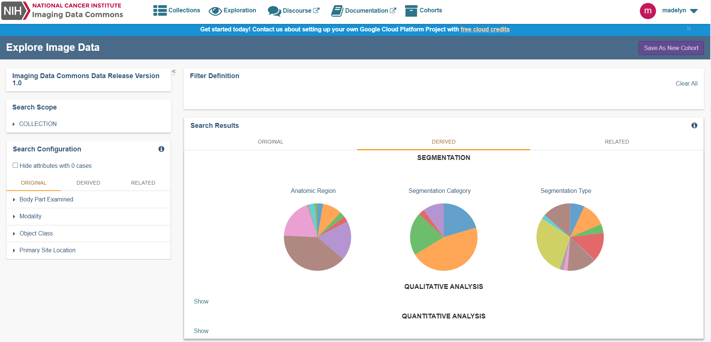

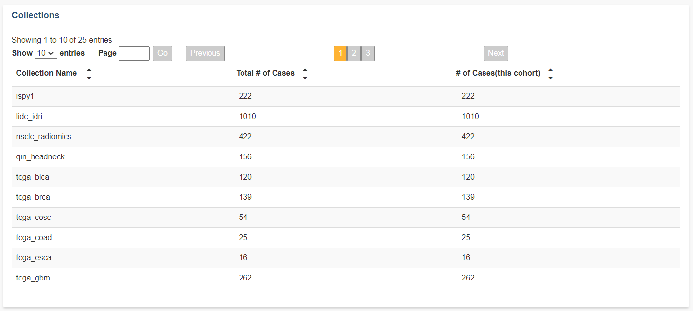

* **Search Scope panel:** The Search Scope panel is primarily used to filter by collection. We currently have 20+ collection options present.
* **Search Configuration panel:** The Search Configuration panel is the more detailed attribute filter option by utilizing various case, Segmentation, Qualitative, and Quantitative Analyses.  
* **Search Results panel:** The Search Results is the visual representation panel of the detailed attribute filter options we have available in the form of pie charts. 


We will cover more in more detail all the attribute options we have available within the Search Configuration panel and the Search Results panel.


* **Collections panel:** The Collections panel can be used to view a Selected Study and/or a Specific Series without any additional attribute option selected. 

Each panel provides the same underlying Imaging Data Commons data and metadata.

## Search Configuration and Search Results attribute filter options in detail

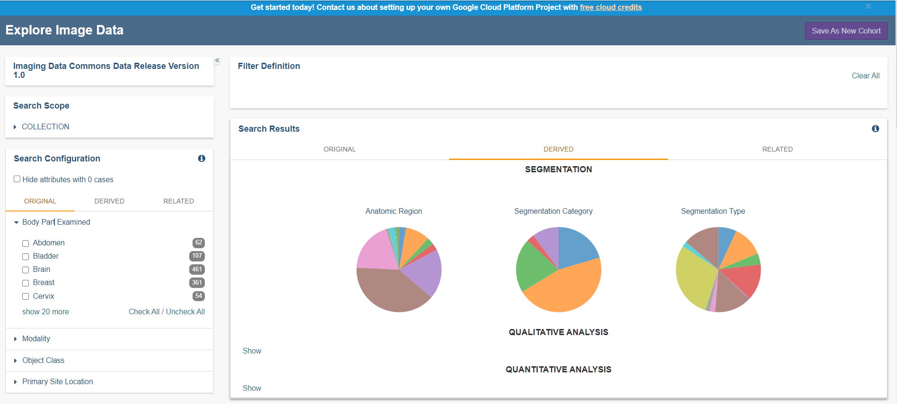

### Count Clarification of Categorization

The Imaging Data Commons currently hosts multiple nuances of non mutually exclusive attributes. Below provided is detailed information of when non-selected attributes are being pulled in and how it's currently being handled. 

For when using the **Search Configuration** panel you will notice the number of unique cases \(or patients\) for each attribute within a cohort constructed by adding the given attribute \(when absent\) to the defined filter. 

For the **Search Results** panel each chart reports the number of cases \(or patients\) for all values within a given attribute, given the currently defined filter set. Once a case is selected, both instances that meet and do not meet the search criteria corresponding to this case will affect the charts content. E.g., cases selected based on the presence of CT modality may also contain PET modality, counts of which for that given case will also appear in the chart summary.

Hence, this needs to be taken into consideration while analyzing the data based on the following logic. 

### Original Tab

As mentioned within the DICOM documentation this attribute set has been built by DICOM objects that are produced by image acquisition equipment \(e.g., MR, CT or PET images\). This tab also includes groups of attributes that are common across all of the DICOM objects \(e.g., Modality\).  
  
For more information please go to our DICOM documentation describing [Original data](../dicom/original-vs-derived-objects.md).

### Derived Tab

All analyzed and post processed data, can easily be filtered with our vast list of Derived attributes. 


We currently have 25+ attribute filter options available!


Please visit our [DICOM documentation related to Derived data](../dicom/derived-objects.md).

Below is a brief description of the three main categories we have sorted the Derived objects by within the data Portal.

* **Segmentations:** volumetric annotations of the image regions stored as DICOM Segmentation objects.
* **Qualitative Analysis:** Qualitative evaluation results \(e.g., scores or categories associated with image findings\) stored in DICOM Structured Reporting TID1500 objects.
* **Quantitative Analysis:** Quantitative evaluation results \(e.g., scores or categories associated with image findings\) stored in DICOM Structured Reporting TID1500 objects.


### Related Tab

[The Cancer Genome Atlas](https://www.cancer.gov/about-nci/organization/ccg/research/structural-genomics/tcga) collections have a rich filter selection for clinical data associated with imaging data. This filter set is useful when working primarily with the TCGA collections.


Filter attributes in this tab only filter cases within the TCGA collections. Other collections are not affected by these filters. 


The organization of the TCGA related data is described in detail [here](https://isb-cancer-genomics-cloud.readthedocs.io/en/latest/sections/BigQuery/ISBCGC-BQ-Projects.html) under the ISB-CGC documentation.

## Preview of Collections, Studies, and Series within the Imaging Data Commons

### Selection of a Collection

The Collections panel we provide is very unique to the rest of the interface. This is in part mainly that it can be used to open Studies and/or Series for all collections we have available with or without other attribute options being selected \(e.g. a Derived attribute option\).



Please be sure to select a Collection option to then be able to open the following panels.


### Selection of a Case per Collection

The Selected Case panel will list all cases available for the collection selected in the previous panel. Listed is the **Collection Name**, **Case Id, Total \# of Studies, and the Total \# of Series.** 

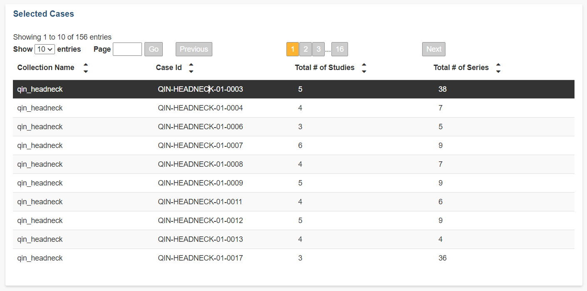

The selection of a case will open the Selected Studies available for the case.

### Viewing Studies **p**er Case

The Selected Studies panel will display all possible series we have available for the collections and/or detailed filter options selected. 

The **Project Name**, **Case Id**, **Study Id**, and **Study Description** is provided for each object.

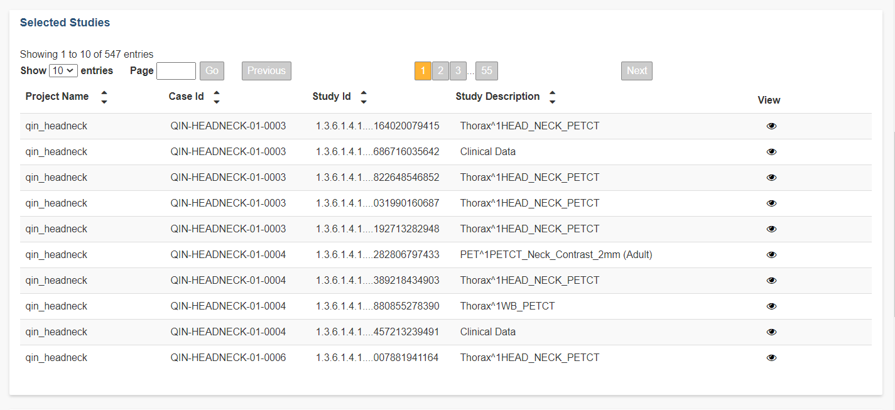

We provide the ability to view study objects in the IDC Viewer, which is based on [Open Health Imaging Foundation](https://docs.ohif.org/) \(OHIF\) Viewer, by selecting any option provided in the **Open Viewer** column.

It's possible to also return Imaging Data Commons data in BigQuery that is also displayed in the data Portal. An example query that will return all studies for a selected collection is provided below:

```sql
SELECT PatientID, StudyInstanceUID
FROM `idc-dev-etl.idc_tcia_mvp_wave0.dicom_derived_all`
WHERE collection_id = 'qin_headneck'
GROUP BY PatientID, StudyInstanceUID
```

This particular example above will return information for the Collection QIN\_HEADNECK.

### Viewing a Series per Study per Case

The Selected Series panel provides the ability to view each series we have available for the Study selected from the Selected Studies panel.   
  
Easily available is the **Study Id**, **Series Number**, **Modality**, **Body Part Examined**, and the **Series Description**. 

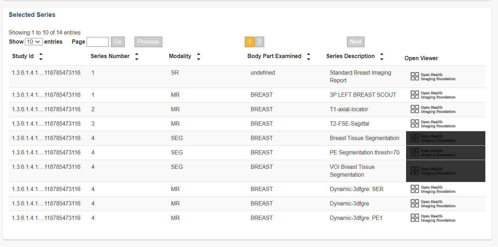

The selection of objects in the **View** column is slightly different from the objects provided in the Selected Studies panel.


Some objects can only be opened by the OHIF viewer at their related Study level and not at the Series level. This is highlighted by the Portal interface as a disabled option in the **View** column. 


For more detailed information on the OHIF viewer please visit our [Image Visualization documentation](visualization.md).

## Cohorts

The creation of a cohort is very beneficial when looking for a specific subset of data within the vast collection of data available at the Imaging Data Commons.

### Cohort creation 

We allow the ability to create cohorts by using three of our main filter panels; a **Search Scope** panel, a **Filter Definition** panel, and the **Search Configuration** panel. 

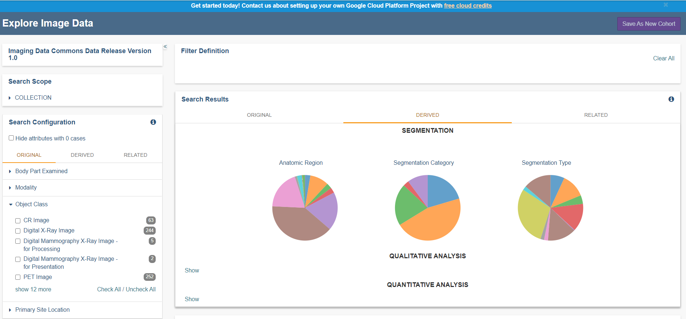

For more detailed information on the data provided by the main attribute selection panels please refer to our [Explore Image Data](../dicom/data-model.md) section.

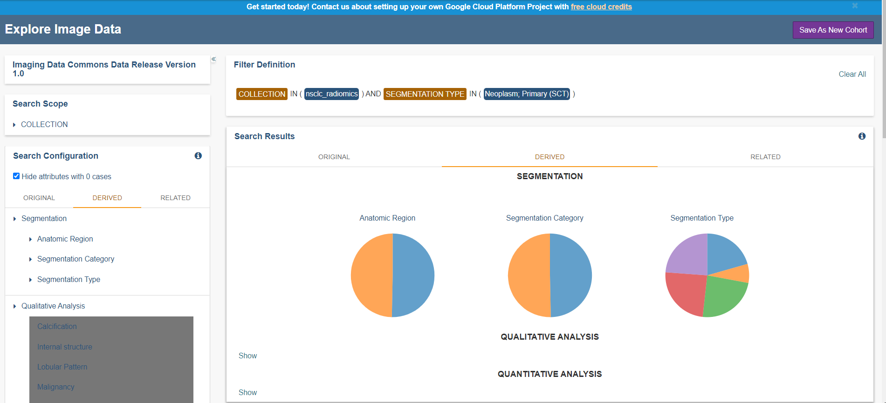

Attribute filter selections in the search configuration panel that have no data available are highlighted in grey. 


The "Save As New Cohort" button can be found in the top right panel at the top of the web page. 

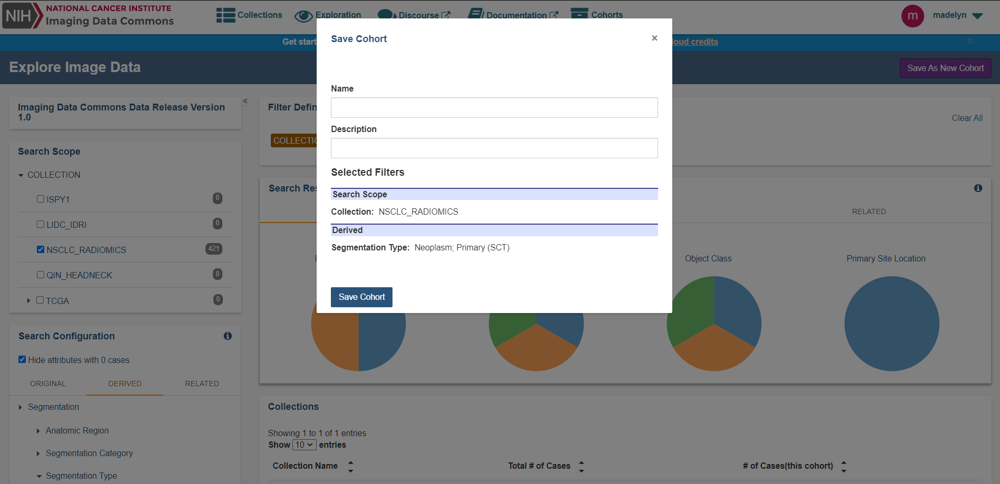

After you have found a desired filter set, you are prompted with a save cohort confirmation page. 


Please be advised only the Search Scope panel and the Search Configuration panel selection define composition of a cohort.


You will be required to add a name for your cohort but, the addition of a description is optional. 

### Detailed Cohort information 

Once a cohort has been created you can view the details of the cohort via the cohort details page. 

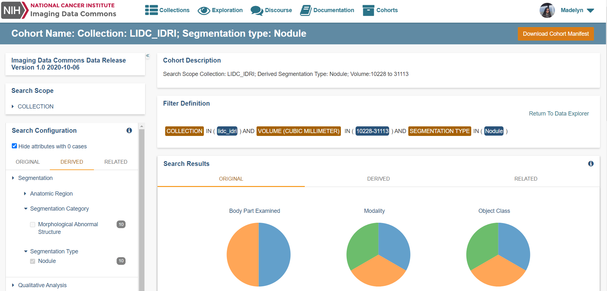

Here is available the cohort name, cohort description\(optional\), the filters used, and the ability to open any study or series associated to the cohort created using the OHIF viewer. 

For more information regarding image visualization please see the [Image visualization](visualization.md) section of the documentation.

### Download manifest of cohort 

The manifest of the cohort contains everything you need to download the data corresponding to your cohort, and to understand the sources of data in your cohort. Currently, cohort manifest can be exported in CSV format, TSV format, JSON format, and as an export to BigQuery.


Cohorts with less than 650,000 rows can now be downloaded as a multipart file. Cohorts larger that 650,000 rows can now be exported to BigQuery \(for Google Accounts\).

A Google account is required to be able to use the export to BigQuery functionality.


#### Header fields and column selection

The header of the manifest contains the name of cohort, user, filters used, the date generated, and the total number of records \(data is separated by multiple files until the max of 65,000 entries then once the limit is reached the data will need to be exported via BigQuery.

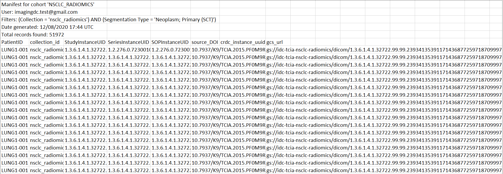

The default fields provided are:

* `PatientID`: value of the corresponding DICOM attribute
* `collection_id`: abbreviated identifier of the source data collection 
* `StudyInstanceUID`: value of the corresponding DICOM attribute
* `SeriesInstanceUID`: value of the corresponding DICOM attribute
* `SOPInstanceUID`: value of the corresponding DICOM attribute
* `source_DOI`: Digital Object Identifier \(DOI\) of the source data collection. Pre-pending `source_DOI` with `https://doi.org/` will give you the URL of the collection dataset
* `crdc_instance_uid`: unique identifier of the object maintained by CRDC IndexD \(details on how to use this UID will be shared at a later time, when the corresponding capability is available\)
* `gcs_url`: `gs://` URL that can be used to access the object using the [GCP `gsutil` tool](https://cloud.google.com/storage/docs/gsutil)

An example of how IDC cohort manifest can be used to retrieve the manifest-defined cohort files is shown in our[ colab notebooks](https://github.com/ImagingDataCommons/IDC-Examples/tree/master/notebooks).


A maximum of six files will be generated before required to export the manifest via BigQuery.


### Cohort manifest export to BigQuery

**From the user interface**

Exporting a manifest to BigQuery enables the end user to take advantage of the functionality the Google BigQuery has to offer. The table is available for seven days after creation. After the initial export a pop-up window will appear on the cohort details page,

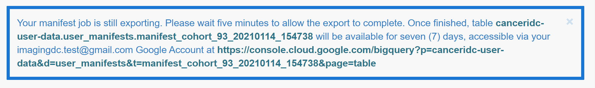


Please be sure to save this URL information or pin the Google BigQuery table to your Google console interface.


After the expiration of a table \(seven days\), the end user can create a new manifest for analysis.

**As a JSON file**

The JSON export of a file will not have any header information available. This provides the ability for the JSON file to be easily imported into a BigQuery table. 

#### Cohort headers and columns selection/de-selection

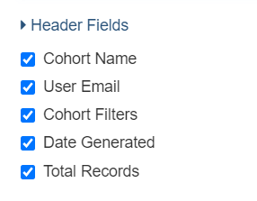

On the cohort manifest export confirmation pop-up the option to select/de-select header and column options is available. 

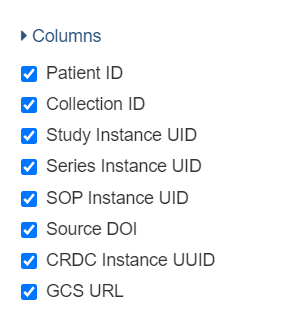


The end user is required to have a column option selected for the export of a manifest. 


### Cohort List

"Cohorts" section of the IDC portal lists all of the cohorts you created under your account. Included is the corresponding **Cohort ID**, **Name**, **Description**, **Ownership**, how many times it has been **Shared.** **Data Version** defines the version of the IDC data against which the cohort was created. 

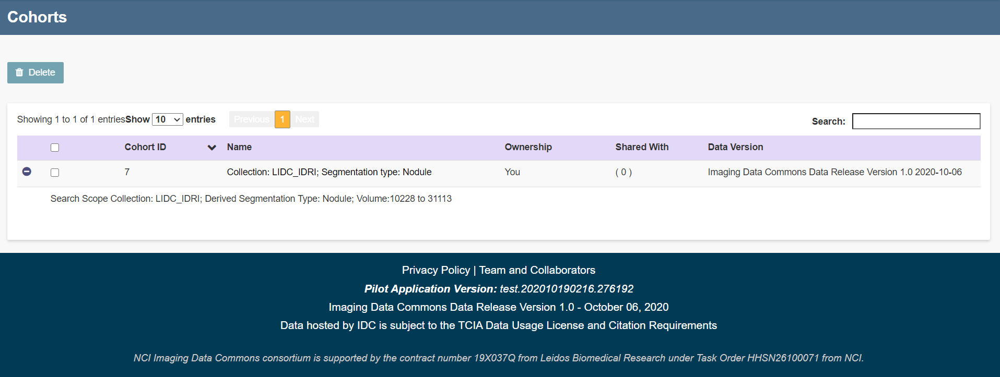

You are given the ability to easily delete one or multiple cohorts at once.  


Sharing of the cohort is a feature not available in the current release of IDC.


