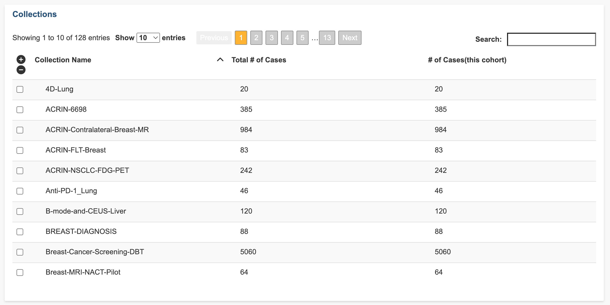
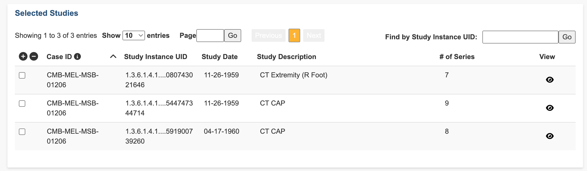
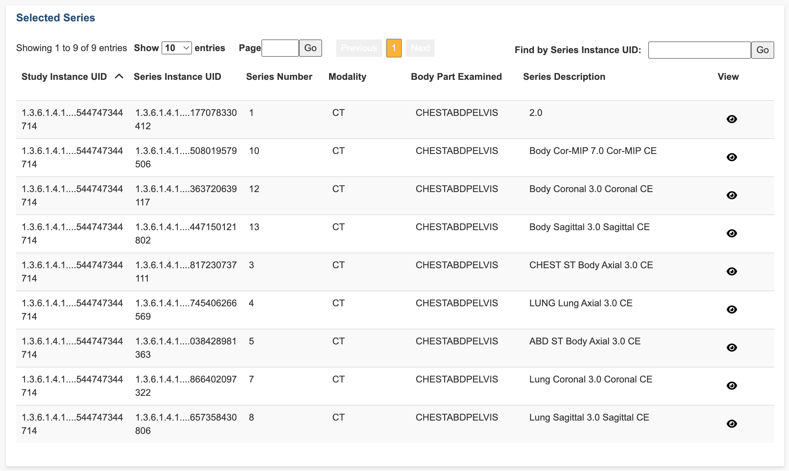

# Viewing collections, studies, and series

All collections in IDC as well as their total number of cases and number of cases in this cohort appear in the Collections panel. The panel shows the collection name, total number of cases, and total number of cases for this cohort. You can customize your display of this data by choosing how many entries to show by page and move to previous and next pages.

Use checkboxes on the left to select the collections. The available cases for the selected collection(s) appear in the Selected Cases panel. Click the up or down arrow to sort the list alphabetically or numerically, as appropriate for the column.

<figure><figcaption></figcaption></figure>


You must select a collection _before_ you can view data in the Selected Cases, Selected Studies, and Selected Series panels.


## Selecting a case per collection

All cases in the selected collections that match the cohort filter will appear in the Selected Cases panel. The panel shows the collection name, case ID, total number of studies, and total number of series for each case. You can customize your display of this data by choosing how many entries to show by page and move to previous and next pages.

<figure><figcaption></figcaption></figure>

Use checkboxes to select the rows. The available studies for the selected case(s) appear in the Selected Studies panel. Click the up or down arrow to sort the list alphabetically or numerically, as appropriate for the column.

## Viewing studies **p**er case

All studies available for the selected case appear in the Selected Studies panel. The panel shows the project name, case ID, study ID, and study description for each study. You can customize your display of this data by choosing how many entries to show by page and move to previous and next pages.

<figure><figcaption></figcaption></figure>

Click one or more studies to select them. The available series for the selected case(s) appear in the Selected Series panel. Click the up or down arrow to sort the list alphabetically or numerically, as appropriate for the column.

Click the icon in the View column for a study row to view study objects in the IDC Viewer. Depending on the type of image, it will be opened using either[ Open Health Imaging Foundation (OHIF) Viewer](https://docs.ohif.org/) (for radiology data) or [SliM Viewer](https://github.com/MGHComputationalPathology/slim) (for digital pathology data).

## Viewing a series per study per case

All series available for the selected study appear in the Selected Series panel. The panel shows the study ID, series number, modality, body part examined, and series description for each study. You can customize your display of this data by choosing how many entries to show by page and move to previous and next pages. Click the up or down arrow to sort the list alphabetically or numerically, as appropriate for the column.

<figure><figcaption></figcaption></figure>

Click the icon in the View column of a study row to view the specific series in the IDC Viewer.


Some objects can only be opened by the OHIF viewer at their related study level and not at the series level. For these objects, the icon in the View column shows that viewing is disabled.

