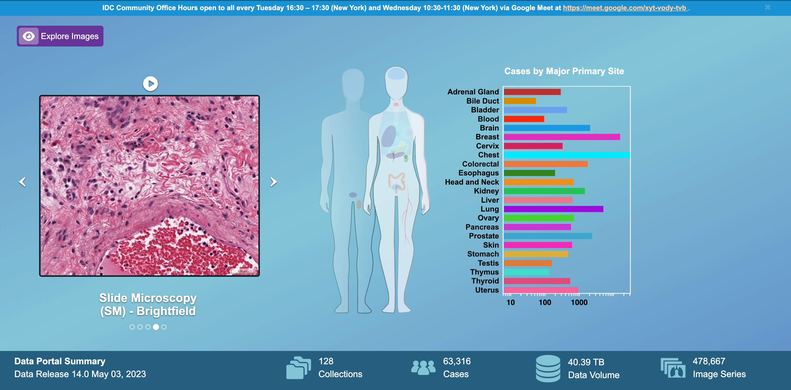

# Getting started

## Overview

The Imaging Data Commons portal provides a web-based interactive interface to browse the data hosted by IDC and build cohorts of cases (subjects). The IDC portal features include:

* Open access to all of the data hosted by IDC
* Search of the IDC data based on a subset of metadata attributes
* Visualization of DICOM images and analysis results
* Interactive selection of the subsets of cases to form cohorts
* Summary plots for the user-defined cohorts
* Saving of the user-defined cohorts under Imaging Data Commons user account

Datasets that are available within IDC are summarized in the [Data release notes](../data/data-release-notes.md).

<figure><figcaption></figcaption></figure>


If you have a need to search IDC content using DICOM attributes other than those available through the portal, you can use [this DataStudio dashboard](https://datastudio.google.com/reporting/ab96379c-e134-414f-8996-188e678f1b70/page/KHtxB). You can also [extend this dashboard](../cookbook/data-studio/cohort-dashboard.md) to include additional attributes. If you would like to have complete control over the metadata search, please complete the IDC ["Getting started" tutorial series](https://github.com/ImagingDataCommons/IDC-Tutorials/tree/master/notebooks/getting\_started), which will introduce you to using SQL for data selection.


## Accessing the Imaging Data Commons Portal

The IDC portal is accessible using a modern web browser such as Chrome, Firefox, and Microsoft Edge at the following URL: [https://imaging.datacommons.cancer.gov](https://imaging.datacommons.cancer.gov/)**.**

While you can browse the data available on IDC without having to log in, you will need to log in to save cohorts and generate cohort manifests. You can create an account to log into IDC using either your existing Google account, or using IDC-specific login.


In order to activate IDC-specific login, you will need to click the link sent by email to confirm your email address. It is a known issue that those confirmation emails may be classified as spam, or may never arrive. Furthermore, there is not much you can do with the IDC data without a Google account, since you will need to authenticate with a Google account to access the files stored in IDC. Because of this, we recommend that you use a Google account to log into the IDC portal.

