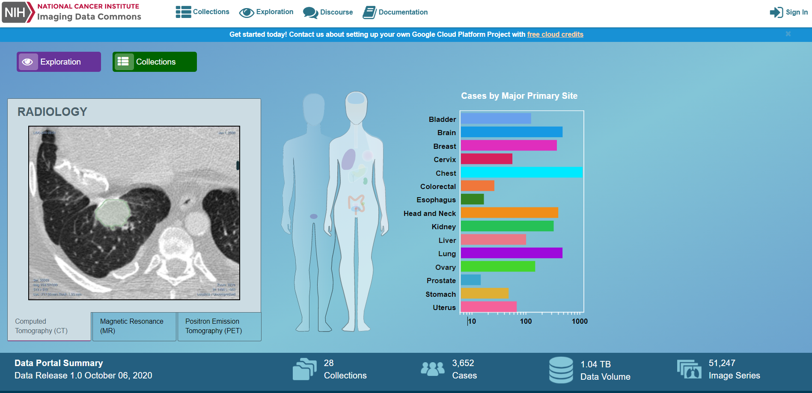

# Getting Started

### Overview

Imaging Data Commons portal provides a web-based interactive interface to browse the data hosted by IDC and build cohorts of cases \(subjects\). The IDC portal features include:

* open access to all of the data hosted by IDC
* search of the IDC data based on DICOM metadata
* visualization of DICOM images and analysis results
* interactive selection of the subsets of cases to form cohorts
* summary plots for the user-defined cohorts
* saving of the user-defined cohorts under Imaging Data Commons user account

Datasets that are available within IDC are summarized in the [Data release notes](../data/data-release-notes.md).

### Accessing the Imaging Data Commons Portal

The IDC portal is accessible using a modern web browser such as Chrome, Firefox and Microsoft Edge at the following URL: [**https://portal.imaging.datacommons.cancer.gov**](https://portal.imaging.datacommons.cancer.gov)\*\*\*\*

