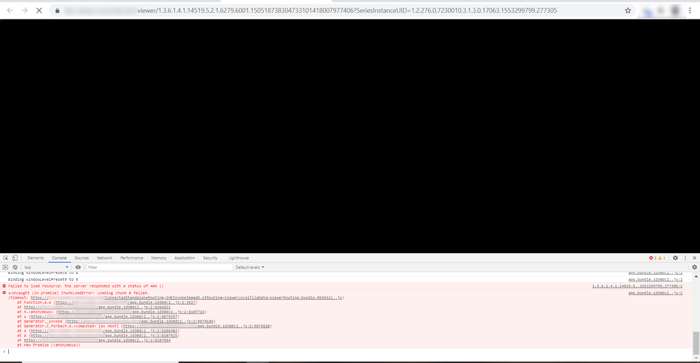
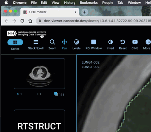

# Portal Known Issues

## 1.0.0 - October 2020 \(canceridc.202010190226.4e8597\)

The Imaging Data Commons Explore Image Data portal is a platform that allows users to explore, filter, create cohorts, and view image studies and series using cutting-edge technology viewers.

### Initial release

### **Data Exploration**

* Lack of consistent punctuation throughout the web app - [ImagingDataCommons/IDC-WebApp\#414](https://github.com/ImagingDataCommons/IDC-WebApp/issues/414)
* Attribute values appear as blank when zero cases are present for the Search Configuration panel - [ImagingDataCommons/IDC-WebApp\#423](https://github.com/ImagingDataCommons/IDC-WebApp/issues/423)
* An attribute selection combined with a Quantitative Analysis attribute selection will display all value options when no cases are available in certain use cases - [ImagingDataCommons/IDC-WebApp\#341](https://github.com/ImagingDataCommons/IDC-WebApp/issues/341)
* Attribute slider for Quantitative values will display with zero cases present in attribute selection - [ImagingDataCommons/IDC-WebApp\#425](https://github.com/ImagingDataCommons/IDC-WebApp/issues/425)
* The selection of the Age at Diagnosis None attribute is not reflected in the cohorts confirmation pop-up or the cohort details page - [ImagingDataCommons/IDC-WebApp\#420](https://github.com/ImagingDataCommons/IDC-WebApp/issues/420)
* The download of the cohort manifest is truncated at 65,000 records ordered by PatientID, StudyID, SeriesID, and InstanceID -[ ImagingDataCommons/IDC-WebApp\#394](https://github.com/ImagingDataCommons/IDC-WebApp/issues/394)
* Duplication of value Digital Mammography X-Ray Image  for Object Class attribute present in the data portal under the original tab -[ ImagingDataCommons/IDC-WebApp\#233](https://github.com/ImagingDataCommons/IDC-WebApp/issues/233)
* Data summary ribbon needs to be updated to account for NSCLC-Radiomics - [ImagingDataCommons/IDC-WebApp\#437](https://github.com/ImagingDataCommons/IDC-WebApp/issues/437)
* Selection of a collection attribute on the no login required data exploration page doesn't save the selection after login - [ImagingDataCommons/IDC-WebApp\#439](https://github.com/ImagingDataCommons/IDC-WebApp/issues/439)

More detailed information can be found on GitHub under the ImagingDataCommons/Web-App repository. All tickets related to known issues within the data portal are labeled with either a [bug](https://github.com/ImagingDataCommons/IDC-WebApp/issues?q=is%3Aissue+is%3Aopen+label%3Abug) or an [enhancement](https://github.com/ImagingDataCommons/IDC-WebApp/issues?q=is%3Aissue+is%3Aopen+label%3Aenhancement) label.

### **Image Visualization**

* The about box of the OHIF viewer reports the incorrect version number - [OHIF/Viewers\#2023](https://github.com/OHIF/Viewers/issues/2023)
* Selection of the Object class real-world mapping attribute will cause the OHIF viewer not to load
* [ImagingDataCommons/IDC-WebApp\#332](https://github.com/ImagingDataCommons/IDC-WebApp/issues/332)
* When working with the Safari browser, the 2D MPR functionality causes the viewer to freeze. We recommend using Google Chrome or Firefox when working with the Imaging Data Commons - [ImagingDataCommons/IDC-WebApp\#213](https://github.com/ImagingDataCommons/IDC-WebApp/issues/213)
* Tag viewer version is currently broken for RT Struct series in the OHIF viewer - [OHIF/Viewers\#2122](https://github.com/OHIF/Viewers/issues/2122)
* The occasional return of a Chunk Load Error on the viewer load not handled correctly and will cause the viewer to fail - [OHIF/Viewers\#2021](https://github.com/OHIF/Viewers/issues/2021)
* The scroll bar is missing in the Tag viewer window - [OHIF/Viewers\#2029](https://github.com/OHIF/Viewers/issues/2029)
* When working with RT Structure sets, the RightSidePanel: Cannot read property 'SeriesInstanceUID' of undefined error returned in the viewer - [OHIF/Viewers\#2123](https://github.com/OHIF/Viewers/issues/2123)
* On occasion, the RTSTRUCT tab is shown when not applicable, does not load when opened - [OHIF/Viewers\#2017](https://github.com/OHIF/Viewers/issues/2117)
* The OHIF viewer doesn't load  kidney and tumor plane segmentations found in TCIA - [OHIF/Viewers\#1345](https://github.com/OHIF/Viewers/issues/1345)
* Zoom does not Update Crosshairs in MPR Mode - [OHIF/Viewers\#1419](https://github.com/OHIF/Viewers/issues/1419)
* Unable to display the same scan in two viewports and displaying different RTSTRUCTs, SEGs, and cornerstone planar measurements in each - [OHIF/Viewers\#1522](https://github.com/OHIF/Viewers/issues/1522)
* SVG Crosshair issues in VTK - [OHIF/Viewers\#1696](https://github.com/OHIF/Viewers/issues/1696)

More detailed information can be found in GitHub within the OHIF/Viewers repository. All tickets related to the Imaging Data Commons are labeled with either an [IDC:candidate](https://github.com/OHIF/Viewers/labels/IDC%3Acandidate) or an [IDC:priority](https://github.com/OHIF/Viewers/labels/IDC%3Apriority) label.

### Black screen while opening IDC Viewer

You may occasionally experience black screen while opening images in IDC Viewer, such as in the image below:

If this happens, try reloading the page several times, or clearing cache and doing hard reload, as shown below.

To track the status of this issue in GitHub please see [OHIF/Viewers\#2121](https://github.com/OHIF/Viewers/issues/2121).

