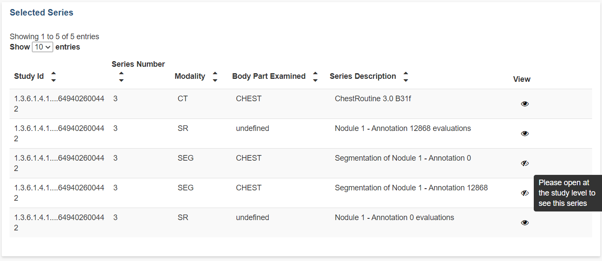
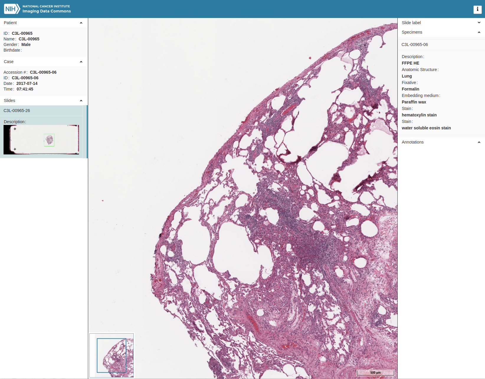

# Visualizing images


In the following we describe the capabilities of IDC-maintained viewer instances that can be used with the data hosted by IDC. If you would like to deploy your own instance of the viewer to be used with your data on GCP, please check out [this tutorial](https://tinyurl.com/idc-ohif-gcp)!


## IDC Viewer overview

IDC integrates two different viewers, which will be used depending on the type of images being opened. Visualization of radiology images uses the open-source [Open Health Imaging Foundation (OHIF) Viewer](https://github.com/OHIF/Viewers). [SliM Viewer](https://github.com/MGHComputationalPathology/slim) is used for visualization of slide microscopy images. We customized both of those viewers slightly to add features specific to IDC. You can find all of those modifications in the respective forks under the IDC GitHub organization for OHIF and SliM viewers: [OHIF Viewer fork](https://github.com/ImagingDataCommons/Viewers) and [SliM Viewer fork](https://github.com/ImagingDataCommons/slim). IDC Viewer is opened every time you click the "eye" icon in the study or series table of the IDC Portal.

**The OHIF and SliM viewers do not support 32 bit browsers.**

IDC Viewer is a "zero-footprint" client-side viewer. What this means is that before you can see the image in the viewer, it has to be downloaded to your browser from the IDC DICOM stores. IDC Viewer communicates the data it receives through a proxy via the [DICOMweb](https://www.dicomstandard.org/using/dicomweb) interface implemented in GCP [Cloud Healthcare API](https://cloud.google.com/healthcare/docs/concepts/dicom). The proxy is intended to throttle download of data.


Currently, IDC Viewer proxy limits the amount of data that can be downloaded in one day to **137 GB per IP address**, and enforces a total quota per day over all of the IP addresses. If the quota is exhausted, you will not be able to see any images in IDC Viewer until the limit is reset and instead will be redirected to [this](https://portal.imaging.datacommons.cancer.gov/quota/index.html)[ page](https://portal.imaging.datacommons.cancer.gov/quota/index.html)! We may adjust the current proxy limits in the future, and you are welcome to provide your feedback on the appropriateness of the current quota in [IDC Discourse](https://discourse.canceridc.dev/c/support/feedback-and-features/7). Note that the IDC Viewer proxy is provided only to support this use case The full proxy policy is described [here](proxy-policy.md)


Depending on a variety of factors (size of the image, your network connection, responsiveness of the proxy) the process of loading images into your browser can take some time before the entire image series is loaded. You will know the series is not loaded completely if you cannot scroll to the arbitrary location of the image volume. This will also be indicated by the incomplete progress bar below the series thumbnail. If you want to ensure the entire series is loaded before you start to explore the reconstructed volume, you can wait until the series load is completed.

.png>)

CINE and 2D MPR modes are shown with red and yellow arrows in the image below, respectively.

Note that 2D MPR mode is only available for series that form a consistent volume (that is, all pixel spacings equal, slices equally spaced, and so on, which means you will not see the MPR button for such series as time-resolved MRI, as an example).

## IDC radiology viewer functionality

The main functions of the viewer are available via the toolbar controls shown below.

The functionality supported by those tools should be self-explanatory, or can be discovered via quick experimentation.


If you want to report a problem related to visualization of a specific study in the IDC Viewer, please use the "Debug Info" tool to collect debugging information. Please report the issue on the [IDC Discourse](https://discourse.canceridc.dev/c/support/feedback-and-features/7), including the entire content of the debugging information to help us investigate the issue.


### Visualizing annotations

IDC Viewer supports visualization of DICOM Segmentation objects (SEG) and DICOM Radiotherapy Structure Sets (RTSTRUCT). When available in a given study, you will see those modalities labeled as such in the left-hand panel of the viewer, as shown below. To see a specific SEG or RTSTRUCT, drag the thumbnail to the viewer. After that you can open the RTSTRUCT/SEG panel in the upper right corner to jump to the locations of the specific structure sets or segments, and to control their individual visibility.


Note that certain modalities, such as Segmentation (SEG) and Real World Value Mapping (RWVM) objects, cannot be selected for visualization from the IDC Portal. SEG can only be viewed in the context of the image series segmented, and RWVM series are not viewable and will not show up in the left panel of the viewer.


Below is an example of series objects that are not viewable at the series level.

## IDC pathology viewer functionality

The IDC pathology viewer allows for interactive visualization of digital slide microscopy (SM) images.

## Configuring the IDC Viewer URL

You can use IDC Viewer to visualize any of the suitable data in IDC. To configure the IDC Viewer URL, simply append `StudyInstanceUID` of a study available in IDC to the following prefix: [https://viewer.imaging.datacommons.cancer.gov/viewer/](https://viewer.imaging.datacommons.cancer.gov/viewer/) (for the radiology viewer) and[ https://viewer.imaging.datacommons.cancer.gov/slim/studies](https://viewer.imaging.datacommons.cancer.gov/slim/studies/)/ (for the digital pathology viewer). This will open the entire study in the viewer. You can also configure the URL to open specific series of the study, as defined by the list of `SeriesInstanceUID` items. When you open the IDC Viewer from the IDC Portal, the URLs of the pages will be populated following those conventions.

Here are some specific examples, taken from the IDC Portal dashboard:

* open entire study with the `StudyInstanceUID`1.3.6.1.4.1.14519.5.2.1.6279.6001.224985459390356936417021464571: [https://viewer.imaging.datacommons.cancer.gov/viewer/1.3.6.1.4.1.14519.5.2.1.6279.6001.224985459390356936417021464571](https://viewer.imaging.datacommons.cancer.gov/viewer/1.3.6.1.4.1.14519.5.2.1.6279.6001.224985459390356936417021464571?seriesInstanceUID=1.2.276.0.7230010.3.1.3.0.57823.1553343864.578877,1.3.6.1.4.1.14519.5.2.1.6279.6001.273525289046256012743471155680).
* open the specified subset of series from the study above: [https://viewer.imaging.datacommons.cancer.gov/viewer/1.3.6.1.4.1.14519.5.2.1.6279.6001.224985459390356936417021464571?seriesInstanceUID=1.2.276.0.7230010.3.1.3.0.57823.1553343864.578877,1.3.6.1.4.1.14519.5.2.1.6279.6001.273525289046256012743471155680](https://viewer.imaging.datacommons.cancer.gov/viewer/1.3.6.1.4.1.14519.5.2.1.6279.6001.224985459390356936417021464571?seriesInstanceUID=1.2.276.0.7230010.3.1.3.0.57823.1553343864.578877,1.3.6.1.4.1.14519.5.2.1.6279.6001.273525289046256012743471155680)

Digital pathology viewer uses a slightly different convention, as should be evident from this example URL: [https://viewer.imaging.datacommons.cancer.gov/slim/studies/1.3.6.1.4.1.5962.99.1.2463087261.2121647220.1625960757917.3.0/series/1.3.6.1.4.1.5962.99.1.2463087261.2121647220.1625960757917.2.0](https://viewer.imaging.datacommons.cancer.gov/slim/studies/1.3.6.1.4.1.5962.99.1.2463087261.2121647220.1625960757917.3.0/series/1.3.6.1.4.1.5962.99.1.2463087261.2121647220.1625960757917.2.0).

You can share the viewer URLs if you want to refer to visualizations of the specific items from IDC. You can also use this functionality if you want to visualize specific items from your notebook or a custom dashboard (e.g., a Google DataStudio dashboard).
