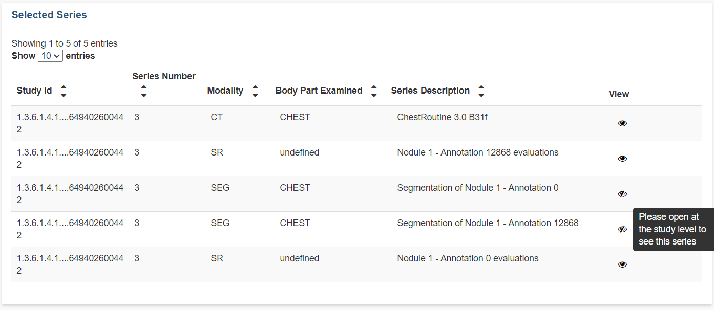

# Visualizing images

IDC integrates two different viewers, which will be used depending on the type of images being opened. Visualization of radiology images uses the open-source [Open Health Imaging Foundation (OHIF) Viewer](https://github.com/OHIF/Viewers) v3. The [SliM Viewer](https://github.com/MGHComputationalPathology/slim) is used for visualization of pathology and slide microscopy images. We customized both of those viewers slightly to add features specific to IDC. You can find all of those modifications in the respective forks under the IDC GitHub organization for OHIF and SliM viewers: [OHIF Viewer fork](https://github.com/ImagingDataCommons/Viewers) and [SliM Viewer fork](https://github.com/ImagingDataCommons/slim). IDC Viewer is opened every time you click the "eye" icon in the study or series table of the IDC Portal.


**The OHIF and SliM viewers do not support 32 bit browsers.**


IDC Viewer is a "zero-footprint" client-side viewer: before you can see the image in the viewer, it has to be downloaded to your browser from the IDC DICOM stores. IDC Viewer communicates the data it receives through a proxy via the [DICOMweb](https://www.dicomstandard.org/using/dicomweb) interface implemented in GCP [Cloud Healthcare API](https://cloud.google.com/healthcare/docs/concepts/dicom).&#x20;


Currently, IDC Viewer proxy limits the amount of data that can be downloaded in one day to **137 GB per IP address**, and enforces a total quota per day over all of the IP addresses. If the quota is exhausted, you will not be able to see any images in IDC Viewer until the limit is reset and instead will be redirected to [this](https://portal.imaging.datacommons.cancer.gov/quota/index.html)[ page](https://portal.imaging.datacommons.cancer.gov/quota/index.html)! We may adjust the current proxy limits in the future, and you are welcome to provide your feedback on the appropriateness of the current quota in [IDC Discourse](https://discourse.canceridc.dev/c/support/feedback-and-features/7).&#x20;


## IDC radiology viewer functionality

The main functions of the viewer are available via the toolbar controls shown below.

<figure><figcaption></figcaption></figure>

The functionality supported by those tools should be self-explanatory, or can be discovered via quick experimentation.


If you want to report a problem related to visualization of a specific study in the IDC Viewer, please use the "Debug Info" tool to collect debugging information. Please report the issue on the [IDC Discourse](https://discourse.canceridc.dev/c/support/feedback-and-features/7), including the entire content of the debugging information to help us investigate the issue.


### Visualizing radiology annotations

IDC Viewer supports visualization of annotations stored as DICOM Segmentation objects (SEG), DICOM Radiotherapy Structure Sets (RTSTRUCT), and certain annotations stored in DICOM TID1500 Structured Reports. When available in a given study, you will see those modalities labeled as such in the left-hand panel of the viewer, as shown below. To load, double-click on the corresponding thumbnail in the series list in the left panel. After that you can open the navigation panel in the upper right corner to jump to the locations of the specific structure sets or segments, and to control their individual visibility.

<figure><figcaption></figcaption></figure>


Note that certain modalities, such as Segmentation (SEG) and Real World Value Mapping (RWVM) objects, cannot be selected for visualization from the IDC Portal. SEG can only be viewed in the context of the image series segmented, and RWVM series are not viewable and will not show up in the left panel of the viewer.


Below is an example of series objects that are not viewable at the series level.

## IDC pathology viewer functionality

The IDC pathology viewer allows for interactive visualization of digital slide microscopy (SM) images. Left panel will show all digital slides available in a given study. Click on the thumbnail to open a specific slide. Right panel will summarize the information about slide image channels, and will list annotations, analysis results, and presentation states when available.&#x20;

IDC viewer support visualization of DICOM Segmentations (binary and fractional), Parametric Maps, planar annotations stored as DICOM TID1500 Structured Reports (SR modality) or bulk annotations (ANN modality).

### Visualizing slide microscopy annotations

Whenever annotations or segmentations are available for the slide you opened, you will see the corresponding sections populated in the bottom-right portion of the window. Expand those to see what is avaialble and to toggle visualization.

<figure><figcaption></figcaption></figure>

## Configuring the IDC Viewer URL

You can use IDC Viewer to visualize any of the suitable data in IDC. To configure the IDC Viewer URL, simply append `StudyInstanceUID` of a study available in IDC to the following prefix: [https://viewer.imaging.datacommons.cancer.gov/viewer/](https://viewer.imaging.datacommons.cancer.gov/viewer/) (for the radiology viewer) and[ https://viewer.imaging.datacommons.cancer.gov/slim/studies](https://viewer.imaging.datacommons.cancer.gov/slim/studies/)/ (for the digital pathology viewer). This will open the entire study in the viewer. You can also configure the URL to open specific series of the study, as defined by the list of `SeriesInstanceUID` items. When you open the IDC Viewer from the IDC Portal, the URLs of the pages will be populated following those conventions.

Here are some specific examples, taken from the IDC Portal dashboard:

* open entire study with the `StudyInstanceUID`1.3.6.1.4.1.14519.5.2.1.6279.6001.224985459390356936417021464571: [https://viewer.imaging.datacommons.cancer.gov/viewer/1.3.6.1.4.1.14519.5.2.1.6279.6001.224985459390356936417021464571](https://viewer.imaging.datacommons.cancer.gov/viewer/1.3.6.1.4.1.14519.5.2.1.6279.6001.224985459390356936417021464571?seriesInstanceUID=1.2.276.0.7230010.3.1.3.0.57823.1553343864.578877,1.3.6.1.4.1.14519.5.2.1.6279.6001.273525289046256012743471155680).
* open the specified subset of series from the study above: [https://viewer.imaging.datacommons.cancer.gov/viewer/1.3.6.1.4.1.14519.5.2.1.6279.6001.224985459390356936417021464571?seriesInstanceUID=1.2.276.0.7230010.3.1.3.0.57823.1553343864.578877,1.3.6.1.4.1.14519.5.2.1.6279.6001.273525289046256012743471155680](https://viewer.imaging.datacommons.cancer.gov/viewer/1.3.6.1.4.1.14519.5.2.1.6279.6001.224985459390356936417021464571?seriesInstanceUID=1.2.276.0.7230010.3.1.3.0.57823.1553343864.578877,1.3.6.1.4.1.14519.5.2.1.6279.6001.273525289046256012743471155680)

Digital pathology viewer uses a slightly different convention, as should be evident from this example URL: [https://viewer.imaging.datacommons.cancer.gov/slim/studies/2.25.211094631316408413440371843585977094852/series/1.3.6.1.4.1.5962.99.1.217222191.146280326.1640894762031.2.0](https://viewer.imaging.datacommons.cancer.gov/slim/studies/2.25.211094631316408413440371843585977094852/series/1.3.6.1.4.1.5962.99.1.217222191.146280326.1640894762031.2.0)

## Deploying your own viewer

You can share the viewer URLs if you want to refer to visualizations of the specific items from IDC. You can also use this functionality if you want to visualize specific items from your notebook or a custom dashboard (e.g., a Google DataStudio dashboard).

If you want to visualize your own images, or if you would like to combine IDC images with the analysis results or annotations you generated, you do have several options:

* You can use Google FireCloud to deploy [OHIF](https://github.com/OHIF/Viewers) v2 radiology or [Slim](https://github.com/ImagingDataCommons/slim) microscopy viewers as web applications, without having to use virtual machines or docker, and for free!
  * [OHIF FireCloud deployment tutorial](https://tinyurl.com/idc-ohif-gcp)
  * [Slim FireCloud deployment tutorial](https://tinyurl.com/idc-slim-gcp)
* If you want to visualize images inside a Colab/Jupyter notebook - you can use [itkWidgets](https://github.com/InsightSoftwareConsortium/itkwidgets) - details in [this tutorial](https://github.com/ImagingDataCommons/IDC-Tutorials/blob/master/notebooks/getting_started/part3_exploring_cohorts.ipynb)
* You can use open source [VolView](https://volview.kitware.com/) zero-footprint viewer to visualize and volume render any image series by simply pointing it to the cloud bucket with the files - see details in [this tutorial](https://github.com/ImagingDataCommons/IDC-Tutorials/blob/master/notebooks/getting_started/part3_exploring_cohorts.ipynb)
